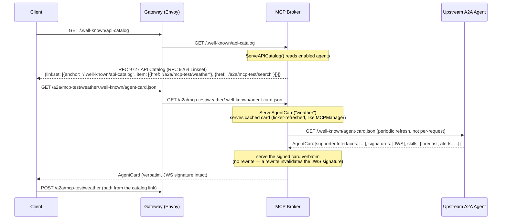
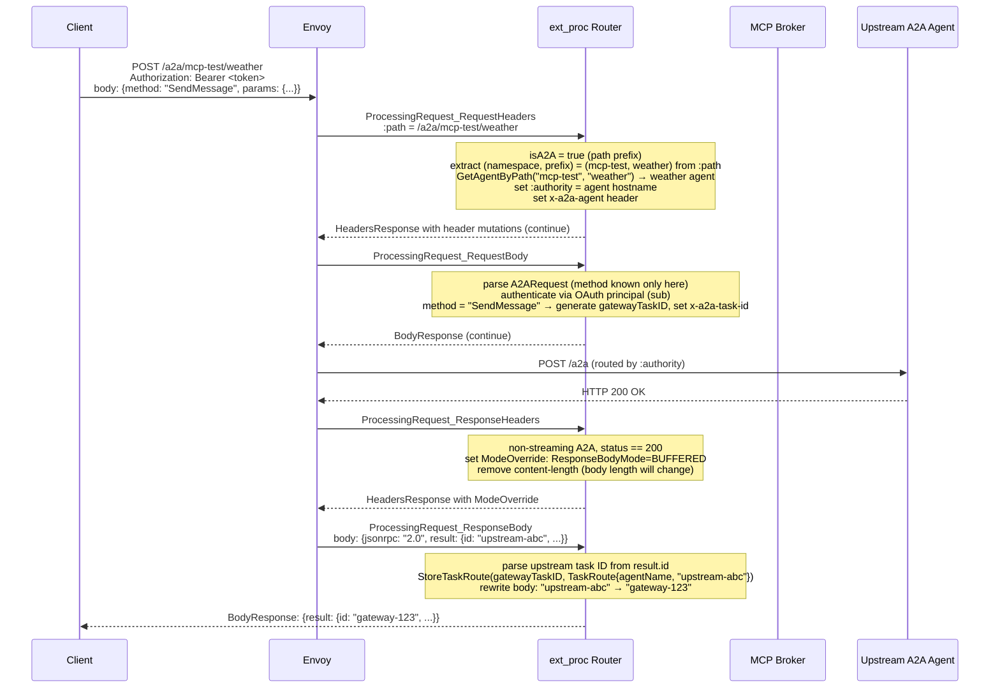
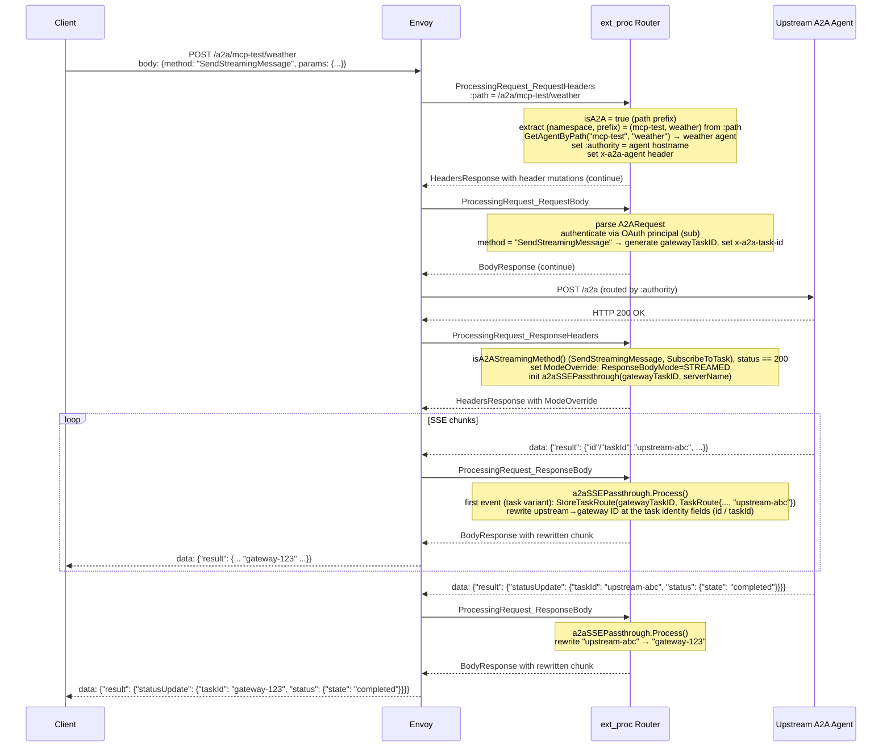
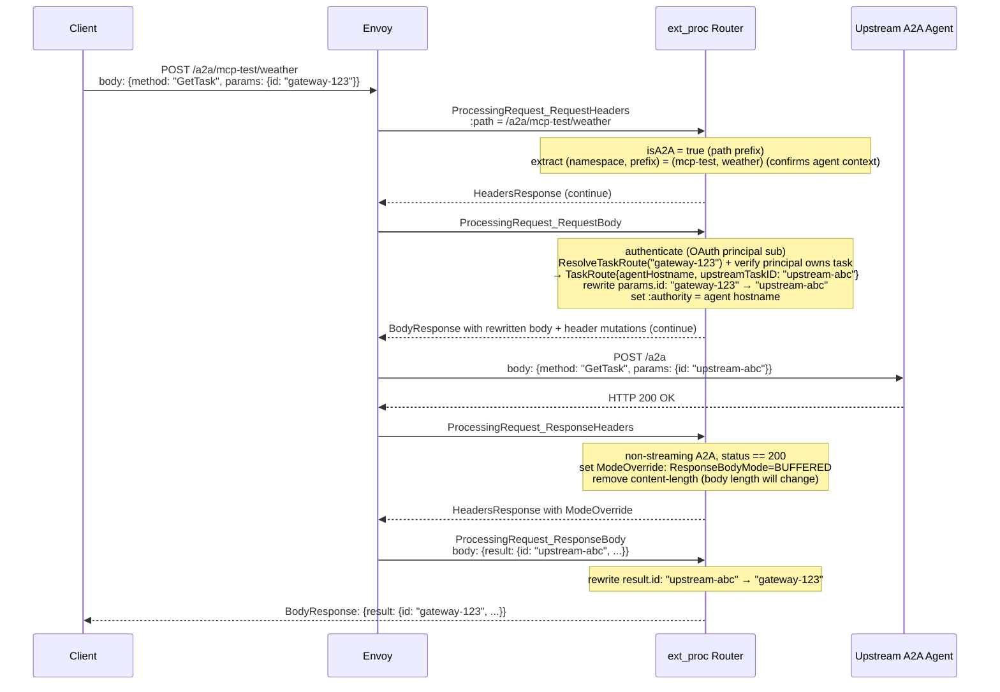

# A2A Protocol Support Design

## Problem

The MCP Gateway handles the vertical axis of agentic workloads: a single client consuming federated
tools from multiple upstream MCP servers. As agentic architectures grow, a second axis emerges — the
horizontal one. Agents increasingly delegate long-running work to other agents, discover peer
capabilities, and coordinate asynchronously over tasks that may run for seconds or days.

The Agent-to-Agent (A2A) protocol standardizes this inter-agent communication layer. Today, A2A
traffic bypasses the gateway entirely. There is no AuthPolicy enforcement, no RateLimitPolicy, no
centralized agent card discovery, and no logging of inter-agent interactions. Every agent-to-agent
delegation is a direct connection outside the gateway's policy perimeter.

## Summary

This design extends the MCP Gateway to support the A2A protocol alongside MCP. A new
`A2AAgentRegistration` CRD allows operators to register upstream A2A agents with the gateway.
The broker serves individual Agent Cards at `/a2a/{namespace}/{prefix}/.well-known/agent-card.json` and an RFC
9727 API Catalog at `/.well-known/api-catalog` (served as an RFC 9264 Linkset) for multi-agent
discovery. Cards are served **verbatim** — v1.0 AgentCards are JWS-signed over the canonicalized card,
so the gateway cannot rewrite an interface URL without breaking the signature; instead the catalog
advertises the per-agent gateway path (`/a2a/{namespace}/{prefix}`) that a client sends to, and the
gateway routes by that path. The ext_proc router detects A2A traffic by path prefix and routes
`SendMessage`, `SendStreamingMessage`, `GetTask`, `CancelTask`, and `SubscribeToTask` requests to the
correct upstream agent, rewriting task IDs at the gateway boundary. All existing MCP behavior is
unchanged. A2A support is entirely additive.

## Goals

- Agent card discovery via an RFC 9727 API Catalog at `/.well-known/api-catalog` (served as an RFC
  9264 Linkset) linking to individual agent cards at `/a2a/{namespace}/{prefix}/.well-known/agent-card.json` for
  each registered upstream A2A agent. Signed cards are served verbatim; the catalog advertises the
  per-agent gateway path so clients route through the gateway.
- A2A request routing through the ext_proc pipeline: `SendMessage`, `SendStreamingMessage`, `GetTask`,
  `CancelTask`, `SubscribeToTask` dispatched to the correct upstream agent based on request path
  prefix (`/a2a/{namespace}/{prefix}`).
- Gateway-owned task ID mapping so the client never sees upstream task IDs and task routing works
  correctly across multiple upstream agents.
- SSE streaming passthrough for `SendStreamingMessage` (the v1.0 streaming method) and
  `SubscribeToTask`, with upstream task IDs replaced by gateway task IDs in streamed events.
- `A2AAgentRegistration` CRD and controller for registering upstream A2A agents via HTTPRoutes,
  consistent with the `MCPServerRegistration` pattern.
- Authentication: A2A requests authenticate per request via an OAuth bearer (Kuadrant AuthPolicy on
  `/a2a`); task ownership is scoped to the principal (`sub`), not a session.
- E2E tests covering agent card discovery, task submission and completion, streaming, auth, and MCP
  regression.

## Non-Goals

- Native A2A scheduler extension (extending the scheduler cache, plugins, and actions to understand
  `A2AAgentRegistration` objects natively). The shadow-queue analogy applies here: the ext_proc
  routing approach delivers working A2A support without modifying the scheduler. Native extension
  is the longer-term architectural direction.
- Webhook-based push notifications for async task completion callbacks. Polling via `GetTask` is
  in scope; push is not — but the secure **webhook-relay** architecture (so the agent can't call the
  client directly, outside the policy perimeter) is sketched in [Future Considerations](#future-considerations).
- Skill-level filtering as a gateway capability — A2A `SendMessage` names no skill, so there is no
  per-skill control surface; the enforceable unit is the agent (see [Policy Enforcement](#policy-enforcement)).
- Supporting multiple A2A spec versions at once — the design targets a single version (v1.0; see
  [Prerequisites](#prerequisites)) with the version-specific surface isolated so a version change is mechanical.
- Deferred v1.0 operations beyond the PoC's discovery-and-invocation surface: `ListTasks`, the
  authenticated extended agent card (`GetExtendedAgentCard`), and the `pushNotificationConfig` operations
  are out of scope for this design. The supported surface is `SendMessage`, `SendStreamingMessage`,
  `GetTask`, `CancelTask`, and `SubscribeToTask`; the rest are recorded as future work, not built here.

## Job Stories

### When a platform engineer deploys a new A2A agent

When a platform engineer has an upstream A2A agent running in their cluster, they want to register
it with the gateway so that clients can discover it via the API Catalog and send tasks
through the gateway, so that all inter-agent traffic is subject to the same AuthPolicy and
RateLimitPolicy as MCP traffic.

### When an MCP client application wants to discover available agents

When an MCP client application wants to discover available agents behind the gateway, it wants to
query `/.well-known/api-catalog` (RFC 9727) and receive links to each registered agent's endpoint
at `/a2a/{namespace}/{prefix}`, then fetch each agent's card at `/a2a/{namespace}/{prefix}/.well-known/agent-card.json`, so that
it can discover all registered agents without knowing their upstream addresses.

### When an agent sends a long-running task through the gateway

When an agent sends a `SendMessage` request to the gateway at the target agent's path
(`/a2a/{namespace}/{prefix}`), it wants to receive a gateway-owned task ID and have subsequent `GetTask` and
`CancelTask` requests routed to the correct upstream agent, so that the agent never needs direct
access to upstream agents and all task interactions are mediated by the gateway.

### When an agent streams task progress

When an agent sends a `SendStreamingMessage` request (the v1.0 streaming method), it wants to
receive real-time task status updates as SSE events with consistent gateway task IDs across all
streamed events, so that it can display progress without polling.

### When a platform engineer removes an A2A agent

When a platform engineer deletes an `A2AAgentRegistration`, they want that agent to disappear from
the API Catalog within one reconcile cycle and for in-flight tasks to complete or return an
appropriate error, so that the gateway accurately reflects available agents without requiring a
deployment restart.

### When a client sends a request without valid auth

When a client sends a `SendMessage` without a valid OAuth bearer, the gateway's AuthPolicy should
return a 401 without forwarding anything to the upstream agent, so that unauthenticated agents
cannot invoke tasks.

## Design

### Prerequisites

- An `MCPGatewayExtension` is installed and a gateway deployment is running.
- The client authenticates each A2A request with an OAuth 2.1 bearer token, validated by a Kuadrant
  AuthPolicy on the `/a2a` route (the same per-request model MCP uses). Task ownership is scoped to
  the authenticated principal (token `sub`), not a session. A2A does **not** reuse `mcp-session-id`, so
  it is unaffected by the MCP stateless cut (2026-07-28, SEP-2567/SEP-2575 removing `initialize` and
  `Mcp-Session-Id`): it authenticates per-request via OAuth and binds tasks to the principal (the router
  already reads `sub` via `ExtractSubClaim`). AuthPolicy MUST be enforced on `/a2a`. One item to confirm
  post-cut: whether `/a2a` is the same OAuth resource/audience as `/mcp` per RFC 8707.
- Upstream A2A agents are accessible from the gateway's network and implement A2A v1.0 (v1.0.1 is
  the current release; the `a2a-go` SDK is v1.0-only, and earlier lines are already behind spec).
  The routing, task store, and policy design are version-agnostic; the version-specific surface —
  method names (`SendMessage` etc.), the well-known path (`/.well-known/agent-card.json`), and the card shape
  (`supportedInterfaces`, named `securitySchemes`, JWS signatures) — is isolated behind one mapping.
- HTTPRoutes targeting upstream A2A agents are programmed and accepted by the gateway.

### Flow

#### Agent Card Discovery



A stock A2A v1.0 client discovers agents via the catalog, then — per the spec's interface-selection
rules — invokes each agent at the `url` of an interface in that agent's AgentCard `supportedInterfaces[]`.
A catalog link alone cannot override that choice, so for a client to route through the gateway **both**
the catalog link and the served card's JSONRPC interface URL must resolve to the agent's gateway path
(`/a2a/{namespace}/{prefix}`). That drives the card-serving contract:

- **Unsigned cards** — the broker rewrites the interface URL to the gateway path before serving (safe;
  no signature to break). This is the transparent-insertion trick that worked for v0.3.
- **Signed cards** — v1.0 AgentCards are JWS-signed over the canonicalized card, so the broker cannot
  rewrite the interface URL without invalidating the signature. The card must therefore be signed to
  **already advertise the gateway URL**: the upstream (or the operator at registration) signs a card
  whose JSONRPC interface is the agent's gateway path, and the broker serves it verbatim, signature
  intact, so the client can still verify against the agent's key.
- **Signed card advertising a direct-upstream URL** — a misconfiguration, not a supported mode: served
  verbatim it would send clients straight to the agent, outside the policy perimeter. The broker
  validates the advertised interface against the expected gateway path on card refresh and, on mismatch,
  **fails closed** — the agent is marked not-`Ready` and never enters the catalog, rather than silently
  leaking a bypass.

agentgateway (Solo.io, now under the Linux Foundation) uses per-agent routing similarly. Multi-agent
discovery under one base URL is an active topic upstream; the RFC 9727 API Catalog (served as an RFC
9264 Linkset) used here aligns with that direction.
**[OPEN: discovery convention is held deliberately loose — commit to the RFC 9727 catalog now vs
track upstream and keep it light. David endorsed holding it loosely; pending Jason/Craig.]**

#### Upstream Agent Card sync (no card-change push)

A2A defines **no card-change notification** — none of its methods is a server-initiated
"agent card changed" push, and the AgentCard carries no cache/ETag hints (only a provider-defined
`version`). This differs structurally from MCP, where the broker holds a persistent connection and the
upstream pushes `notifications/tools/list_changed` (`internal/broker/upstream/manager.go:265-273`) for
near-instant updates. A2A has no such channel and no persistent discovery connection, so the gateway
**must poll**.

The broker's `A2AAgentManager` therefore mirrors only the **poll half** of `MCPManager`: a ticker
re-fetches each agent's card on a configurable interval (reusing the existing `--mcp-check-interval` /
`managerTickerInterval`, default 1 min) and re-publishes the cached card on change. There is no
notification half to mirror and no persistent connection, so the A2A manager is simpler than
`MCPManager` — a periodic HTTP GET, no session, no subscription.

The poll is kept cheap so the interval can stay short:

- **Conditional GET.** The re-fetch sends `If-None-Match`/`If-Modified-Since`; an agent server that emits
  `ETag`/`Last-Modified` returns `304 Not Modified` (no body) when unchanged.
- **Change detection (act only on change).** Layered, cheapest first: a `304` (agent supports
  conditional GET) means unchanged; else compare the card `version`; else compare a SHA-256 of the
  normalized card body — which catches providers that don't bump `version` and changes beyond skills
  (`capabilities`, input/output modes, security schemes). On no change the manager does nothing: no
  allocation, no cache swap.

The refresh updates the broker's **in-memory** card cache (a swap under the manager's `RWMutex`); it does
**not** write the config Secret. A 60s poll therefore never thrashes the Secret — the Secret is written
by the controller only on reconcile events (agent add/remove, credential change) via `UpsertA2AAgent()` →
`SetAgents()` → `Notify()`, a flow separate from card content. The controller applies the same "act only on change" discipline to
its `Ready` status — skipping the status `Update` when nothing has changed (as `MCPServer.ConfigChanged()`
already does) — so reconciles don't thrash the API server.

**Staleness bound.** A skill added upstream appears at `GET /a2a/{namespace}/{prefix}/.well-known/agent-card.json`
within ≤ one tick (default 1 min). Skills live in the **per-agent card**, not the API Catalog (which
lists only agent *endpoints*), so a skill change is a per-agent-card refresh; agent add/remove is the
separate, reconcile-driven path. The controller's reconcile-time fetch validates reachability at config time but is **not** surfaced as
discovered content in status (mirroring `MCPServerRegistration`, which no longer lists discovered tools) —
the live serving refresh is the broker ticker.

A client-supplied cache-busting query param is **not** used: A2A clients don't send one, it would not
force an upstream re-fetch unless explicitly wired, and wiring it would let any client trigger unbounded
upstream fetches (a DoS vector). The bounded TTL poll is the sync mechanism.

#### SendMessage Routing (non-streaming)



The `BUFFERED` override at ResponseHeaders must also **remove the `content-length` response header
in the same ResponseHeaders response**. The upstream's `Content-Length` is committed before the body
mutation arrives, and the task-ID rewrite changes the body length, so a fail-closed Envoy otherwise
rejects the mutation ("mismatch between content length and the length of the mutated body") and
returns a 500. Removing the header lets Envoy re-frame the response. Verified against Envoy
(Istio 1.27, `allow_mode_override: true`): with the header removed, the per-method mode change and
buffered rewrite work end-to-end. MCP never encounters this because tool-call responses are SSE and
carry no `Content-Length` — the constraint is specific to buffered JSON rewrites, and applies
equally to `GetTask`/`CancelTask`.

#### SendStreamingMessage Routing (SSE streaming)

`SendStreamingMessage` is the v1.0 streaming method (a distinct JSON-RPC method, not `SendMessage` with
an `Accept` header). `SubscribeToTask` reuses the same passthrough.



#### SSE artifact passthrough — envelope-only parsing

A2A streaming events carry multi-modal Artifacts whose `parts` may include large base64
`FilePart.file.bytes`, `DataPart.data`, and text. v1.0 streaming responses are a discriminated union
with **no `kind` field** — the event is one of `task`, `message`, `statusUpdate`, or `artifactUpdate`,
identified by which member is present. The task ID the gateway must rewrite lives only at the **top of
the event envelope** — the task's `id` on the initial `task` event, `taskId` on `statusUpdate` and
`artifactUpdate` events — sibling to the heavy `status`/`artifact`/`history` fields, **never inside
`parts`**. `a2aSSEPassthrough` exploits this so it never inspects payload bytes:

- It works line-by-line over `data:` lines (buffering a partial line until newline-complete), like the
  elicitation `sseRewriter` (`internal/mcp-router/elicitation.go`).
- Per line it unmarshals **only the JSON-RPC envelope and the result's identity fields** (`id`,
  `taskId`, `contextId`) into a struct that captures those as strings and keeps **every heavy subtree —
  `status`, `artifact`, `artifacts`, `history`, `message`, and all `parts` — as `json.RawMessage`** (the
  same discipline `sseRewriter` already uses for `params`/`result`). The router **never unmarshals,
  decodes, or re-encodes Part content**: `FilePart.file.bytes` (base64 images/files), `DataPart.data`,
  and `TextPart.text` pass through as opaque bytes.
- It swaps the upstream task ID → gateway task ID at the identity fields and re-marshals the envelope;
  the `RawMessage` subtrees are emitted byte-for-byte. For `history[].taskId` (the same task's own ID
  inside the heavy `history` of a full Task object), the rewrite is a **scoped** replacement of the
  single known upstream task-ID string within the `history` raw bytes only — never a global replace, so
  Part content cannot be corrupted.

**Cost.** Per event the router does work proportional to the **envelope size, not the artifact size** —
no base64 decode, no `Part` allocation, no re-encode of multimodal payloads; large artifacts pass
through raw. Two honest bounds: (1) the line reader still buffers a single `data:` event until its
terminating newline, so one pathological multi-MB artifact event is held whole — A2A's artifact chunking
(chunked `artifactUpdate` events) is the spec mechanism for streaming large outputs across
events, and there is no response-side SSE size cap today (`docs/design/security-architecture.md`), so
bound it with Envoy buffer limits or a configurable cap; (2) `RawMessage` passthrough avoids *parsing*
but the envelope re-marshal still copies those raw bytes once — if profiling shows that copy matters for
very large single events, the fallback is an in-place byte-splice of just the ID token (zero payload
copy, at the cost of more careful scoping).

#### GetTask Routing



#### Task Lifecycle State Machine

```mermaid
stateDiagram-v2
    [*] --> submitted: SendMessage or SendStreamingMessage received by gateway
    submitted --> working: upstream agent begins processing
    working --> input-required: agent needs additional input
    input-required --> working: client provides input
    working --> auth-required: agent needs additional authorization
    auth-required --> working: client provides authorization
    working --> completed: task finished successfully
    working --> failed: task encountered an error
    working --> canceled: CancelTask received
    submitted --> rejected: upstream agent rejects the task
    completed --> [*]
    failed --> [*]
    canceled --> [*]
    rejected --> [*]

    note right of submitted: gateway task ID generated at RequestBody\nStoreTaskRoute() called at ResponseBody
    note right of rejected: A2A defines 9 task states;\n'unknown' is a sentinel for indeterminate state
    note right of completed: task route deleted on terminal state;\nRedis safety-net TTL backstops crashes (idmap pattern)
```

### Component Responsibilities

| Component | Responsibility |
|---|---|
| Controller (`A2AReconciler`) | Watches `A2AAgentRegistration` CRDs. Resolves HTTPRoute → upstream endpoint → agent card URL. Writes `A2AAgent` config to the config Secret. Sets a `Ready` status condition (`Ready` = config written, mirroring `MCPServerRegistration` — no discovered-content in status). |
| Broker (`a2a.Broker`) | Implements `config.Observer`. On config change, calls `SetAgents()`. `ServeAPICatalog()` serves `GET /.well-known/api-catalog` as an RFC 9264 Linkset (`Content-Type: application/linkset+json`, registered by RFC 9727) listing all enabled agent endpoints. `ServeAgentCard(namespace, prefix)` serves `GET /a2a/{namespace}/{prefix}/.well-known/agent-card.json` from a cached, ticker-refreshed copy of the upstream card (mirroring `MCPManager`; not a per-request proxy). Signed cards are served **verbatim** (a rewrite would invalidate the JWS signature) and MUST already advertise the gateway path; the broker validates the advertised interface on refresh and **fails closed** (agent not-`Ready`) on mismatch, so a signed card can't leak a gateway bypass. Unsigned cards have their interface URL rewritten to the gateway path (see [Discovery Flow](#flow) for the full contract). `GetAgentByPath(namespace, prefix)` resolves a namespace-qualified path to the upstream agent. |
| Router (`ExtProcServer`) | At the `RequestHeaders` phase: detects A2A **invocation** traffic (POST to `/a2a/{namespace}/{prefix}`) by `:path` prefix — GET requests to the card and catalog paths are served by the broker via their own HTTPRoute rules and never reach method routing; extracts the `(namespace, prefix)` from `:path`, calls `A2ABroker.GetAgentByPath()`, sets `:authority` to the resolved agent hostname and the `x-a2a-agent` header. The JSON-RPC method is not known until the body, so **all method-specific work happens at `RequestBody`**, not here. At the `RequestBody` phase: authenticates via the OAuth principal (`sub`, read with `ExtractSubClaim`); for `SendMessage`/`SendStreamingMessage` generates the gateway task ID and sets `x-a2a-task-id`; for `GetTask`/`CancelTask`/`SubscribeToTask` calls `ResolveTaskRoute()`, verifies the principal owns the task, and rewrites the gateway task ID in the request body to the upstream task ID. At the `ResponseHeaders` phase: sets `ModeOverride ResponseBodyMode=BUFFERED` (non-streaming, removing `content-length` in the same response since the rewrite changes the body length) or `STREAMED` (`SendStreamingMessage`/`SubscribeToTask`) when `status == 200`. At the `ResponseBody` phase: for non-streaming methods, parses the upstream task ID from `result.id`, calls `StoreTaskRoute()`, rewrites upstream→gateway task ID (a buffered full-body JSON rewrite, distinct from the line-based SSE path), and evicts the route on a body-level `-32001`. `a2aSSEPassthrough.Process()` handles streaming: on the first `task` event it stores the `TaskRoute`, and on every event it rewrites the task ID at the envelope identity field (`id` on the `task` variant, `taskId` on `statusUpdate`/`artifactUpdate`) — parsing only the event envelope, with `parts` (incl. base64 `FilePart` bytes) carried through as raw `json.RawMessage`, never decoded (see [SSE artifact passthrough](#sse-artifact-passthrough--envelope-only-parsing)). |
| Config (`MCPServersConfig`) | Stores `A2AAgents []*A2AAgent` alongside `Servers`. `SetA2AAgents()`, `ListA2AAgents()` provide thread-safe access under the existing `sync.RWMutex`. `Notify()` delivers A2A agent list to observers. |
| Config Secret (`SecretReaderWriter`) | `UpsertA2AAgent()` and `RemoveA2AAgent()` follow the existing read-modify-write pattern with `retry.RetryOnConflict()`. `BrokerConfig` YAML gains an `a2aAgents` key. |
| Gateway HTTPRoute (`broker_router.go`) | `buildGatewayHTTPRoute()` gains rules that disambiguate **discovery** (GET, served by the broker) from **invocation** (POST, via the router). More-specific matches for the card suffix `/a2a/{namespace}/{prefix}/.well-known/agent-card.json` and for `/.well-known/api-catalog` send GET discovery traffic to the **broker**; the general `/a2a` prefix match (with `stripRouterHeaders` filter removing `x-a2a-agent` and `x-a2a-task-id`) carries POST invocations through the **router** to the upstream. Rule ordering matters — the card-suffix rule MUST precede the `/a2a` prefix rule so a card GET is never treated as an invocation. `httpRouteNeedsUpdate()` via `DeepEqual` ensures automatic updates on existing deployments. |
| Task Store (`session.Cache`) | New `taskRoutes sync.Map` field (immutable `TaskRoute` values, no COW). `StoreTaskRoute()`, `ResolveTaskRoute()`, `DeleteTaskRoute()` follow the in-memory/Redis duality. Redis key prefix: `a2atask:`. TTL is a **fixed safety-net decoupled from the JWT/session** (the `idmap` pattern, `idmap/redis.go`) — A2A tasks can outlive a 24h session, so a session-derived TTL would evict live tasks. Primary cleanup is `DeleteTaskRoute()` on a terminal `TaskState`/`-32001`; the TTL only backstops crashes. In-memory routes are torn down with the owning principal's session (or documented dev-only). |

### API Changes

#### A2AAgentRegistration CRD

The CRD goes in the `mcp.kuadrant.io` group, consistent with the planned CRD graduation
(CONNLINK-1109). The CRD follows the `MCPServerRegistration` pattern exactly. Key fields:

```yaml
apiVersion: mcp.kuadrant.io/v1alpha1
kind: A2AAgentRegistration
metadata:
  name: weather-agent
  namespace: mcp-test
spec:
  agentPrefix: weather       # immutable once set (CEL rule); path-routes requests to /a2a/mcp-test/weather
  targetRef:                 # HTTPRoute pointing to the upstream A2A agent
    group: gateway.networking.k8s.io
    kind: HTTPRoute
    name: weather-agent-route
  # agentCardURL: http://weather-agent.mcp-test.svc.cluster.local:9090/custom/.well-known/agent-card.json
  #                          # optional override for the card fetch URL; must match ^https?://
  #                          # when set (an empty string fails the CRD pattern validation)
  credentialRef:             # optional auth for fetching the agent card
    name: weather-agent-secret
    key: token
  state: Enabled             # Enabled | Disabled
status:
  conditions:
    - type: Ready             # Reason 'Ready' = config written; not a promise the agent is reachable/serving
```

**Validation markers:**
- `agentPrefix` immutability: `+kubebuilder:validation:XValidation:rule="self == oldSelf"`
- `agentPrefix` pattern: `+kubebuilder:validation:Pattern=^[a-z0-9][a-z0-9_]*$`
- `targetRef` immutability: `+kubebuilder:validation:XValidation:rule="self == oldSelf"` — retargeting
  to a route on a different gateway would require cleaning stale namespace fan-out config from the
  previous target (config is last-known-good, removed only on deletion and consent revocation), so
  replacing an agent means replacing the registration; blue/green swaps happen at the HTTPRoute's
  `backendRef`, which the controller watches
- `agentCardURL` format: `+kubebuilder:validation:Pattern=^https?://`
- `targetRef` uses `omitzero` not `omitempty` (kubeapilinter requirement)
- `targetRef` may reference an HTTPRoute in another namespace **only with that namespace's
  consent**: the controller honors `targetRef.namespace`, and when it differs from the
  registration's namespace a `ReferenceGrant` in the route's namespace must permit the
  reference (`from`: `A2AAgentRegistration` in the registration's namespace, `to`:
  `HTTPRoute`) — the same consent model `MCPGatewayExtension` uses for cross-namespace
  Gateway references. Without a grant the registration is `Ready=False` and no config is
  written; the controller watches `ReferenceGrant`s, so granting takes effect on the next
  reconcile and **revoking a grant withdraws the agent's config** — consent withdrawn means
  exposure withdrawn, not just a status flip. Being able to create a registration is not
  permission to expose another namespace's agent (see
  [Security Considerations](#security-considerations) for the prefix-collision implications).

#### New config types

```go
// internal/config/a2a_types.go
type A2AAgent struct {
    Name         string      `json:"name"                   yaml:"name"`
    URL          string      `json:"url"                    yaml:"url"`
    Hostname     string      `json:"hostname,omitempty"     yaml:"hostname,omitempty"`
    AgentPrefix  string      `json:"agentPrefix,omitempty"  yaml:"agentPrefix,omitempty"`
    Auth         *AuthConfig `json:"auth,omitempty"         yaml:"auth,omitempty"`
    Credential   string      `json:"credential,omitempty"   yaml:"credential,omitempty"`
    AgentCardURL string      `json:"agentCardURL,omitempty" yaml:"agentCardURL,omitempty"`
    State        string      `json:"state"                  yaml:"state"`
}
```

`AuthConfig` is the existing type from `internal/config/types.go`. `Auth` covers bearer tokens and API keys for upstream agent card fetching; `Credential` covers the simple secret reference case. If both are set, `Auth` takes precedence.

`BrokerConfig` gains:

```go
A2AAgents []A2AAgent `json:"a2aAgents,omitempty" yaml:"a2aAgents,omitempty"`
```

#### New router headers

Defined in `internal/headers/headers.go` (shared package):

```go
const (
    A2AAgentHeader  = "x-a2a-agent"   // upstream agent name, set by router, stripped at HTTPRoute
    A2ATaskIDHeader = "x-a2a-task-id" // gateway task ID, set by router, stripped at HTTPRoute
    A2AMethodHeader = "x-a2a-method"  // A2A JSON-RPC method name
)
```

Both `x-a2a-agent` and `x-a2a-task-id` are added to `internalOnlyHeaders` in
`internal/mcp-router/headers.go` and to the `stripRouterHeaders` filter in
`broker_router.go:buildGatewayHTTPRoute()`.

### Data Storage

#### TaskStore

New methods on `session.Cache`:

```go
type TaskRoute struct {
    AgentName      string `json:"agentName"`
    AgentHostname  string `json:"agentHostname"`
    AgentPath      string `json:"agentPath"`
    UpstreamTaskID string `json:"upstreamTaskID"`
    Principal      string `json:"principal"` // OAuth token `sub` that owns this task; checked on every tasks/* call
    CreatedAt      int64  `json:"createdAt"`
}

StoreTaskRoute(ctx context.Context, gatewayTaskID string, route TaskRoute) error
ResolveTaskRoute(ctx context.Context, gatewayTaskID string) (TaskRoute, bool, error)
DeleteTaskRoute(ctx context.Context, gatewayTaskID string) error
```

In-memory: new `taskRoutes sync.Map` field on `Cache`, separate from `inmemory` to avoid type
collision. No COW needed — values are immutable `TaskRoute` structs stored and replaced atomically
via `sync.Map.Store`, unlike the `inmemory` map whose values are `map[string]string` requiring COW.

Redis: key `a2atask:{gatewayTaskID}`, with a **fixed safety-net TTL decoupled from the session JWT**
(the `idmap` pattern — `idmap/redis.go` uses a 1h default safety net plus an explicit `Remove`). A2A
tasks can run for "seconds or days" and routinely outlive a 24h session, so a JWT-derived TTL
would evict live tasks. Primary cleanup is `DeleteTaskRoute()` on a terminal `TaskState` or a
body-level `-32001 TaskNotFoundError`; the TTL only backstops process crashes.

#### Agent card cache (pluggable backend)

The broker keeps each agent card in an in-memory cache, refreshed on a ticker via conditional `GET`
from the upstream (mirroring `MCPManager`). This card store is treated as a **backend behind an
interface, not a fixed choice**: the in-memory poll cache is the steel-thread implementation, and a
**shared metadata store is a first-class future option** so that, in multi-replica / multi-gateway
deployments, every broker sees the same set of agents without each one polling independently. A registry
that natively governs agent cards (e.g. Apicurio Registry's `AGENT_CARD` artifacts, aligned with A2A
v1.0) is one such backend — the broker would read from the store rather than polling each upstream.
Out of scope for the PoC; kept behind an interface so it is not locked out.

#### BrokerConfig Secret

The config Secret (`mcp-gateway-config`) YAML gains:

```yaml
servers: [...]
virtualServers: [...]
a2aAgents:
  - name: mcp-test/weather-agent-route
    url: http://weather-agent.mcp-test.svc.cluster.local:8080
    hostname: weather-agent.mcp.local
    agentPrefix: weather
    state: Enabled
```

## Security Considerations

**Authentication.** A2A authenticates per request via an OAuth 2.1 bearer token, validated by a
Kuadrant AuthPolicy/Authorino on the `/a2a` route (the same model MCP uses; the MCP/A2A auth specs
require a bearer on every request, audience-bound per RFC 8707). The router reads the authenticated
principal (`sub`) at `RequestBody` via `ExtractSubClaim` (`internal/jwt/decode.go`), exactly as the
existing URL-elicitation path does. **AuthPolicy MUST be enforced on `/a2a`**: `ExtractSubClaim`
decode-trusts an already-validated bearer, so without edge validation the `sub` would be forgeable.
For deployments issuing opaque (non-JWT) access tokens, the principal must instead come from an
Authorino-signed trusted header (the `x-mcp-authorized`/ES256 machinery, verified today in the
broker) — the documented hardening path.

**Task ID isolation.** The gateway generates its own task IDs (UUIDv4); clients never see upstream
task IDs. Task ownership is bound to the OAuth principal — `GetTask`/`CancelTask`/`SubscribeToTask`
verify the requesting principal owns the resolved `TaskRoute` (SEP-2567 §Security: validate
`(handle, auth_context)` on every call), so a client cannot probe or cancel another principal's task
by guessing a gateway task ID.

**Internal header stripping.** `x-a2a-agent` and `x-a2a-task-id` are stripped at both the
HTTPRoute level (via `RequestHeaderModifier` filter in `buildGatewayHTTPRoute()`) and in
`internalOnlyHeaders` in the router. A client cannot inject these headers to influence routing.

**Agent card credential isolation.** `credentialRef` on `A2AAgentRegistration` is used exclusively
by the controller to fetch Agent Cards for registration validation. It is never injected into
client `SendMessage` requests. The same authentication separation applies as with
`MCPServerRegistration.credentialRef`.

**Cross-namespace prefix collision — solved by namespace-qualified paths.** `A2AAgentRegistrations`
from multiple namespaces are aggregated into one gateway's config (mirroring `MCPServerRegistration`,
which writes to every valid gateway-extension namespace whose listener the route attaches to). If the
routing path were a bare `/a2a/{prefix}`, two agents in *different* namespaces could both claim prefix
`weather` and collide — a cross-tenant traffic hijack on a multi-tenant gateway, not just an
operational clash — and no timing-based tiebreaker (oldest-`creationTimestamp`-wins) would resolve it
deterministically under reconcile and GitOps. **The routing path is therefore namespace-qualified as
`/a2a/{namespace}/{prefix}`**, which makes cross-namespace collision structurally impossible: uniqueness
reduces to a namespace-scoped check on `prefix`, and each tenant gets isolation by construction. The
namespace is the registration's own namespace, so no CRD field changes — the broker and router derive
the path from data they already hold. Cross-namespace registration is **allowed with consent**: the A2A
controller honors `targetRef.namespace`, and a registration may target an HTTPRoute in another namespace
only when a `ReferenceGrant` in the route's namespace permits it — so a tenant cannot register another
tenant's agent without that tenant opting in.

## Policy Enforcement

A2A's primary justification is that inter-agent traffic flows through the same Kuadrant policy plane as
MCP — authentication, authorization, rate limiting, observability — instead of agent-to-agent calls
bypassing the gateway. All A2A traffic transits the `/a2a` HTTPRoute, so every Kuadrant policy that
attaches to a Gateway listener or HTTPRoute applies unchanged. Enforcement needs **no gateway code** —
it is Kubernetes resource configuration. This is also why routing is path-per-agent: Kuadrant policies
attach to HTTPRoutes, so giving each agent its own `/a2a/{namespace}/{prefix}` path lets an operator attach a
*distinct* `AuthPolicy`/`RateLimitPolicy` per agent. A body-level discriminator (such as A2A v1.0's
`tenant` field) can still carry per-agent *enforcement* — `ext_proc` can lift it into a request header
for Authorino/Limitador to key on, exactly as the router exposes `x-mcp-toolname` — but it has no
policy *attachment* point, so every agent would share one policy rather than each getting its own.

### Authentication and per-agent authorization (AuthPolicy)

An operator attaches an `AuthPolicy` as for MCP (`config/e2e/auth/mcps-auth-policy.yaml`).
Authentication validates the OAuth2/OIDC bearer; authorization enforces **per-agent** RBAC using the
router-set `x-a2a-agent` header, analogous to MCP's per-tool check on `x-mcp-toolname`:

```yaml
apiVersion: kuadrant.io/v1
kind: AuthPolicy
metadata:
  name: a2a-auth-policy
  namespace: gateway-system
spec:
  targetRef:                      # target the named `a2a` rule to scope strictly to A2A traffic
    group: gateway.networking.k8s.io
    kind: HTTPRoute
    name: mcp-gateway-route
    sectionName: a2a
  rules:
    authentication:
      keycloak:
        jwt:
          issuerUrl: https://keycloak.example.com/realms/agents
    authorization:
      agent-access-check:
        when:
          - predicate: "request.headers.exists(h, h == 'x-a2a-agent')"
        patternMatching:
          patterns:
            - predicate: |
                ('agent:' + request.headers['x-a2a-agent']) in
                (has(auth.identity.resource_access) ? auth.identity.resource_access['a2a'].roles : [])
```

**Filter ordering.** ext_proc runs before Authorino (the EnvoyFilter inserts ext_proc `INSERT_FIRST`),
so the router sets `x-a2a-agent` at the `RequestHeaders` phase — from the immutable `:path`, before the
body is read — and Authorino reads it for the per-agent decision (the same ordering MCP relies on for
`x-mcp-toolname`, see `docs/design/security-architecture.md`). `x-a2a-agent` carries the
**namespace-qualified** agent identity (`{namespace}/{prefix}`, derived from the `/a2a/{namespace}/{prefix}`
path), so the authorization role above is namespace-scoped (`agent:{namespace}/{prefix}`) — two agents
sharing a `prefix` across namespaces map to distinct roles, matching the collision-free routing. It is
router-derived and stripped from client input (HTTPRoute `RequestHeaderModifier` + `internalOnlyHeaders`),
so a client cannot forge it to reach an unauthorized agent. Token exchange (RFC 8693) is available identically to
MCP. Per-agent policies can also attach to each agent's own HTTPRoute (`targetRef`), enforced on the
`:authority`-rewritten second hop — mirroring MCP's per-server AuthPolicy.

### Skill-level filtering — not applicable to A2A

Unlike MCP's per-tool filtering, A2A has no per-skill control surface: `SendMessage` carries **no
skill** (no `skill`/`skillId` in `MessageSendParams` (v1.0)) — the client sends
message parts and the agent decides what to do — so the gateway has no skill to authorize or filter on.
The enforceable unit for A2A is the **agent**, not the skill: authorization is the agent-level Kuadrant
AuthPolicy on `/a2a/{namespace}/{prefix}` (above). Any per-skill visibility on the served card would be cosmetic,
not an access-control boundary, so it is out of scope.

### RateLimitPolicy

A `RateLimitPolicy` on the `/a2a` route throttles abuse with no gateway code. The reliable counter
dimensions are the authenticated principal (`auth.identity.sub`, from the validated bearer) and the
per-agent identity — the `:path` (`/a2a/{namespace}/{prefix}`) or the router-set `x-a2a-agent` header,
which is set at the `RequestHeaders` phase (from the immutable path, before the body). Distinguishing
*methods* — rating long-lived `SendStreamingMessage`/`SubscribeToTask` streams more strictly than
`GetTask` polls — is harder: the JSON-RPC method is only known at the `RequestBody` phase, so it would
depend on `x-a2a-method` being available at Limitador's evaluation point. That phase/ordering dependency
is not yet validated, so per-method rate limiting is treated as a follow-up rather than assumed;
per-principal and per-agent limiting stand on their own.

### Observability

A2A routing emits OpenTelemetry spans on the same tracer as MCP — a router span per request
(`x-a2a-method`, agent prefix, gateway task ID), a broker span on agent-card fetch/refresh, and
task-store operations — while Authorino and Limitador export their own auth/rate-limit decision metrics.
A2A-specific Prometheus metrics are in [Future Considerations](#future-considerations).

### Distributed tracing for async tasks

A2A is asynchronous: `SendMessage` (one HTTP request → one trace), then `GetTask`/`CancelTask`/
`SubscribeToTask` minutes or hours later (separate requests → separate traces). W3C trace context
(`traceparent`, extracted today by `extractTraceContext`, `internal/mcp-router/tracing.go:46`) links the
hops **within** a single request — client → gateway → agent — but cannot link request 1 to request 2:
different requests carry different trace IDs, so a stalled task's lifecycle is fragmented across N traces.
Two complementary layers fix this:

- **Inter-request correlation (the floor).** Every A2A span carries `a2a.task.id = {gatewayTaskID}` as an
  attribute (alongside `a2a.method`, `a2a.agent`, and the operator-only `a2a.upstream.task.id`), set via
  an `a2aSpanAttributes()` analog of the existing `spanAttributes()` (`tracing.go:51`). The gateway task
  ID is stable across every request for the task, so a single backend query —
  `{ span.a2a.task.id = "gateway-123" }` in Tempo, the equivalent tag search in Jaeger — gathers **all**
  traces touching the task (send, polls, cancel) into one view. `a2a.upstream.task.id` additionally
  stitches the gateway's spans to the agent's own traces, if the agent emits OTel.
- **Span links (the enhancement).** The `SendMessage` span's trace context (`traceID`/`spanID`) is stored
  in the `TaskRoute` (extending the gateway↔backend correlation `idmap.Entry` already keeps via
  `ServerName`/`SessionID`). Each later operation adds an OpenTelemetry **Span Link** back to the creating
  span, which Jaeger/Tempo render as clickable cross-trace navigation — richer than tag search, but
  dependent on storing the context and on backend link rendering. The attribute is the must-have (works in
  any backend with tag search); links are additive.

**Cardinality.** `a2a.task.id` is high-cardinality (one value per task). That is correct on a **span**
(trace backends index attributes for search) but must **not** become a Prometheus metric label — the A2A
metrics ([Future Considerations](#future-considerations)) use bounded labels (`method`, `agent`,
`hit`/`miss`) and reference a task only via trace exemplars, never as a metric dimension.

## Upstream Authentication

A2A has two distinct gateway→agent paths with different credential models — the same split MCP uses, and
the reason MCP keeps `credentialRef` off the client path.

### Card discovery (broker → agent): Gateway-to-Agent via `credentialRef`

The broker fetches each agent card on a ticker — there is **no client** in this flow. If the card
endpoint requires auth, the broker presents the static credential from `A2AAgentRegistration.credentialRef`
(the A2A analog of `MCPServerRegistration.credentialRef`, used by the broker for discovery only). The
router never sees `credentialRef` — confirmed for MCP (`internal/mcp-router/` has no access to it), and
the same isolation holds for A2A.

### Task invocation (client → agent): client identity, not `credentialRef`

`SendMessage` / `tasks/*` carry a real client, so — exactly as MCP `tools/call` — the upstream credential
is the **client's identity**, never the gateway's static `credentialRef`. Injecting a static service
credential here is the **confused-deputy** anti-pattern: the agent loses the caller's identity and a
low-privilege client rides the gateway's credential. The agent's `securitySchemes`/`securityRequirements` declare
what it accepts. Two modes, mirroring MCP:

- **Token pass-through (default).** The client's `Authorization: Bearer` is forwarded to the agent (MCP
  forwards client headers verbatim unless exchange is configured — `request_handlers.go:706-714` passes
  `authorization` through). Works when the agent trusts the same issuer and the token's audience covers
  the agent.
- **Token exchange (recommended).** A Kuadrant AuthPolicy has Authorino perform RFC 8693 exchange,
  replacing the client token with one scoped and **re-audienced to the agent** before the call (the
  pattern in `config/samples/oauth-token-exchange/tools-call-auth.yaml`). This preserves the caller's
  identity while limiting blast radius, and satisfies RFC 8707 audience binding — a token minted for the
  `/a2a` resource is otherwise wrong-audience for the agent. No gateway code; it is AuthPolicy config.

The agent's **per-skill** `securityRequirements` are advisory at the gateway: since `SendMessage`
names no skill, the gateway authenticates at the agent level and the agent applies any per-skill
requirement itself — consistent with [Policy Enforcement](#policy-enforcement) (the agent, not the
skill, is the gateway's boundary).

### Exception: static-key / mTLS-only agents

If an agent advertises only `apiKey` or `mutualTLS` (no OIDC the client could satisfy), there is no
client token the agent would accept. The operator may then opt into **Gateway-to-Agent on the invocation
path** — a per-agent static credential the gateway injects. This is acceptable **only** because the
gateway is the enforcement point: per-client authorization MUST be enforced at the gateway by the
per-agent AuthPolicy ([Policy Enforcement](#policy-enforcement)) before the call, and per-user audit then
lives at the gateway, not the agent. It is an explicit opt-in, not the default, and takes the
confused-deputy trade-off knowingly.

### Summary

| Path | Who authenticates | Mechanism |
|---|---|---|
| Card fetch (discovery) | gateway | `credentialRef` (static, broker-held) |
| `SendMessage`/`tasks/*` — default | client | forward client bearer |
| `SendMessage`/`tasks/*` — recommended | client | RFC 8693 token exchange (Authorino) → agent-audience token |
| static-key / mTLS-only agent | gateway (opt-in) | per-agent static credential; client authz enforced at gateway AuthPolicy |

### Card integrity (signed cards)

**v1.0 AgentCards carry JWS signatures** over the canonicalized (RFC 8785 / JCS) card, and the
signature covers the interface URL(s). Rewriting an interface URL to point at the gateway — the
transparent-insertion trick that worked for unsigned cards — **would invalidate the signature**. So the
gateway **serves signed cards verbatim** and does not rewrite them; this is the primary serving model
(reflected in the flows and [Component Responsibilities](#component-responsibilities)), not a fallback.

The routing indirection lives in discovery, not in the card: the gateway routes by the namespace-qualified
`:path` (`/a2a/{namespace}/{prefix}`, and where present v1.0's `tenant` field), and the RFC 9727 catalog
advertises that per-agent gateway path. A client takes the endpoint from the **catalog link** and sends
there. **Residual dependency:** a verbatim card's `supportedInterfaces[].url` points at whatever the agent
signed — if that's the agent's own address, a client that routes off the card URL rather than the catalog
would bypass the gateway. Two ways this resolves cleanly: the agent operator signs the card advertising
the gateway endpoint (verbatim then points at the gateway), or clients treat the catalog as the discovery
source of truth. For **unsigned** cards the broker may still rewrite the interface URL as a convenience,
but the design does not depend on it.

The alternative — **re-signing at the gateway** (rewrite the URL, re-sign with a gateway key) — is correct
for any client but makes the gateway a **card-signing trust authority** (key management, a trust-root
decision), out of scope unless explicitly needed.

And if a [pluggable card store](#agent-card-cache-pluggable-backend) (e.g. a registry) is the card source
rather than the upstream agent, the store must stay out of the trust chain: it **preserves the agent's
signatures byte-for-byte and never re-signs**, so the client always verifies against the agent's key —
the store provides versioned storage, discovery, and governance, not identity. Any backend that verifies
or re-signs on publish would silently become the trust authority the client is actually verifying, which
is a different (and larger) trust decision than storage. This signature-preserving behavior is a
**requirement on any card-store backend**, and at least one existing registry implementation already
works exactly this way (stores cards as opaque content, validates only the JWS structure on ingest).

## Relationship to Existing Approaches

A2A support is entirely additive. The `/mcp` path, all MCP request handling, all existing
`MCPServerRegistration` and `MCPVirtualServer` resources, and all existing sessions are unaffected.

The ext_proc router branches on `:path` prefix before any MCP-specific logic runs. A request
on `/mcp` never enters the A2A branch. A request on `/a2a/{namespace}/{prefix}` never enters `MCPRequest.Validate()`
or `RouteMCPRequest()`.

The broker serves `/.well-known/api-catalog` and `/a2a/{namespace}/{prefix}/.well-known/agent-card.json` (A2A)
alongside `/mcp` (MCP) on the same HTTP server, following the same pattern as
`/.well-known/oauth-protected-resource`.

The config hot-reload system, session cache, JWT manager, OTel instrumentation, and controller
infrastructure are all reused without modification. Only new fields and new methods are added.

**Rollback.** Deleting all `A2AAgentRegistration` resources removes A2A agents from the API
Catalog within one reconcile cycle. `/.well-known/api-catalog` returns an empty link list.
`/a2a/{namespace}/{prefix}` requests return routing errors (no agent found for prefix). No gateway restart required.
Redis A2A task entries expire naturally via their TTLs.

## Future Considerations

**A2A-specific Prometheus metrics.** Following the gateway's existing OTel metrics pattern:
`a2a.router.task.routing` (counter), `a2a.broker.agent_card.fetch.duration` (histogram),
`a2a.router.task_store.operations` (counter with hit/miss labels).

**Webhook-based push notifications (relay architecture).** A2A's `tasks/pushNotificationConfig/set`
lets a client register a webhook `url` that the **agent** POSTs to when a task updates
(`PushNotificationConfig{url, token, id, authentication}`). Forwarding this config to the agent
verbatim would have the agent call the client's webhook **directly** — outside the gateway entirely: no
AuthPolicy, no RateLimitPolicy, no observability, and the callback payload would carry **upstream** task
IDs, breaking task-ID isolation. To support push securely the gateway must act as a **webhook relay**,
reusing the mechanisms it already uses for the card `url` and task IDs:

1. **Intercept `set`.** Rewrite `pushNotificationConfig.url` to a gateway-internal callback
   (`/a2a/push/{callbackID}`) and store `{callbackID → client url, client token/authentication,
   gatewayTaskID}` beside the `TaskRoute`. Replace `token`/`authentication` with a **gateway-issued**
   credential so the agent authenticates to the gateway's webhook, not the client's. Forward the
   rewritten config to the agent.
2. **Agent → gateway webhook.** The agent POSTs task updates to `/a2a/push/{callbackID}` — a normal
   gateway ingress, so AuthPolicy, RateLimitPolicy, and tracing (`a2a.task.id`) all apply. The gateway
   validates the gateway-issued credential, rewrites upstream→gateway task IDs in the payload (the same
   buffered rewrite as `GetTask`), then forwards to the client's real webhook using the client's
   originally-configured `token`/`authentication`, so the client validates authenticity via the `token`
   it set.

This keeps both legs inside the policy perimeter and preserves task-ID and credential isolation
end-to-end. It is deferred (polling via `GetTask` covers the PoC); the architecture is recorded so the
extension is additive when prioritized.

## Execution

See [`tasks/tasks.md`](tasks/tasks.md) for the ordered implementation plan.

See [`tasks/e2e_test_cases.md`](tasks/e2e_test_cases.md) for E2E test case definitions.
