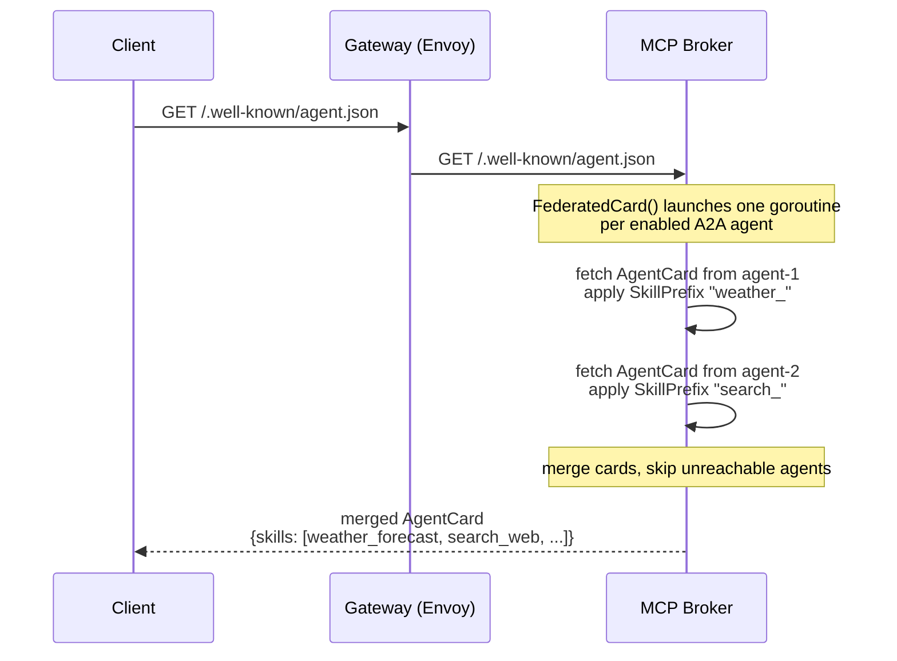
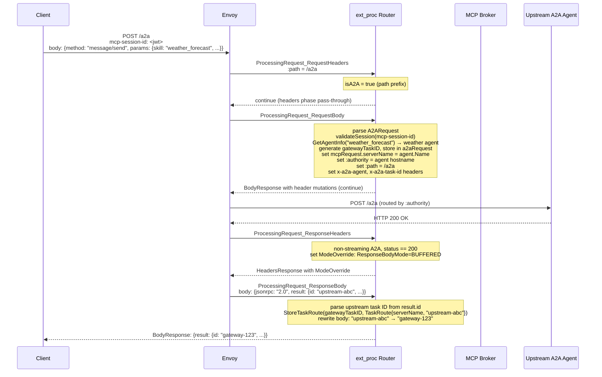
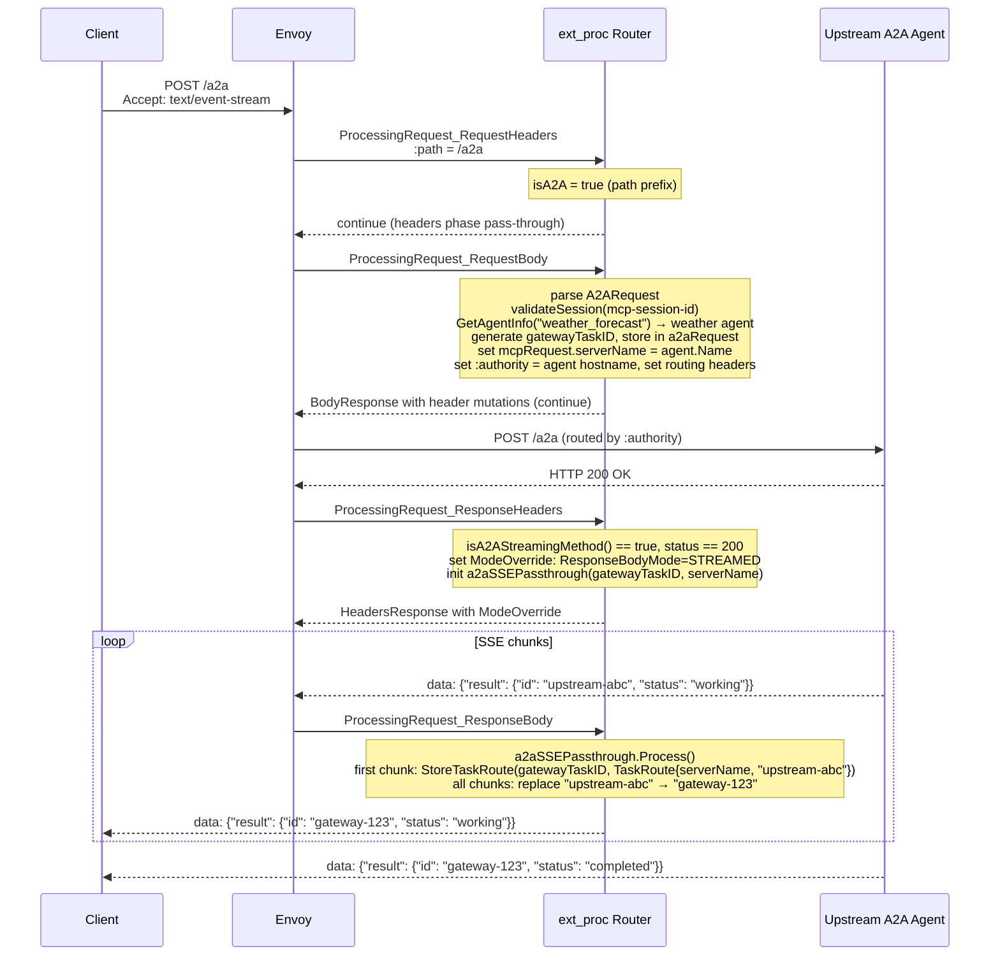
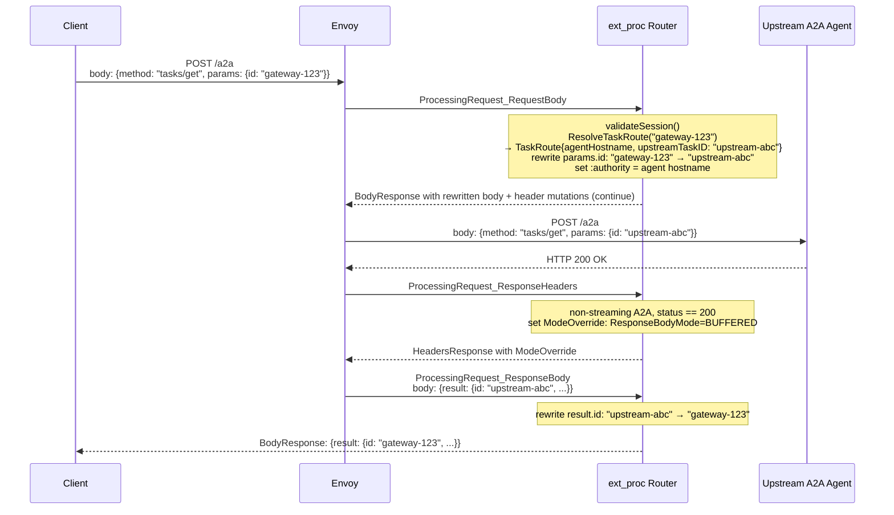
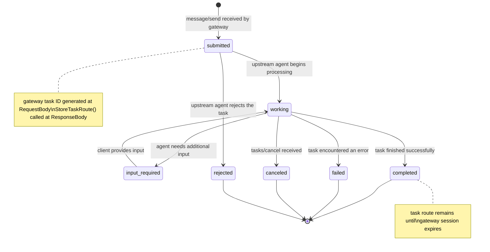

# A2A Protocol Support Design

## Problem

The MCP Gateway handles the vertical axis of agentic workloads: a single client consuming federated
tools from multiple upstream MCP servers. As agentic architectures grow, a second axis emerges — the
horizontal one. Agents increasingly delegate long-running work to other agents, discover peer
capabilities, and coordinate asynchronously over tasks that may run for seconds or days.

The Agent-to-Agent (A2A) protocol standardises this inter-agent communication layer. Today, A2A
traffic bypasses the gateway entirely. There is no AuthPolicy enforcement, no RateLimitPolicy, no
centralised agent card discovery, and no logging of inter-agent interactions. Every agent-to-agent
delegation is a direct connection outside the gateway's policy perimeter.

## Summary

This design extends the MCP Gateway to support the A2A protocol alongside MCP. A new
`A2AAgentRegistration` CRD allows operators to register upstream A2A agents with the gateway.
The broker federates their Agent Cards into a single `/.well-known/agent.json` endpoint. The
ext_proc router detects A2A traffic by path prefix and routes `message/send`, `tasks/get`, and
`tasks/cancel` requests to the correct upstream agent, rewriting task IDs at the gateway boundary.
All existing MCP behaviour is unchanged. A2A support is entirely additive.

## Goals

- Federated agent card discovery at `/.well-known/agent.json` aggregating skills from all registered
  upstream A2A agents with per-agent skill prefixes.
- A2A request routing through the ext_proc pipeline: `message/send`, `tasks/get`, `tasks/cancel`
  dispatched to the correct upstream agent based on skill prefix.
- Gateway-owned task ID mapping so the client never sees upstream task IDs and task routing works
  correctly across multiple upstream agents.
- SSE streaming passthrough for `message/send` when the client requests `Accept: text/event-stream`,
  with upstream task IDs replaced by gateway task IDs in streamed events.
- `A2AAgentRegistration` CRD and controller for registering upstream A2A agents via HTTPRoutes,
  consistent with the `MCPServerRegistration` pattern.
- Session validation: A2A requests require a valid gateway session JWT (reusing `mcp-session-id`).
- E2E tests covering agent card discovery, task submission and completion, streaming, auth, and MCP
  regression.

## Non-Goals

- Native A2A scheduler extension (extending the scheduler cache, plugins, and actions to understand
  `A2AAgentRegistration` objects natively). The shadow-queue analogy applies here: the ext_proc
  routing approach delivers working A2A support without modifying the scheduler. Native extension
  is the longer-term architectural direction.
- Webhook-based push notifications for async task completion callbacks. Polling via `tasks/get` is
  in scope; push is not.
- Skill-level JWT filtering (the A2A analog of `x-mcp-authorized` capability filtering). The
  architecture supports this as a future addition; it is not in scope for this term.
- Supporting A2A spec versions other than the one agreed with mentors at the first sync.
  **[OPEN: Q2 — which spec version to target? Needed before Week 2.]**

## Job Stories

### When a platform engineer deploys a new A2A agent

When a platform engineer has an upstream A2A agent running in their cluster, they want to register
it with the gateway so that clients can discover it via the federated agent card and send tasks
through the gateway, so that all inter-agent traffic is subject to the same AuthPolicy and
RateLimitPolicy as MCP traffic.

### When an MCP client application wants to discover available agents

When an MCP client application initializes with the gateway, it wants to query
`/.well-known/agent.json` and receive a single merged Agent Card listing all skills available
across all registered upstream agents with namespaced skill prefixes, so that it does not need
to know the addresses of individual upstream agents.

### When an agent sends a long-running task through the gateway

When an agent sends a `message/send` request to the gateway using a skill prefix to identify the
target agent, it wants to receive a gateway-owned task ID and have subsequent `tasks/get` and
`tasks/cancel` requests routed to the correct upstream agent, so that the agent never needs direct
access to upstream agents and all task interactions are mediated by the gateway.

### When an agent streams task progress

When an agent sends a `message/send` request with `Accept: text/event-stream`, it wants to receive
real-time task status updates as SSE events with consistent gateway task IDs across all streamed
events, so that it can display progress without polling.

### When a platform engineer removes an A2A agent

When a platform engineer deletes an `A2AAgentRegistration`, they want the skills from that agent
to disappear from the federated Agent Card within one reconcile cycle and for in-flight tasks to
complete or return an appropriate error, so that the gateway accurately reflects available agents
without requiring a deployment restart.

### When a client sends a request without a valid session

When a client sends a `message/send` without a valid `mcp-session-id` JWT, the gateway should
return a 401 without forwarding anything to the upstream agent, so that unauthenticated agents
cannot invoke tasks.

## Design

### Prerequisites

- An `MCPGatewayExtension` is installed and a gateway deployment is running.
- The client has completed MCP `initialize` with the gateway and holds a valid `mcp-session-id`
  JWT. A2A requests reuse this session.
  **[OPEN: Q4 — reuse mcp-session-id or separate A2A session? Needed before Week 8.]**
- Upstream A2A agents are accessible from the gateway's network and implement the A2A spec.
  **[OPEN: Q2 — which A2A spec version? Needed before Week 2.]**
- HTTPRoutes targeting upstream A2A agents are programmed and accepted by the gateway.

### Flow

#### Agent Card Discovery



#### message/send Routing (non-streaming)



#### message/send Routing (SSE streaming)



#### tasks/get Routing



#### Task Lifecycle State Machine



### Component Responsibilities

| Component | Responsibility |
|---|---|
| Controller (`A2AReconciler`) | Watches `A2AAgentRegistration` CRDs. Resolves HTTPRoute → upstream endpoint → agent card URL. Writes `A2AAgent` config to the config Secret. Sets `Ready` and `AgentCardDiscovered` status conditions. |
| Broker (`a2a.Broker`) | Implements `config.Observer`. On config change, calls `SetAgents()`. `FederatedCard()` fetches Agent Cards from all enabled upstream agents concurrently, applies `SkillPrefix`, merges into a single card. `ServeAgentCard()` serves `GET /.well-known/agent.json`. `GetAgentInfo(skillID)` resolves a prefixed skill to the upstream agent using longest-prefix matching. |
| Router (`ExtProcServer`) | Detects A2A traffic by `:path` prefix at the `RequestHeaders` phase. At the `RequestBody` phase: validates session JWT; for `message/send`/`message/stream`, calls `A2ABroker.GetAgentInfo()`, generates a gateway task ID (carried in `a2aRequest`), sets `mcpRequest.serverName` to the resolved agent name, sets routing headers (`:authority`, `:path`, `x-a2a-agent`, `x-a2a-task-id`); for `tasks/get`/`tasks/cancel`, calls `ResolveTaskRoute()` to look up the agent and upstream task ID, rewrites gateway task ID in request body to upstream task ID, sets `:authority`. At the `ResponseHeaders` phase: for all A2A requests, sets `ModeOverride ResponseBodyMode=BUFFERED` (non-streaming) or `STREAMED` (SSE) when `status == 200`. At the `ResponseBody` phase: for non-streaming, parses upstream task ID from `result.id`, calls `StoreTaskRoute(gatewayTaskID, TaskRoute{...})`, rewrites upstream task ID to gateway task ID in response body; for `tasks/get` responses, rewrites result task ID back to gateway task ID. `a2aSSEPassthrough.Process()` handles streaming: on first chunk stores `TaskRoute` and rewrites task IDs; on subsequent chunks rewrites only. |
| Config (`MCPServersConfig`) | Stores `A2AAgents []*A2AAgent` alongside `Servers`. `SetA2AAgents()`, `ListA2AAgents()` provide thread-safe access under the existing `sync.RWMutex`. `Notify()` delivers A2A agent list to observers. |
| Config Secret (`SecretReaderWriter`) | `UpsertA2AAgent()` and `RemoveA2AAgent()` follow the existing read-modify-write pattern with `retry.RetryOnConflict()`. `BrokerConfig` YAML gains an `a2aAgents` key. |
| Gateway HTTPRoute (`broker_router.go`) | `buildGatewayHTTPRoute()` gains two new rules: `/a2a` (with `stripRouterHeaders` filter removing `x-a2a-agent` and `x-a2a-task-id`) and `/.well-known/agent.json`. `httpRouteNeedsUpdate()` via `DeepEqual` ensures automatic updates on existing deployments. |
| Task Store (`session.Cache`) | New `taskRoutes sync.Map` field. `StoreTaskRoute()`, `ResolveTaskRoute()`, `DeleteTaskRoute()` follow the same in-memory/Redis duality as the session cache. Redis key prefix: `a2atask:`. TTL: from `JWTManager.GetExpiresIn()` matching the gateway session. |

### API Changes

#### A2AAgentRegistration CRD

**[OPEN: Q1 — API group: `mcp.kuadrant.io` or `a2a.kuadrant.io`? Needed before Week 3.]**

The CRD follows the `MCPServerRegistration` pattern exactly. Key fields:

```yaml
apiVersion: <tbd>.kuadrant.io/v1alpha1
kind: A2AAgentRegistration
metadata:
  name: weather-agent
  namespace: mcp-test
spec:
  skillPrefix: weather_      # immutable once set (CEL rule); prefixes all federated skill IDs
  targetRef:                 # HTTPRoute pointing to the upstream A2A agent
    group: gateway.networking.k8s.io
    kind: HTTPRoute
    name: weather-agent-route
  agentCardURL: ""           # optional override for /.well-known/agent.json path
  credentialRef:             # optional auth for fetching the agent card
    name: weather-agent-secret
    key: token
  state: Enabled             # Enabled | Disabled
status:
  conditions:
    - type: Ready
    - type: AgentCardDiscovered
  discoveredSkills: 4        # count of skills in the most recently fetched Agent Card
```

**Validation markers:**
- `skillPrefix` immutability: `+kubebuilder:validation:XValidation:rule="self == oldSelf"`
- `skillPrefix` pattern: `+kubebuilder:validation:Pattern=^[a-z0-9][a-z0-9_]*$`
- `agentCardURL` format: `+kubebuilder:validation:Pattern=^https?://`
- `targetRef` uses `omitzero` not `omitempty` (kubeapilinter requirement)

#### New config types

```go
// internal/config/a2a_types.go
type A2AAgent struct {
    Name         string      `json:"name"                   yaml:"name"`
    URL          string      `json:"url"                    yaml:"url"`
    Hostname     string      `json:"hostname,omitempty"     yaml:"hostname,omitempty"`
    SkillPrefix  string      `json:"skillPrefix,omitempty"  yaml:"skillPrefix,omitempty"`
    Auth         *AuthConfig `json:"auth,omitempty"         yaml:"auth,omitempty"`
    Credential   string      `json:"credential,omitempty"   yaml:"credential,omitempty"`
    AgentCardURL string      `json:"agentCardURL,omitempty" yaml:"agentCardURL,omitempty"`
    State        string      `json:"state"                  yaml:"state"`
}
```

`AuthConfig` is the existing type from `internal/config/types.go`. `Auth` covers bearer tokens and API keys for upstream agent card fetching; `Credential` covers the simple secret reference case. If both are set, `Auth` takes precedence.

`BrokerConfig` gains:

```go
A2AAgents []A2AAgent `json:"a2aAgents,omitempty" yaml:"a2aAgents,omitempty"`
```

#### New router headers

Defined in `internal/headers/headers.go` (shared package):

```go
const (
    A2AAgentHeader  = "x-a2a-agent"   // upstream agent name, set by router, stripped at HTTPRoute
    A2ATaskIDHeader = "x-a2a-task-id" // gateway task ID, set by router, stripped at HTTPRoute
    A2AMethodHeader = "x-a2a-method"  // A2A JSON-RPC method name
)
```

Both `x-a2a-agent` and `x-a2a-task-id` are added to `internalOnlyHeaders` in
`internal/mcp-router/headers.go` and to the `stripRouterHeaders` filter in
`broker_router.go:buildGatewayHTTPRoute()`.

### Data Storage

#### TaskStore

New methods on `session.Cache`:

```go
type TaskRoute struct {
    AgentName      string `json:"agentName"`
    AgentHostname  string `json:"agentHostname"`
    AgentPath      string `json:"agentPath"`
    UpstreamTaskID string `json:"upstreamTaskID"`
    SessionID      string `json:"sessionID"`
    CreatedAt      int64  `json:"createdAt"`
}

StoreTaskRoute(ctx context.Context, gatewayTaskID string, route TaskRoute) error
ResolveTaskRoute(ctx context.Context, gatewayTaskID string) (TaskRoute, bool, error)
DeleteTaskRoute(ctx context.Context, gatewayTaskID string) error
```

In-memory: new `taskRoutes sync.Map` field on `Cache`, separate from `inmemory` to avoid type
collision. No COW needed — values are immutable `TaskRoute` structs stored and replaced atomically
via `sync.Map.Store`, unlike the `inmemory` map whose values are `map[string]string` requiring COW.

Redis: key `a2atask:{gatewayTaskID}`, TTL from `JWTManager.GetExpiresIn(gatewaySessionID)`.
Matches the session TTL alignment established in PR #1037.

**[OPEN: Q4 — if A2A gets its own session, the TTL source changes. Needed before Week 8.]**

#### BrokerConfig Secret

The config Secret (`mcp-gateway-config`) YAML gains:

```yaml
servers: [...]
virtualServers: [...]
a2aAgents:
  - name: mcp-test/weather-agent-route
    url: http://weather-agent.mcp-test.svc.cluster.local:8080
    hostname: weather-agent.mcp.local
    skillPrefix: weather_
    state: Enabled
```

## Security Considerations

**Session validation.** All A2A requests require a valid `mcp-session-id` JWT validated by
`JWTManager.Validate()`. Requests without a valid session return 401 before reaching the upstream.
This is identical to the `validateSession()` call in `HandleToolCall()`.

**Task ID isolation.** The gateway generates its own task IDs. Clients never see upstream task IDs.
This prevents a client from probing or manipulating tasks belonging to other sessions by guessing
upstream IDs.

**Internal header stripping.** `x-a2a-agent` and `x-a2a-task-id` are stripped at both the
HTTPRoute level (via `RequestHeaderModifier` filter in `buildGatewayHTTPRoute()`) and in
`internalOnlyHeaders` in the router. A client cannot inject these headers to influence routing.

**Agent card credential isolation.** `credentialRef` on `A2AAgentRegistration` is used exclusively
by the controller to fetch Agent Cards for registration validation. It is never injected into
client `message/send` requests. The same authentication separation applies as with
`MCPServerRegistration.credentialRef`.

**Skill prefix collision.** Two `A2AAgentRegistrations` with overlapping `skillPrefix` values
would cause ambiguous routing. The `A2AReconciler` detects prefix conflicts at reconcile time
by listing all `A2AAgentRegistrations` in the namespace and comparing prefixes. A conflict sets
a `PrefixConflict` condition on the newer registration and skips writing it to the config Secret
until the conflict is resolved. No admission webhook is required.

## Relationship to Existing Approaches

A2A support is entirely additive. The `/mcp` path, all MCP request handling, all existing
`MCPServerRegistration` and `MCPVirtualServer` resources, and all existing sessions are unaffected.

The ext_proc router branches on `:path` prefix before any MCP-specific logic runs. A request
on `/mcp` never enters the A2A branch. A request on `/a2a` never enters `MCPRequest.Validate()`
or `RouteMCPRequest()`.

The broker serves both `/.well-known/agent.json` (A2A) and `/mcp` (MCP) on the same HTTP server,
following the same pattern as `/.well-known/oauth-protected-resource`.

The config hot-reload system, session cache, JWT manager, OTel instrumentation, and controller
infrastructure are all reused without modification. Only new fields and new methods are added.

**Rollback.** Deleting all `A2AAgentRegistration` resources removes A2A agents from the
federated card within one reconcile cycle. `/.well-known/agent.json` returns `{"skills":[]}`.
`/a2a` requests return routing errors (no agent found for skill). No gateway restart required.
Redis A2A task entries expire naturally via their TTLs.

## Future Considerations

**Native A2A support in the ext_proc router without path-based discrimination.** If the community
decides A2A traffic should share the `/mcp` path (discriminated by JSON-RPC method rather than
`:path`), the detection logic moves into the body phase. The controller, config plumbing, and broker
are entirely unaffected by this change. Only the router (PRs 9–10) would need rework.

**Skill-level JWT filtering.** The `x-mcp-authorized` JWT filtering pattern in
`filtered_tools_handler.go` extends naturally to A2A: an `x-a2a-authorized` header with an
`allowed-capabilities` claim containing a `skills` key. `ServeAgentCard()` would filter the
returned skills to only those the client is authorized to invoke.

**A2A-specific Prometheus metrics.** Following the OTel metrics pattern from PR #1044:
`a2a.router.task.routing` (counter), `a2a.broker.agent_card.fetch.duration` (histogram),
`a2a.router.task_store.operations` (counter with hit/miss labels).

**Webhook-based push notifications.** The A2A spec supports push notification callbacks for async
task completion. This requires the gateway to act as a notification relay and is deferred.

## Execution

See [`tasks/tasks.md`](tasks/tasks.md) for the ordered implementation plan.

See [`tasks/e2e_test_cases.md`](tasks/e2e_test_cases.md) for E2E test case definitions.
