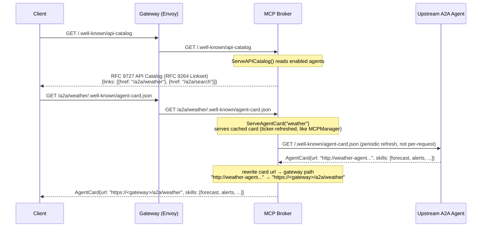
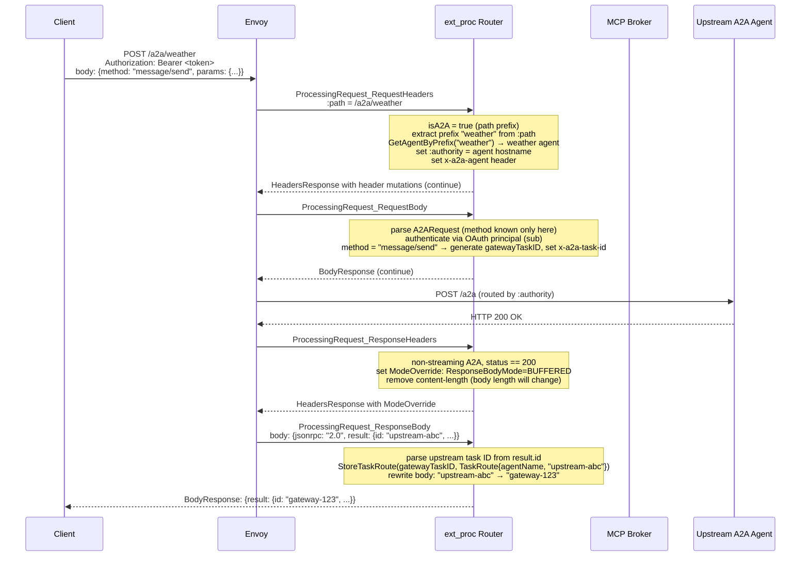
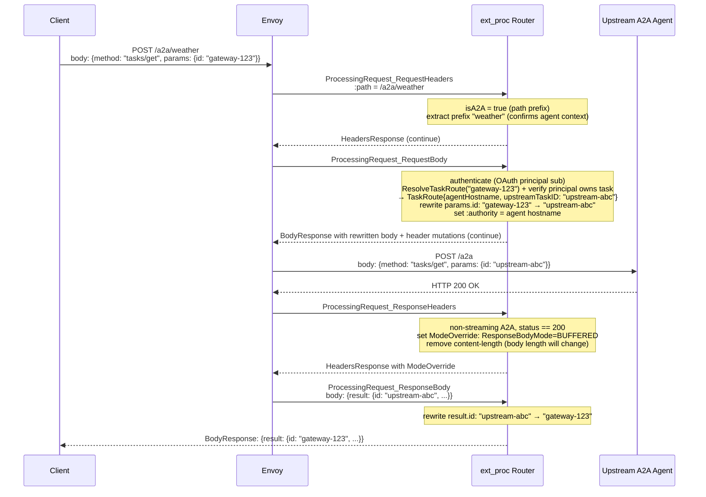

# A2A Protocol Support Design

## Problem

The MCP Gateway handles the vertical axis of agentic workloads: a single client consuming federated
tools from multiple upstream MCP servers. As agentic architectures grow, a second axis emerges — the
horizontal one. Agents increasingly delegate long-running work to other agents, discover peer
capabilities, and coordinate asynchronously over tasks that may run for seconds or days.

The Agent-to-Agent (A2A) protocol standardizes this inter-agent communication layer. Today, A2A
traffic bypasses the gateway entirely. There is no AuthPolicy enforcement, no RateLimitPolicy, no
centralized agent card discovery, and no logging of inter-agent interactions. Every agent-to-agent
delegation is a direct connection outside the gateway's policy perimeter.

## Summary

This design extends the MCP Gateway to support the A2A protocol alongside MCP. A new
`A2AAgentRegistration` CRD allows operators to register upstream A2A agents with the gateway.
The broker serves individual Agent Cards at `/a2a/{prefix}/.well-known/agent-card.json` (with
`/.well-known/agent.json` kept as a v0.2 legacy alias) and an RFC 9727 API Catalog at
`/.well-known/api-catalog` (served as an RFC 9264 Linkset) for multi-agent discovery. Each served
card has its `url` field rewritten to the gateway path, so unmodified A2A clients route through the
gateway by following the card they already fetch. The ext_proc router detects A2A traffic by path
prefix and routes `message/send`, `message/stream`, `tasks/get`, `tasks/cancel`, and
`tasks/resubscribe` requests to the correct upstream agent, rewriting task IDs at the gateway boundary.
All existing MCP behavior is unchanged. A2A support is entirely additive.

## Goals

- Agent card discovery via an RFC 9727 API Catalog at `/.well-known/api-catalog` (served as an RFC
  9264 Linkset) linking to individual agent cards at `/a2a/{prefix}/.well-known/agent-card.json` for
  each registered upstream A2A agent, with each card's `url` rewritten to the gateway path so
  unmodified A2A clients route through the gateway.
- A2A request routing through the ext_proc pipeline: `message/send`, `message/stream`, `tasks/get`,
  `tasks/cancel`, `tasks/resubscribe` dispatched to the correct upstream agent based on request path
  prefix (`/a2a/{prefix}`).
- Gateway-owned task ID mapping so the client never sees upstream task IDs and task routing works
  correctly across multiple upstream agents.
- SSE streaming passthrough for `message/stream` (the v0.3.0 streaming method, §7.2) and
  `tasks/resubscribe`, with upstream task IDs replaced by gateway task IDs in streamed events.
- `A2AAgentRegistration` CRD and controller for registering upstream A2A agents via HTTPRoutes,
  consistent with the `MCPServerRegistration` pattern.
- Authentication: A2A requests authenticate per request via an OAuth bearer (Kuadrant AuthPolicy on
  `/a2a`); task ownership is scoped to the principal (`sub`), not a session.
- E2E tests covering agent card discovery, task submission and completion, streaming, auth, and MCP
  regression.

## Non-Goals

- Native A2A scheduler extension (extending the scheduler cache, plugins, and actions to understand
  `A2AAgentRegistration` objects natively). The shadow-queue analogy applies here: the ext_proc
  routing approach delivers working A2A support without modifying the scheduler. Native extension
  is the longer-term architectural direction.
- Webhook-based push notifications for async task completion callbacks. Polling via `tasks/get` is
  in scope; push is not — but the secure **webhook-relay** architecture (so the agent can't call the
  client directly, outside the policy perimeter) is sketched in [Future Considerations](#future-considerations).
- Skill-level filtering as a gateway capability — A2A `message/send` names no skill, so there is no
  per-skill control surface; the enforceable unit is the agent (see [Policy Enforcement](#policy-enforcement)).
- Supporting multiple A2A spec versions at once — the design targets a single version (v1.0; see
  [Prerequisites](#prerequisites)) with the version-specific surface isolated so a version change is mechanical.

## Job Stories

### When a platform engineer deploys a new A2A agent

When a platform engineer has an upstream A2A agent running in their cluster, they want to register
it with the gateway so that clients can discover it via the API Catalog and send tasks
through the gateway, so that all inter-agent traffic is subject to the same AuthPolicy and
RateLimitPolicy as MCP traffic.

### When an MCP client application wants to discover available agents

When an MCP client application wants to discover available agents behind the gateway, it wants to
query `/.well-known/api-catalog` (RFC 9727) and receive links to each registered agent's endpoint
at `/a2a/{prefix}`, then fetch each agent's card at `/a2a/{prefix}/.well-known/agent-card.json`, so that
it can discover all registered agents without knowing their upstream addresses.

### When an agent sends a long-running task through the gateway

When an agent sends a `message/send` request to the gateway at the target agent's path
(`/a2a/{prefix}`), it wants to receive a gateway-owned task ID and have subsequent `tasks/get` and
`tasks/cancel` requests routed to the correct upstream agent, so that the agent never needs direct
access to upstream agents and all task interactions are mediated by the gateway.

### When an agent streams task progress

When an agent sends a `message/stream` request (the v0.3.0 streaming method, §7.2), it wants to
receive real-time task status updates as SSE events with consistent gateway task IDs across all
streamed events, so that it can display progress without polling.

### When a platform engineer removes an A2A agent

When a platform engineer deletes an `A2AAgentRegistration`, they want that agent to disappear from
the API Catalog within one reconcile cycle and for in-flight tasks to complete or return an
appropriate error, so that the gateway accurately reflects available agents without requiring a
deployment restart.

### When a client sends a request without valid auth

When a client sends a `message/send` without a valid OAuth bearer, the gateway's AuthPolicy should
return a 401 without forwarding anything to the upstream agent, so that unauthenticated agents
cannot invoke tasks.

## Design

### Prerequisites

- An `MCPGatewayExtension` is installed and a gateway deployment is running.
- The client authenticates each A2A request with an OAuth 2.1 bearer token, validated by a Kuadrant
  AuthPolicy on the `/a2a` route (the same per-request model MCP uses). Task ownership is scoped to
  the authenticated principal (token `sub`), not a session.
  **[OPEN: Q4 — confirm at the Week 8 sync. MCP 2026-07-28 (SEP-2567/SEP-2575) removes `initialize`
  and `Mcp-Session-Id`, so A2A does NOT reuse `mcp-session-id`; it authenticates per-request via OAuth
  and binds tasks to the principal (the router already reads `sub` via `ExtractSubClaim`). Open for
  David: does any client-facing gateway token survive the stateless cut, and is `/a2a` the same OAuth
  resource/audience as `/mcp` per RFC 8707? Prereq: AuthPolicy MUST be enforced on `/a2a`.]**
- Upstream A2A agents are accessible from the gateway's network and implement A2A v1.0.
  **[OPEN: Q2 — version target. This design is moving from v0.3.0 to v1.0 (v1.0.1 is the current release;
  v0.3.0 is the last 0.x line before the v1.0 major, and the `a2a-go` SDK is v1.0-only). The routing, task
  store, and policy design are
  version-agnostic; the version-specific surface — method names (`SendMessage` etc.), the well-known path
  (`/.well-known/a2a`), and the card shape (`supportedInterfaces`, named `securitySchemes`) — is isolated
  behind one mapping. Body references to v0.3.0 below are being migrated. Pending mentor confirm.]**
- HTTPRoutes targeting upstream A2A agents are programmed and accepted by the gateway.

### Flow

#### Agent Card Discovery



The broker rewrites the `url` field of each Agent Card to point at the gateway path
(`/a2a/{prefix}`) before returning it. This is what lets unmodified A2A clients route
through the gateway: a standard client reads the card's `url` and sends its
`message/send` there, so the routing key lives in the card the gateway serves rather
than in any header or out-of-band knowledge the client has to be given. The same
mechanism is used by agentgateway (Solo.io, now under the Linux Foundation), which
also rewrites agent card URLs to point at the gateway and routes per-agent rather than
multiplexing on a skill. Multi-agent discovery under one base URL is an active topic
upstream; the RFC 9727 API
Catalog (served as an RFC 9264 Linkset) used here aligns with that direction.
**[OPEN: discovery convention is held deliberately loose — commit to the RFC 9727 catalog now vs
track upstream and keep it light. David endorsed holding it loosely; pending Jason/Craig.]**

#### Upstream Agent Card sync (no card-change push)

A2A defines **no card-change notification** — none of its ten methods (§7) is a server-initiated
"agent card changed" push, and the AgentCard carries no cache/ETag hints (only a provider-defined
`version`). This differs structurally from MCP, where the broker holds a persistent connection and the
upstream pushes `notifications/tools/list_changed` (`internal/broker/upstream/manager.go:265-273`) for
near-instant updates. A2A has no such channel and no persistent discovery connection, so the gateway
**must poll**.

The broker's `A2AAgentManager` therefore mirrors only the **poll half** of `MCPManager`: a ticker
re-fetches each agent's card on a configurable interval (reusing the existing `--mcp-check-interval` /
`managerTickerInterval`, default 1 min) and re-publishes the cached card on change. There is no
notification half to mirror and no persistent connection, so the A2A manager is simpler than
`MCPManager` — a periodic HTTP GET, no session, no subscription.

The poll is kept cheap so the interval can stay short:

- **Conditional GET.** The re-fetch sends `If-None-Match`/`If-Modified-Since`; an agent server that emits
  `ETag`/`Last-Modified` returns `304 Not Modified` (no body) when unchanged.
- **Change detection (act only on change).** Layered, cheapest first: a `304` (agent supports
  conditional GET) means unchanged; else compare the card `version`; else compare a SHA-256 of the
  normalized card body — which catches providers that don't bump `version` and changes beyond skills
  (`capabilities`, input/output modes, security schemes). On no change the manager does nothing: no
  allocation, no cache swap.

The refresh updates the broker's **in-memory** card cache (a swap under the manager's `RWMutex`); it does
**not** write the config Secret. A 60s poll therefore never thrashes the Secret — the Secret is written
by the controller only on reconcile events (agent add/remove, credential change) via `UpsertA2AAgent()` →
`SetAgents()` → `Notify()`, a flow separate from card content. The controller applies the same "act only on change" discipline to
its `Ready` status — skipping the status `Update` when nothing has changed (as `MCPServer.ConfigChanged()`
already does) — so reconciles don't thrash the API server.

**Staleness bound.** A skill added upstream appears at `GET /a2a/{prefix}/.well-known/agent-card.json`
within ≤ one tick (default 1 min). Skills live in the **per-agent card**, not the API Catalog (which
lists only agent *endpoints*), so a skill change is a per-agent-card refresh; agent add/remove is the
separate, reconcile-driven path. The controller's reconcile-time fetch validates reachability at config time but is **not** surfaced as
discovered content in status (mirroring `MCPServerRegistration`, which no longer lists discovered tools) —
the live serving refresh is the broker ticker.

A client-supplied cache-busting query param is **not** used: A2A clients don't send one, it would not
force an upstream re-fetch unless explicitly wired, and wiring it would let any client trigger unbounded
upstream fetches (a DoS vector). The bounded TTL poll is the sync mechanism.

#### message/send Routing (non-streaming)



The `BUFFERED` override at ResponseHeaders must also **remove the `content-length` response header
in the same ResponseHeaders response**. The upstream's `Content-Length` is committed before the body
mutation arrives, and the task-ID rewrite changes the body length, so a fail-closed Envoy otherwise
rejects the mutation ("mismatch between content length and the length of the mutated body") and
returns a 500. Removing the header lets Envoy re-frame the response. Verified against Envoy
(Istio 1.27, `allow_mode_override: true`): with the header removed, the per-method mode change and
buffered rewrite work end-to-end. MCP never encounters this because tool-call responses are SSE and
carry no `Content-Length` — the constraint is specific to buffered JSON rewrites, and applies
equally to `tasks/get`/`tasks/cancel`.

#### message/stream Routing (SSE streaming, §7.2)

`message/stream` is the v0.3.0 streaming method (a distinct JSON-RPC method, not `message/send` with
an `Accept` header). `tasks/resubscribe` (§7.9) reuses the same passthrough.


#### SSE artifact passthrough — envelope-only parsing

A2A streaming events carry multi-modal Artifacts whose `parts` may include large base64
`FilePart.file.bytes`, `DataPart.data`, and text. The task ID the gateway must rewrite, however, lives
only at the **top of the event envelope** — `result.id` (initial `kind:task`), `result.taskId`
(`status-update`/`artifact-update`) — sibling to the heavy `status`/`artifact`/`artifacts`/`history`
fields, **never inside `parts`** (§6.4–6.7). `a2aSSEPassthrough` exploits this so it never inspects
payload bytes:

- It works line-by-line over `data:` lines (buffering a partial line until newline-complete), like the
  elicitation `sseRewriter` (`internal/mcp-router/elicitation.go`).
- Per line it unmarshals **only the JSON-RPC envelope and the result's identity fields** (`id`,
  `taskId`, `contextId`) into a struct that captures those as strings and keeps **every heavy subtree —
  `status`, `artifact`, `artifacts`, `history`, `message`, and all `parts` — as `json.RawMessage`** (the
  same discipline `sseRewriter` already uses for `params`/`result`). The router **never unmarshals,
  decodes, or re-encodes Part content**: `FilePart.file.bytes` (base64 images/files), `DataPart.data`,
  and `TextPart.text` pass through as opaque bytes.
- It swaps the upstream task ID → gateway task ID at the identity fields and re-marshals the envelope;
  the `RawMessage` subtrees are emitted byte-for-byte. For `history[].taskId` (the same task's own ID
  inside the heavy `history` of a full Task object), the rewrite is a **scoped** replacement of the
  single known upstream task-ID string within the `history` raw bytes only — never a global replace, so
  Part content cannot be corrupted.

**Cost.** Per event the router does work proportional to the **envelope size, not the artifact size** —
no base64 decode, no `Part` allocation, no re-encode of multimodal payloads; large artifacts pass
through raw. Two honest bounds: (1) the line reader still buffers a single `data:` event until its
terminating newline, so one pathological multi-MB artifact event is held whole — A2A's artifact chunking
(`append`/`lastChunk` on `artifact-update`) is the spec mechanism for streaming large outputs across
events, and there is no response-side SSE size cap today (`docs/design/security-architecture.md`), so
bound it with Envoy buffer limits or a configurable cap; (2) `RawMessage` passthrough avoids *parsing*
but the envelope re-marshal still copies those raw bytes once — if profiling shows that copy matters for
very large single events, the fallback is an in-place byte-splice of just the ID token (zero payload
copy, at the cost of more careful scoping).

#### tasks/get Routing



#### Task Lifecycle State Machine

```mermaid
stateDiagram-v2
    [*] --> submitted: message/send or message/stream received by gateway
    submitted --> working: upstream agent begins processing
    working --> input-required: agent needs additional input
    input-required --> working: client provides input
    working --> auth-required: agent needs additional authorization
    auth-required --> working: client provides authorization
    working --> completed: task finished successfully
    working --> failed: task encountered an error
    working --> canceled: tasks/cancel received
    submitted --> rejected: upstream agent rejects the task
    completed --> [*]
    failed --> [*]
    canceled --> [*]
    rejected --> [*]

    note right of submitted: gateway task ID generated at RequestBody\nStoreTaskRoute() called at ResponseBody
    note right of rejected: A2A v0.3.0 §6.3 = 9 states (kebab-case);\n'unknown' is a sentinel for indeterminate state
    note right of completed: task route deleted on terminal state;\nRedis safety-net TTL backstops crashes (idmap pattern)
```

### Component Responsibilities

| Component | Responsibility |
|---|---|
| Controller (`A2AReconciler`) | Watches `A2AAgentRegistration` CRDs. Resolves HTTPRoute → upstream endpoint → agent card URL. Writes `A2AAgent` config to the config Secret. Sets a `Ready` status condition (`Ready` = config written, mirroring `MCPServerRegistration` — no discovered-content in status). |
| Broker (`a2a.Broker`) | Implements `config.Observer`. On config change, calls `SetAgents()`. `ServeAPICatalog()` serves `GET /.well-known/api-catalog` as an RFC 9264 Linkset (`Content-Type: application/linkset+json`, registered by RFC 9727) listing all enabled agent endpoints. `ServeAgentCard(prefix)` serves `GET /a2a/{prefix}/.well-known/agent-card.json` from a cached, ticker-refreshed copy of the upstream card (mirroring `MCPManager`; not a per-request proxy), rewriting the card's `url` field to the gateway path (`/a2a/{prefix}`) so unmodified A2A clients route back through the gateway. `GetAgentByPrefix(prefix)` resolves a path prefix to the upstream agent. |
| Router (`ExtProcServer`) | At the `RequestHeaders` phase: detects A2A traffic by `:path` prefix; extracts the agent prefix from `:path`, calls `A2ABroker.GetAgentByPrefix()`, sets `:authority` to the resolved agent hostname and the `x-a2a-agent` header. The JSON-RPC method is not known until the body, so **all method-specific work happens at `RequestBody`**, not here. At the `RequestBody` phase: authenticates via the OAuth principal (`sub`, read with `ExtractSubClaim`); for `message/send`/`message/stream` generates the gateway task ID and sets `x-a2a-task-id`; for `tasks/get`/`tasks/cancel`/`tasks/resubscribe` calls `ResolveTaskRoute()`, verifies the principal owns the task, and rewrites the gateway task ID in the request body to the upstream task ID. At the `ResponseHeaders` phase: sets `ModeOverride ResponseBodyMode=BUFFERED` (non-streaming, removing `content-length` in the same response since the rewrite changes the body length) or `STREAMED` (`message/stream`/`tasks/resubscribe`) when `status == 200`. At the `ResponseBody` phase: for non-streaming methods, parses the upstream task ID from `result.id`, calls `StoreTaskRoute()`, rewrites upstream→gateway task ID (a buffered full-body JSON rewrite, distinct from the line-based SSE path), and evicts the route on a body-level `-32001`. `a2aSSEPassthrough.Process()` handles streaming: on the first `kind:task` event it stores the `TaskRoute`, and on every event it rewrites task IDs across `result.id`, `result.taskId`, and `history[].taskId` — parsing only the event envelope, with `parts` (incl. base64 `FilePart` bytes) carried through as raw `json.RawMessage`, never decoded (see [SSE artifact passthrough](#sse-artifact-passthrough--envelope-only-parsing)). |
| Config (`MCPServersConfig`) | Stores `A2AAgents []*A2AAgent` alongside `Servers`. `SetA2AAgents()`, `ListA2AAgents()` provide thread-safe access under the existing `sync.RWMutex`. `Notify()` delivers A2A agent list to observers. |
| Config Secret (`SecretReaderWriter`) | `UpsertA2AAgent()` and `RemoveA2AAgent()` follow the existing read-modify-write pattern with `retry.RetryOnConflict()`. `BrokerConfig` YAML gains an `a2aAgents` key. |
| Gateway HTTPRoute (`broker_router.go`) | `buildGatewayHTTPRoute()` gains two new rules: `/a2a` prefix match (with `stripRouterHeaders` filter removing `x-a2a-agent` and `x-a2a-task-id`, covering all `/a2a/{prefix}` paths including per-agent card endpoints) and `/.well-known/api-catalog`. `httpRouteNeedsUpdate()` via `DeepEqual` ensures automatic updates on existing deployments. |
| Task Store (`session.Cache`) | New `taskRoutes sync.Map` field (immutable `TaskRoute` values, no COW). `StoreTaskRoute()`, `ResolveTaskRoute()`, `DeleteTaskRoute()` follow the in-memory/Redis duality. Redis key prefix: `a2atask:`. TTL is a **fixed safety-net decoupled from the JWT/session** (the `idmap` pattern, `idmap/redis.go`) — A2A tasks can outlive a 24h session (§6.3), so a session-derived TTL would evict live tasks. Primary cleanup is `DeleteTaskRoute()` on a terminal `TaskState`/`-32001`; the TTL only backstops crashes. In-memory routes are torn down with the owning principal's session (or documented dev-only). |

### API Changes

#### A2AAgentRegistration CRD

The CRD goes in the `mcp.kuadrant.io` group, consistent with the planned CRD graduation
(CONNLINK-1109). The CRD follows the `MCPServerRegistration` pattern exactly. Key fields:

```yaml
apiVersion: mcp.kuadrant.io/v1alpha1
kind: A2AAgentRegistration
metadata:
  name: weather-agent
  namespace: mcp-test
spec:
  agentPrefix: weather       # immutable once set (CEL rule); path-routes requests to /a2a/weather
  targetRef:                 # HTTPRoute pointing to the upstream A2A agent
    group: gateway.networking.k8s.io
    kind: HTTPRoute
    name: weather-agent-route
  agentCardURL: ""           # optional override for /.well-known/agent-card.json path
  credentialRef:             # optional auth for fetching the agent card
    name: weather-agent-secret
    key: token
  state: Enabled             # Enabled | Disabled
status:
  conditions:
    - type: Ready             # Reason 'Ready' = config written; not a promise the agent is reachable/serving
```

**Validation markers:**
- `agentPrefix` immutability: `+kubebuilder:validation:XValidation:rule="self == oldSelf"`
- `agentPrefix` pattern: `+kubebuilder:validation:Pattern=^[a-z0-9][a-z0-9_]*$`
- `agentCardURL` format: `+kubebuilder:validation:Pattern=^https?://`
- `targetRef` uses `omitzero` not `omitempty` (kubeapilinter requirement)
- `targetRef` may reference an HTTPRoute in another namespace: the controller honors
  `targetRef.namespace`, following the same cross-namespace resolution the sibling
  controllers use (see [Security Considerations](#security-considerations) for the
  prefix-collision implications).

#### New config types

```go
// internal/config/a2a_types.go
type A2AAgent struct {
    Name         string      `json:"name"                   yaml:"name"`
    URL          string      `json:"url"                    yaml:"url"`
    Hostname     string      `json:"hostname,omitempty"     yaml:"hostname,omitempty"`
    AgentPrefix  string      `json:"agentPrefix,omitempty"  yaml:"agentPrefix,omitempty"`
    Auth         *AuthConfig `json:"auth,omitempty"         yaml:"auth,omitempty"`
    Credential   string      `json:"credential,omitempty"   yaml:"credential,omitempty"`
    AgentCardURL string      `json:"agentCardURL,omitempty" yaml:"agentCardURL,omitempty"`
    State        string      `json:"state"                  yaml:"state"`
}
```

`AuthConfig` is the existing type from `internal/config/types.go`. `Auth` covers bearer tokens and API keys for upstream agent card fetching; `Credential` covers the simple secret reference case. If both are set, `Auth` takes precedence.

`BrokerConfig` gains:

```go
A2AAgents []A2AAgent `json:"a2aAgents,omitempty" yaml:"a2aAgents,omitempty"`
```

#### New router headers

Defined in `internal/headers/headers.go` (shared package):

```go
const (
    A2AAgentHeader  = "x-a2a-agent"   // upstream agent name, set by router, stripped at HTTPRoute
    A2ATaskIDHeader = "x-a2a-task-id" // gateway task ID, set by router, stripped at HTTPRoute
    A2AMethodHeader = "x-a2a-method"  // A2A JSON-RPC method name
)
```

Both `x-a2a-agent` and `x-a2a-task-id` are added to `internalOnlyHeaders` in
`internal/mcp-router/headers.go` and to the `stripRouterHeaders` filter in
`broker_router.go:buildGatewayHTTPRoute()`.

### Data Storage

#### TaskStore

New methods on `session.Cache`:

```go
type TaskRoute struct {
    AgentName      string `json:"agentName"`
    AgentHostname  string `json:"agentHostname"`
    AgentPath      string `json:"agentPath"`
    UpstreamTaskID string `json:"upstreamTaskID"`
    Principal      string `json:"principal"` // OAuth token `sub` that owns this task; checked on every tasks/* call
    CreatedAt      int64  `json:"createdAt"`
}

StoreTaskRoute(ctx context.Context, gatewayTaskID string, route TaskRoute) error
ResolveTaskRoute(ctx context.Context, gatewayTaskID string) (TaskRoute, bool, error)
DeleteTaskRoute(ctx context.Context, gatewayTaskID string) error
```

In-memory: new `taskRoutes sync.Map` field on `Cache`, separate from `inmemory` to avoid type
collision. No COW needed — values are immutable `TaskRoute` structs stored and replaced atomically
via `sync.Map.Store`, unlike the `inmemory` map whose values are `map[string]string` requiring COW.

Redis: key `a2atask:{gatewayTaskID}`, with a **fixed safety-net TTL decoupled from the session JWT**
(the `idmap` pattern — `idmap/redis.go` uses a 1h default safety net plus an explicit `Remove`). A2A
tasks can run for "seconds or days" (§6.3) and routinely outlive a 24h session, so a JWT-derived TTL
would evict live tasks. Primary cleanup is `DeleteTaskRoute()` on a terminal `TaskState` or a
body-level `-32001 TaskNotFoundError`; the TTL only backstops process crashes.

#### Agent card cache (pluggable backend)

The broker keeps each agent card in an in-memory cache, refreshed on a ticker via conditional `GET`
from the upstream (mirroring `MCPManager`). This card store is treated as a **backend behind an
interface, not a fixed choice**: the in-memory poll cache is the steel-thread implementation, and a
**shared metadata store is a first-class future option** so that, in multi-replica / multi-gateway
deployments, every broker sees the same set of agents without each one polling independently. A registry
that natively governs agent cards (e.g. Apicurio Registry's `AGENT_CARD` artifacts, aligned with A2A
v1.0) is one such backend — the broker would read from the store rather than polling each upstream.
Out of scope for the PoC; kept behind an interface so it is not locked out.

#### BrokerConfig Secret

The config Secret (`mcp-gateway-config`) YAML gains:

```yaml
servers: [...]
virtualServers: [...]
a2aAgents:
  - name: mcp-test/weather-agent-route
    url: http://weather-agent.mcp-test.svc.cluster.local:8080
    hostname: weather-agent.mcp.local
    agentPrefix: weather
    state: Enabled
```

## Security Considerations

**Authentication.** A2A authenticates per request via an OAuth 2.1 bearer token, validated by a
Kuadrant AuthPolicy/Authorino on the `/a2a` route (the same model MCP uses; the MCP/A2A auth specs
require a bearer on every request, audience-bound per RFC 8707). The router reads the authenticated
principal (`sub`) at `RequestBody` via `ExtractSubClaim` (`internal/jwt/decode.go`), exactly as the
existing URL-elicitation path does. **AuthPolicy MUST be enforced on `/a2a`**: `ExtractSubClaim`
decode-trusts an already-validated bearer, so without edge validation the `sub` would be forgeable.
For deployments issuing opaque (non-JWT) access tokens, the principal must instead come from an
Authorino-signed trusted header (the `x-mcp-authorized`/ES256 machinery, verified today in the
broker) — the documented hardening path.

**Task ID isolation.** The gateway generates its own task IDs (UUIDv4); clients never see upstream
task IDs. Task ownership is bound to the OAuth principal — `tasks/get`/`tasks/cancel`/`tasks/resubscribe`
verify the requesting principal owns the resolved `TaskRoute` (SEP-2567 §Security: validate
`(handle, auth_context)` on every call), so a client cannot probe or cancel another principal's task
by guessing a gateway task ID.

**Internal header stripping.** `x-a2a-agent` and `x-a2a-task-id` are stripped at both the
HTTPRoute level (via `RequestHeaderModifier` filter in `buildGatewayHTTPRoute()`) and in
`internalOnlyHeaders` in the router. A client cannot inject these headers to influence routing.

**Agent card credential isolation.** `credentialRef` on `A2AAgentRegistration` is used exclusively
by the controller to fetch Agent Cards for registration validation. It is never injected into
client `message/send` requests. The same authentication separation applies as with
`MCPServerRegistration.credentialRef`.

**Cross-namespace path prefix collision.** `A2AAgentRegistrations` from multiple namespaces are
aggregated into one gateway's config (mirroring `MCPServerRegistration`, which writes to every valid
gateway-extension namespace whose listener the route attaches to), so two agents in *different*
namespaces can both claim prefix `weather` and collide at the broker's `prefix→agent` map. A
per-namespace listing **cannot** detect this, and on a multi-tenant gateway (`allowedRoutes` admits
both namespaces) it is a cross-tenant traffic hijack, not just an operational clash. **Oldest-`creationTimestamp`-wins
tiebreaking is rejected** — it is timing-dependent and so non-deterministic under reconcile and GitOps,
where creation order carries no meaning. The recommended resolution is to **namespace-qualify the routing
path as `/a2a/{namespace}/{prefix}`**, which makes collision structurally impossible (uniqueness reduces
to a namespace-scoped check) and gives tenant isolation by construction. **[OPEN: adopting this switches
the path form from `/a2a/{prefix}` (used throughout this doc) to `/a2a/{namespace}/{prefix}` everywhere —
recommend the switch; pending mentor confirm.]** Cross-namespace registration is **allowed**: the A2A
controller honors `targetRef.namespace`, so a registration may target an HTTPRoute in another namespace.

## Policy Enforcement

A2A's primary justification is that inter-agent traffic flows through the same Kuadrant policy plane as
MCP — authentication, authorization, rate limiting, observability — instead of agent-to-agent calls
bypassing the gateway. All A2A traffic transits the `/a2a` HTTPRoute, so every Kuadrant policy that
attaches to a Gateway listener or HTTPRoute applies unchanged. Enforcement needs **no gateway code** —
it is Kubernetes resource configuration. This is also why routing is path-per-agent: Kuadrant policies
attach to HTTPRoutes, so giving each agent its own `/a2a/{prefix}` path lets an operator attach a
*distinct* `AuthPolicy`/`RateLimitPolicy` per agent. A body-level discriminator (such as A2A v1.0's
`tenant` field) can still carry per-agent *enforcement* — `ext_proc` can lift it into a request header
for Authorino/Limitador to key on, exactly as the router exposes `x-mcp-toolname` — but it has no
policy *attachment* point, so every agent would share one policy rather than each getting its own.

### Authentication and per-agent authorization (AuthPolicy)

An operator attaches an `AuthPolicy` as for MCP (`config/e2e/auth/mcps-auth-policy.yaml`).
Authentication validates the OAuth2/OIDC bearer; authorization enforces **per-agent** RBAC using the
router-set `x-a2a-agent` header, analogous to MCP's per-tool check on `x-mcp-toolname`:

```yaml
apiVersion: kuadrant.io/v1
kind: AuthPolicy
metadata:
  name: a2a-auth-policy
  namespace: gateway-system
spec:
  targetRef:                      # target the named `a2a` rule to scope strictly to A2A traffic
    group: gateway.networking.k8s.io
    kind: HTTPRoute
    name: mcp-gateway-route
    sectionName: a2a
  rules:
    authentication:
      keycloak:
        jwt:
          issuerUrl: https://keycloak.example.com/realms/agents
    authorization:
      agent-access-check:
        when:
          - predicate: "request.headers.exists(h, h == 'x-a2a-agent')"
        patternMatching:
          patterns:
            - predicate: |
                ('agent:' + request.headers['x-a2a-agent']) in
                (has(auth.identity.resource_access) ? auth.identity.resource_access['a2a'].roles : [])
```

**Filter ordering.** ext_proc runs before Authorino (the EnvoyFilter inserts ext_proc `INSERT_FIRST`),
so the router sets `x-a2a-agent` at the `RequestHeaders` phase — from the immutable `:path`, before the
body is read — and Authorino reads it for the per-agent decision (the same ordering MCP relies on for
`x-mcp-toolname`, see `docs/design/security-architecture.md`). `x-a2a-agent` is router-derived and
stripped from client input (HTTPRoute `RequestHeaderModifier` + `internalOnlyHeaders`), so a client
cannot forge it to reach an unauthorized agent. Token exchange (RFC 8693) is available identically to
MCP. Per-agent policies can also attach to each agent's own HTTPRoute (`targetRef`), enforced on the
`:authority`-rewritten second hop — mirroring MCP's per-server AuthPolicy.

### Skill-level filtering — not applicable to A2A

Unlike MCP's per-tool filtering, A2A has no per-skill control surface: `message/send` carries **no
skill** (no `skill`/`skillId` in `MessageSendParams`, in both v0.3.0 and v1.0) — the client sends
message parts and the agent decides what to do — so the gateway has no skill to authorize or filter on.
The enforceable unit for A2A is the **agent**, not the skill: authorization is the agent-level Kuadrant
AuthPolicy on `/a2a/{prefix}` (above). Any per-skill visibility on the served card would be cosmetic,
not an access-control boundary, so it is out of scope.

### RateLimitPolicy

A `RateLimitPolicy` on the `/a2a` route throttles abuse with no gateway code (Limitador enforces before
ext_proc). Useful dimensions: the `x-a2a-method` header (rate `message/stream`/`tasks/resubscribe` —
long-lived streams — more strictly than `tasks/get` polls) and the authenticated principal (counter
qualifier on `auth.identity.sub`).

### Observability

A2A routing emits OpenTelemetry spans on the same tracer as MCP — a router span per request
(`x-a2a-method`, agent prefix, gateway task ID), a broker span on agent-card fetch/refresh, and
task-store operations — while Authorino and Limitador export their own auth/rate-limit decision metrics.
A2A-specific Prometheus metrics are in [Future Considerations](#future-considerations).

### Distributed tracing for async tasks

A2A is asynchronous: `message/send` (one HTTP request → one trace), then `tasks/get`/`tasks/cancel`/
`tasks/resubscribe` minutes or hours later (separate requests → separate traces). W3C trace context
(`traceparent`, extracted today by `extractTraceContext`, `internal/mcp-router/tracing.go:46`) links the
hops **within** a single request — client → gateway → agent — but cannot link request 1 to request 2:
different requests carry different trace IDs, so a stalled task's lifecycle is fragmented across N traces.
Two complementary layers fix this:

- **Inter-request correlation (the floor).** Every A2A span carries `a2a.task.id = {gatewayTaskID}` as an
  attribute (alongside `a2a.method`, `a2a.agent`, and the operator-only `a2a.upstream.task.id`), set via
  an `a2aSpanAttributes()` analog of the existing `spanAttributes()` (`tracing.go:51`). The gateway task
  ID is stable across every request for the task, so a single backend query —
  `{ span.a2a.task.id = "gateway-123" }` in Tempo, the equivalent tag search in Jaeger — gathers **all**
  traces touching the task (send, polls, cancel) into one view. `a2a.upstream.task.id` additionally
  stitches the gateway's spans to the agent's own traces, if the agent emits OTel.
- **Span links (the enhancement).** The `message/send` span's trace context (`traceID`/`spanID`) is stored
  in the `TaskRoute` (extending the gateway↔backend correlation `idmap.Entry` already keeps via
  `ServerName`/`SessionID`). Each later operation adds an OpenTelemetry **Span Link** back to the creating
  span, which Jaeger/Tempo render as clickable cross-trace navigation — richer than tag search, but
  dependent on storing the context and on backend link rendering. The attribute is the must-have (works in
  any backend with tag search); links are additive.

**Cardinality.** `a2a.task.id` is high-cardinality (one value per task). That is correct on a **span**
(trace backends index attributes for search) but must **not** become a Prometheus metric label — the A2A
metrics ([Future Considerations](#future-considerations)) use bounded labels (`method`, `agent`,
`hit`/`miss`) and reference a task only via trace exemplars, never as a metric dimension.

## Upstream Authentication

A2A has two distinct gateway→agent paths with different credential models — the same split MCP uses, and
the reason MCP keeps `credentialRef` off the client path.

### Card discovery (broker → agent): Gateway-to-Agent via `credentialRef`

The broker fetches each agent card on a ticker — there is **no client** in this flow. If the card
endpoint requires auth, the broker presents the static credential from `A2AAgentRegistration.credentialRef`
(the A2A analog of `MCPServerRegistration.credentialRef`, used by the broker for discovery only). The
router never sees `credentialRef` — confirmed for MCP (`internal/mcp-router/` has no access to it), and
the same isolation holds for A2A.

### Task invocation (client → agent): client identity, not `credentialRef`

`message/send` / `tasks/*` carry a real client, so — exactly as MCP `tools/call` — the upstream credential
is the **client's identity**, never the gateway's static `credentialRef`. Injecting a static service
credential here is the **confused-deputy** anti-pattern: the agent loses the caller's identity and a
low-privilege client rides the gateway's credential. The agent's `securitySchemes`/`security` (§5) declare
what it accepts. Two modes, mirroring MCP:

- **Token pass-through (default).** The client's `Authorization: Bearer` is forwarded to the agent (MCP
  forwards client headers verbatim unless exchange is configured — `request_handlers.go:706-714` passes
  `authorization` through). Works when the agent trusts the same issuer and the token's audience covers
  the agent.
- **Token exchange (recommended).** A Kuadrant AuthPolicy has Authorino perform RFC 8693 exchange,
  replacing the client token with one scoped and **re-audienced to the agent** before the call (the
  pattern in `config/samples/oauth-token-exchange/tools-call-auth.yaml`). This preserves the caller's
  identity while limiting blast radius, and satisfies RFC 8707 audience binding — a token minted for the
  `/a2a` resource is otherwise wrong-audience for the agent. No gateway code; it is AuthPolicy config.

The agent's **per-skill** `security` is advisory at the gateway: since `message/send` names no skill
(§7.1.1), the gateway authenticates at the agent level and the agent applies any per-skill requirement
itself — consistent with [Policy Enforcement](#policy-enforcement) (the agent, not the skill, is the
gateway's boundary).

### Exception: static-key / mTLS-only agents

If an agent advertises only `apiKey` or `mutualTLS` (no OIDC the client could satisfy), there is no
client token the agent would accept. The operator may then opt into **Gateway-to-Agent on the invocation
path** — a per-agent static credential the gateway injects. This is acceptable **only** because the
gateway is the enforcement point: per-client authorization MUST be enforced at the gateway by the
per-agent AuthPolicy ([Policy Enforcement](#policy-enforcement)) before the call, and per-user audit then
lives at the gateway, not the agent. It is an explicit opt-in, not the default, and takes the
confused-deputy trade-off knowingly.

### Summary

| Path | Who authenticates | Mechanism |
|---|---|---|
| Card fetch (discovery) | gateway | `credentialRef` (static, broker-held) |
| `message/send`/`tasks/*` — default | client | forward client bearer |
| `message/send`/`tasks/*` — recommended | client | RFC 8693 token exchange (Authorino) → agent-audience token |
| static-key / mTLS-only agent | gateway (opt-in) | per-agent static credential; client authz enforced at gateway AuthPolicy |

### Card integrity (signed cards)

With v1.0 the target ([Q2](#prerequisites)), signed cards are in scope. **v1.0 AgentCards carry JWS
signatures** (over the canonicalized card), and the signature covers the interface URL(s) — so the
broker's url-rewrite (which the flows and [Component Responsibilities](#component-responsibilities)
describe, and which is transparent for the unsigned cards of v0.3.0) **would invalidate a v1.0
signature**. Reconciling that rewrite is part of the v1.0 surface migration.

The direction that avoids re-signing: the gateway routes by `:path` prefix (and, in v1.0, the `tenant`
field), **not** by the card's URL, so it can **serve the card verbatim** and let the RFC 9727 catalog
advertise the gateway endpoint + per-agent prefix/tenant. **Open dependency:** this only routes clients
through the gateway if they discover the endpoint from the catalog/tenant rather than from the card's own
`supportedInterfaces[].url` (which, served verbatim, points at the agent — a bypass). Whether v1.0
clients reliably do so needs validating before it is settled.

The alternative is **re-signing at the gateway** (rewrite the URL, re-sign with a gateway key) — correct
for any client, but it makes the gateway a **card-signing trust authority** (key management, a trust-root
decision), out of scope unless explicitly needed.

And if a [pluggable card store](#agent-card-cache-pluggable-backend) (e.g. a registry) is the card source
rather than the upstream agent: does the store preserve the agent's original signature or re-sign on
publish — i.e. does the registry become the trust authority? That changes who the client verifies, and is
the piece to settle before leaning on a registry as a source.

## Relationship to Existing Approaches

A2A support is entirely additive. The `/mcp` path, all MCP request handling, all existing
`MCPServerRegistration` and `MCPVirtualServer` resources, and all existing sessions are unaffected.

The ext_proc router branches on `:path` prefix before any MCP-specific logic runs. A request
on `/mcp` never enters the A2A branch. A request on `/a2a/{prefix}` never enters `MCPRequest.Validate()`
or `RouteMCPRequest()`.

The broker serves `/.well-known/api-catalog` and `/a2a/{prefix}/.well-known/agent-card.json` (A2A)
alongside `/mcp` (MCP) on the same HTTP server, following the same pattern as
`/.well-known/oauth-protected-resource`.

The config hot-reload system, session cache, JWT manager, OTel instrumentation, and controller
infrastructure are all reused without modification. Only new fields and new methods are added.

**Rollback.** Deleting all `A2AAgentRegistration` resources removes A2A agents from the API
Catalog within one reconcile cycle. `/.well-known/api-catalog` returns an empty link list.
`/a2a/{prefix}` requests return routing errors (no agent found for prefix). No gateway restart required.
Redis A2A task entries expire naturally via their TTLs.

## Future Considerations

**A2A-specific Prometheus metrics.** Following the gateway's existing OTel metrics pattern:
`a2a.router.task.routing` (counter), `a2a.broker.agent_card.fetch.duration` (histogram),
`a2a.router.task_store.operations` (counter with hit/miss labels).

**Webhook-based push notifications (relay architecture).** A2A's `tasks/pushNotificationConfig/set`
lets a client register a webhook `url` that the **agent** POSTs to when a task updates
(`PushNotificationConfig{url, token, id, authentication}`, §7.5). Forwarding this config to the agent
verbatim would have the agent call the client's webhook **directly** — outside the gateway entirely: no
AuthPolicy, no RateLimitPolicy, no observability, and the callback payload would carry **upstream** task
IDs, breaking task-ID isolation. To support push securely the gateway must act as a **webhook relay**,
reusing the mechanisms it already uses for the card `url` and task IDs:

1. **Intercept `set`.** Rewrite `pushNotificationConfig.url` to a gateway-internal callback
   (`/a2a/push/{callbackID}`) and store `{callbackID → client url, client token/authentication,
   gatewayTaskID}` beside the `TaskRoute`. Replace `token`/`authentication` with a **gateway-issued**
   credential so the agent authenticates to the gateway's webhook, not the client's. Forward the
   rewritten config to the agent.
2. **Agent → gateway webhook.** The agent POSTs task updates to `/a2a/push/{callbackID}` — a normal
   gateway ingress, so AuthPolicy, RateLimitPolicy, and tracing (`a2a.task.id`) all apply. The gateway
   validates the gateway-issued credential, rewrites upstream→gateway task IDs in the payload (the same
   buffered rewrite as `tasks/get`), then forwards to the client's real webhook using the client's
   originally-configured `token`/`authentication`, so the client validates authenticity via the `token`
   it set.

This keeps both legs inside the policy perimeter and preserves task-ID and credential isolation
end-to-end. It is deferred (polling via `tasks/get` covers the PoC); the architecture is recorded so the
extension is additive when prioritized.

## Execution

See [`tasks/tasks.md`](tasks/tasks.md) for the ordered implementation plan.

See [`tasks/e2e_test_cases.md`](tasks/e2e_test_cases.md) for E2E test case definitions.
