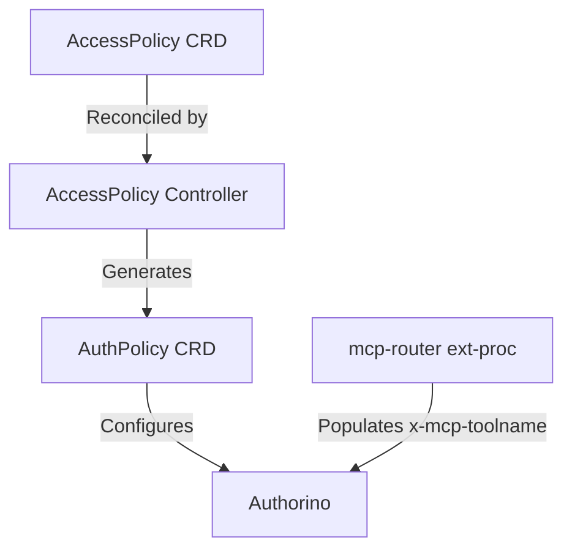
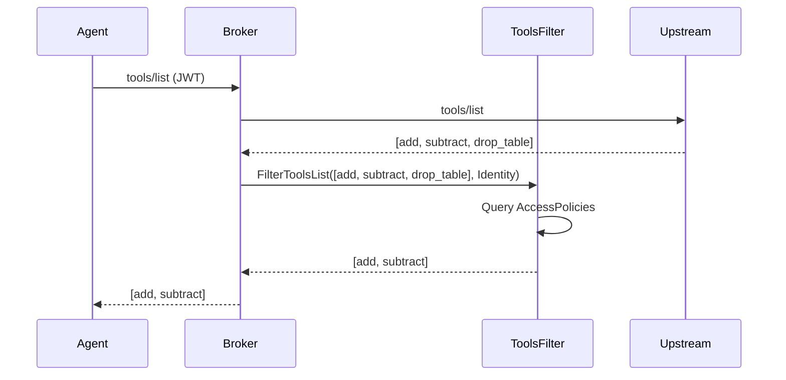
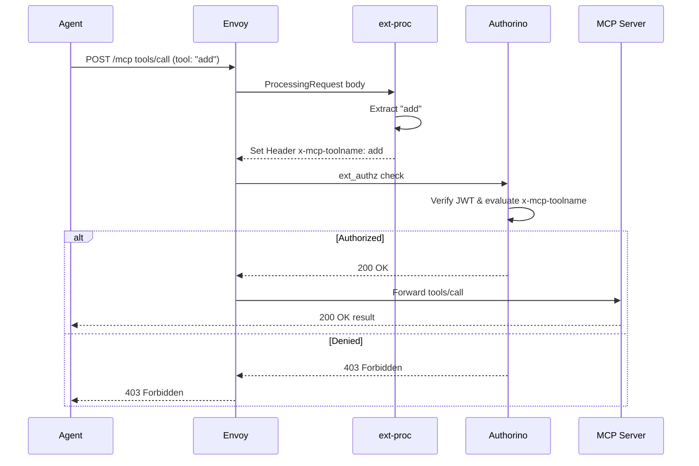

# Tool-Level Authorization using AccessPolicy

This document outlines the design for implementing per-tool authorization in the MCP Gateway using the `AccessPolicy` CRD defined by the kube-agentic-networking SIG.

## Overview

The MCP Gateway currently handles authentication and coarse-grained authorization at the gateway level using Authorino. However, there is no built-in mechanism for fine-grained, tool-based authorization (e.g., allowing Agent A to call `add` but denying `delete_user`). 

The `AccessPolicy` CRD provides a standard API for tool-level authorization. This design implements a controller that translates `AccessPolicy` rules into `AuthPolicy` resources that Authorino can enforce, leveraging the `x-mcp-toolname` header already populated by the `ext-proc` component.

## 1. AccessPolicy to AuthPolicy Mapping

The AccessPolicy controller translates tool-level intent into Authorino pattern-matching configuration.

### Direct AuthPolicy Generation
The controller watches `AccessPolicy` CRDs and generates/updates `AuthPolicy` resources. Authorino enforces these policies using its existing OPA/Rego pattern matching capabilities.

**Mapping Logic:**
1. **Target**: `AccessPolicy.Spec.TargetRefs` maps to `AuthPolicy.Spec.TargetRef`.
2. **Identity**: `AccessPolicy.Spec.Rules[].Source.OIDC` maps to `AuthPolicy.Spec.AuthScheme.Identity` definitions.
3. **Authorization**: `AccessPolicy.Spec.Rules[].Tools` translates to `PatternExpression` rules checking `context.request.http.headers.x-mcp-toolname` against allowed tools.

## 2. Body Parsing Strategy

The MCP Gateway needs to parse JSON-RPC bodies to extract tool metadata.

**Current State (ext-proc):**
The `internal/mcp-router` (ext-proc) currently handles JSON-RPC body parsing and sets the `x-mcp-method`, `x-mcp-toolname`, and `x-mcp-servername` headers. 

**Decision:** We will continue using the `ext-proc` for body parsing in the initial prototype. The `ext-proc` sits before `ext_authz` (Authorino) in the Envoy filter chain, meaning Authorino receives the fully populated headers for its authorization evaluation. 

*Future Consideration*: Envoy v1.38 introduces a native MCP filter. If adopted, it could populate dynamic metadata natively, which downstream filters could consume. However, `ext-proc` is sufficient for the current implementation and requires no architectural shift.

## 3. Identity Model

The upstream AccessPolicy specification supports `ServiceAccount`, `SPIFFE`, and `OIDC` source types.

**Decision:** The initial implementation focuses on **OIDC**.
Authorino natively handles OIDC identity extraction and validation via JWTs. Supporting OIDC maps directly to `kuadrantv1.OIDCIdentity` in the generated `AuthPolicy`.

## 4. tools/list Filtering

Returning the full list of tools to an agent that cannot execute them constitutes an information leak. The `tools/list` response must be filtered.

**Strategy:**
Filtering will happen dynamically inside the gateway broker component during the federation process.
1. The `Broker` receives a `tools/list` request.
2. The `ToolsFilter` component intercepts the request, inspecting the caller's identity.
3. The `ToolsFilter` queries all active `AccessPolicy` resources in the namespace targeting the backend.
4. It computes the allowed tool intersection and removes unauthorized tools from the federated `tools/list` response before returning it to the agent.

## 5. Flow Sequence

