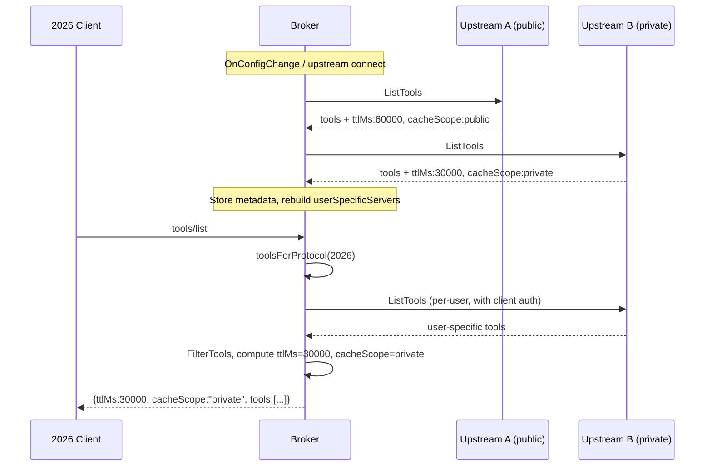

# Broker: MCP `2026-07-28` Protocol Support

## Problem

The broker federates tools and prompts from multiple upstream MCP servers. The `2026-07-28` spec adds mandatory `ttlMs` and `cacheScope` fields to list results and replaces GET SSE notifications with `subscriptions/listen`. The broker currently ignores upstream cache values and uses the old notification pattern.

Builds on [router-2026-07-28](../router-2026-07-28/router-2026-07-28-design.md) and [single-gateway-dual-protocol](../single-gateway-dual-protocol/single-gateway-dual-protocol-design.md).

## Summary

Isolate protocol-specific broker behavior behind a `ProtocolHandler` interface with `2025-11-25` and `2026-07-28` implementations. This keeps version-branching logic out of shared code paths and makes 2025 removal a clean delete. Store upstream `ttlMs` and `cacheScope` per server. Derive aggregated values on list responses: `min(ttlMs)`, `"private"` if any upstream is private. For 2026 upstreams, `cacheScope: "private"` supersedes `userSpecificList` on the CRD. Replace GET SSE `notificationWatcher` with `subscriptions/listen` for 2026 upstreams.

## Goals

- **G1:** List responses to 2026 clients include `ttlMs` and `cacheScope` derived from upstream values
- **G2:** `cacheScope: "private"` from a 2026 upstream triggers per-user tool fetching, superseding `userSpecificList`
- **G3:** Upstream notifications from 2026 backends use `subscriptions/listen`
- **G4:** 2025 client responses unchanged (compat handler continues stripping)
- **G5:** Protocol-specific broker logic isolated behind an interface so 2025 removal is a clean delete

## Non-Goals

- MRTR / `InputRequiredResult` (router concern — `tools/call` goes directly to backend via Envoy)
- Per-request `_meta` capabilities for elicitation (tracked in `router-2026-07-28/tasks/broker-2026-scope.md` Item 5)
- Stateless equivalents for `discover_tools`/`select_tools` (needs a scoping mechanism without sessions)
- `userSpecificList` removal from the CRD (backward compat for 2025 backends)
- TTL-based routing table refresh in the router
- Other 2026 features (tasks extension, resource subscriptions)

## Job Stories

### When a 2026 client lists tools from a gateway with mixed cache scopes

The response must be `cacheScope: "private"` so shared intermediaries do not serve one user's tool list to another.

### When an upstream declares private scope via the 2026 protocol

The gateway automatically fetches per-user tools from that upstream without requiring `userSpecificList: true` on the MCPServerRegistration. The upstream's own declaration is authoritative.

### When a 2026 upstream sends a tools list changed notification

The broker receives the change via `subscriptions/listen`, updates its aggregated tool list, and notifies subscribed 2026 clients through the SDK's subscription system.

## Constraints

### Aggregated ttlMs

`min(upstream ttlMs values)`. If any upstream reports `0`, the aggregate is `0`.

### Aggregated cacheScope

Any private-scoped upstream or `userSpecificList` server makes the entire response `"private"`. No partial caching — the response is one aggregated list.

### userSpecificList coexistence

2025 upstreams: `userSpecificList: true` on CRD remains the per-user signal (no `cacheScope` in protocol). 2026 upstreams: `cacheScope: "private"` is authoritative, CRD field ignored. Both feed the same internal per-user fetch path.

## Design

### Prerequisites

- `mcp-go` SDK `v1.7.0` (bump from `v1.7.0-pre.3`) — stable release with full `2026-07-28` support: `CacheableResult`, `SubscriptionsListenParams`, MRTR types, `server/discover`
- Dual-protocol gateway (done)
- Protocol version tracking per upstream (done) — `serverVersions` map

### Protocol handler isolation

Version-conditional logic is currently scattered across `user_specific_tools.go`, `protocol_filter.go`, `discovery.go`, and `http_compat.go` as inline `if version == protocol.Version2026` branches. Adding more (ttlMs aggregation, cacheScope-driven fetching, notification watcher selection) would deepen the entanglement.

A `ProtocolHandler` interface encapsulates version-specific behavior:

```go
// internal/broker/protocol_handler.go
type ProtocolHandler interface {
    // FetchUserSpecificTools fetches per-user tools using the protocol's fetch strategy
    FetchUserSpecificTools(ctx context.Context, servers []userSpecificServer, headers http.Header, result *mcp.ListToolsResult)
    // IsUserSpecific returns true if the server needs per-user tool fetching
    IsUserSpecific(srv userSpecificServer, meta *cacheMetadata) bool
    // AggregateCache computes ttlMs and cacheScope for the list response
    AggregateCache(contributing []cacheMetadata) (ttlMs int, cacheScope string)
    // StartNotificationWatcher starts the appropriate notification mechanism for an upstream
    StartNotificationWatcher(ctx context.Context, server *upstream.MCPServer) 
}
```

**`ProtocolHandler2025`**: stateful fetch via session pool, `userSpecificList` CRD field for per-user detection, no cache aggregation (compat handler strips), GET SSE `notificationWatcher`.

**`ProtocolHandler2026`**: stateless connect-list-close, `cacheScope: "private"` for per-user detection, `min(ttlMs)` / pessimistic `cacheScope` aggregation, SDK `subscriptions/listen`.

The `filteringMiddleware` and `OnConfigChange` select the handler by protocol version. The `protocolRouter` already dispatches HTTP requests by version — this extends the pattern into the broker's internal logic.

When 2025 is dropped: delete `ProtocolHandler2025`, the `compatHandler`, session resurrection, and all session management code.

### Upstream cache metadata

The upstream manager stores `ttlMs` and `cacheScope` per server from each `ListTools`/`ListPrompts` response.

```go
// upstream/mcp.go
type cacheMetadata struct {
    TTLMs      int
    CacheScope string // "public" or "private"
}
```

Defaults: `TTLMs: 0`, `CacheScope: "public"` (2025 backends via SDK).

The spec puts `ttlMs`/`cacheScope` on every list result type (`tools/list`, `prompts/list`, `resources/list`, `resources/read`). The broker currently federates tools and prompts only. Cache metadata is stored per upstream, not per result type — sufficient while resources are unsupported. When resources are added, metadata should be stored per result type per upstream.

When `CacheScope` changes, the broker rebuilds `userSpecificServers` to include/exclude the server. 2026 upstreams with `"private"` scope are added to the slice alongside CRD-declared `userSpecificList` servers.

### Aggregated values in filteringMiddleware

After `FetchUserSpecificTools` and `FilterTools` run, the middleware computes aggregated `ttlMs` and `cacheScope` from contributing upstreams and sets them on the result.

For 2025 clients, the compat handler strips these fields downstream — no change needed there. 2026 clients already bypass the compat handler via `protocolRouter` (verification task only).

### subscriptions/listen for 2026 upstreams

The current `notificationWatcher` uses GET SSE to receive list-changed notifications. 2026 backends may not support this endpoint.

For 2026 upstreams, the broker uses the SDK client's `subscriptions/listen` instead, subscribing to `toolsListChanged` and `promptsListChanged`. Selection is based on `UsesStatelessProtocol()`.

On the broker-as-server side, the SDK's stateless `StreamableHTTPHandler` handles `subscriptions/listen` from 2026 clients. The broker's existing `RemoveTools`/`AddTools` calls on the gateway server trigger SDK-level notifications — no additional wiring expected.

2025 upstreams continue using the existing `notificationWatcher` unchanged.

### Flow



### Component Responsibilities

| Component | Responsibility |
|-----------|---------------|
| **ProtocolHandler** | Version-specific: user-specific fetch strategy, per-user detection, cache aggregation, notification mechanism |
| **ProtocolHandler2025** | Stateful fetch, CRD-based per-user detection, GET SSE notifications, no cache aggregation |
| **ProtocolHandler2026** | Stateless fetch, cacheScope-based per-user detection, `subscriptions/listen`, ttlMs/cacheScope aggregation |
| **Upstream manager** | Store `cacheMetadata` per upstream, notify broker on scope changes |
| **filteringMiddleware** | Delegates to `ProtocolHandler` for cache aggregation after filtering |

### API Changes

None. `userSpecificList` stays for 2025 backward compat.

## Security Considerations

- **cacheScope correctness.** Wrong `"public"` on a response containing per-user tools leaks tool lists across users. The design is pessimistic: any private upstream makes the response private.
- **ttlMs manipulation.** A malicious upstream returning a large `ttlMs` could cause stale lists. `min()` across upstreams bounds freshness.
- **subscriptions/listen** uses the same `credentialRef` auth as `ListTools`.

## Future Considerations

- **Deprecate `userSpecificList`** once 2025 support is dropped
- **TTL-based routing table refresh** using the broker's aggregated `ttlMs`
- **Stateless `discover_tools`/`select_tools`** via `requiredHeaders` or `requestState`

## Execution

See:
- TODO Tasks for the implementation plan
- TODO for test cases
