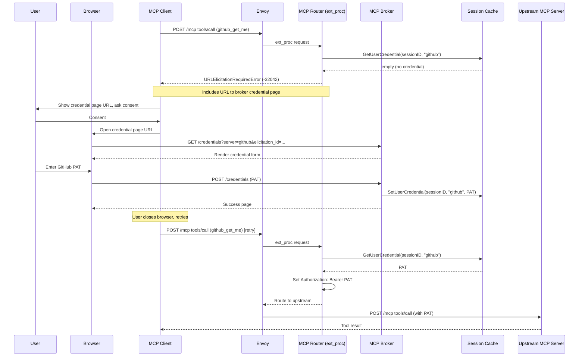
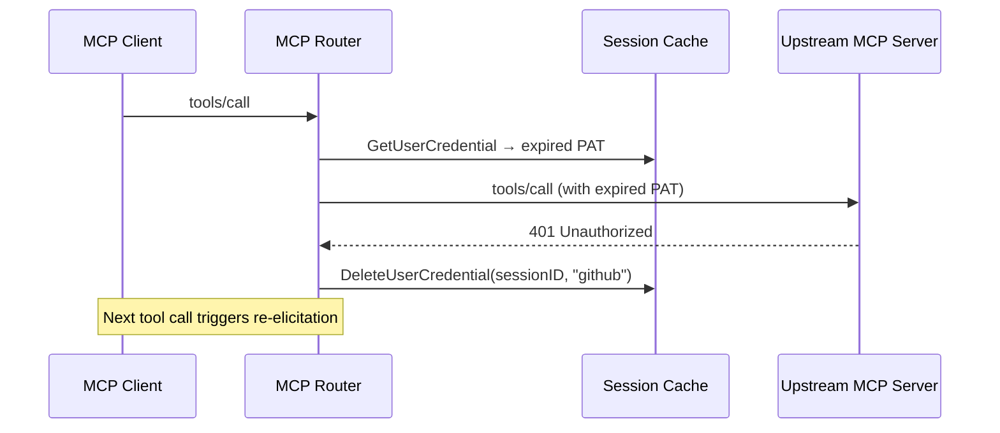

# Gateway-Initiated URL Elicitation for Per-User Credentials

## Problem

Many upstream MCP servers require per-user credentials. Example: a user's own GitHub PAT, not a shared service account token. The gateway currently supports several per-user credential strategies:

1. **Header-based token replacement** — the MCP client sends the user's credential in a custom header and the gateway maps it to the upstream `Authorization` header. The credential passes through the MCP client, making it visible to the LLM context and client-side logging. The MCP specification explicitly [prohibits token passthrough](https://modelcontextprotocol.io/specification/2025-11-25/basic/security_best_practices#token-passthrough) for this reason.
2. **Token exchange via OAuth provider** — requires the OAuth provider to support token exchange and be configured per upstream. Requires third party identity federation.
3. **Vault integration** — requires a Vault instance exposed to external users for credential provisioning.

URL elicitation complements these strategies by offering a server-side credential collection path that doesn't require exposing infrastructure like Vault to external users and keeps credentials out of the MCP client entirely.

## Summary

Enable the MCP Gateway to dynamically request per-user credentials at client tool-call/backend MCP call time if required using [URL mode elicitation](https://modelcontextprotocol.io/specification/2025-11-25/client/elicitation). The router detects a missing credential and returns a `URLElicitationRequiredError`. The client directs the user to a broker-hosted credential page. The credential is cached per session and re-elicited on upstream 401.

## Goals

- Per-user credential acquisition without exposing credentials to the client configuration
- Protocol compliant as per [URLElicitationRequiredError flow](https://modelcontextprotocol.io/specification/2025-11-25/client/elicitation#url-mode-with-elicitation-required-error-flow) from the MCP specification
- Cache credentials encrypted in the shared session cache (Redis / in-memory)
- Invalidate cached credentials on upstream 401 to trigger re-elicitation
- Maintain capability of using OIDC authentication the main broker gateway route

## Non-Goals

- Replace `credentialRef` (still used by the broker for tool discovery)
- Form mode elicitation for credentials (prohibited by the MCP spec for sensitive data)
- Full OAuth client in the broker

## Prerequisites

- MCP client must support URL mode elicitation (MCP spec 2025-11-25)
- MCP Gateway accessible over HTTPS for the credential page


## Design

### Flow



### Credential Invalidation on 401



### Component Responsibilities

| Component | Role |
|-----------|------|
| **Router** | Detects missing credential, returns `-32042` with configured or default URL, injects cached credential into `Authorization` header (pattern 1), invalidates on upstream 401 |
| **Broker** | Hosts `/credentials` page, verifies user identity, writes credential to cache |
| **Cache** | Shared storage for per-user, per-server credentials |
| **Controller** | Propagates `elicitation` from CRD to config |

### API Changes

#### MCPServerRegistration

New optional object `elicitation`:

```yaml
apiVersion: mcp.kuadrant.io/v1alpha1
kind: MCPServerRegistration
metadata:
  name: github
  namespace: mcp-test
spec:
  toolPrefix: github_
  targetRef:
    kind: HTTPRoute
    name: github-mcp-external
  credentialRef:           # broker-only: used for tool discovery
    name: github-token
    key: token
  elicitation: {}
```

`credentialRef` and `elicitation` serve different purposes: `credentialRef` gives the broker a credential for tool discovery, while `elicitation` triggers per-user credential collection at tool-call time.

When present, the router checks the session cache for a per-user credential before routing tool calls. On cache miss, it returns `URLElicitationRequiredError` with a URL to the broker's credential page.

| Field | Type | Description |
|-------|------|-------------|
| `url` | string | Optional. Overrides the default broker credential page URL. Allows operators to direct users to an external UI (e.g., Vault web UI). |

Example with external URL:

```yaml
spec:
  elicitation:
    url: "https://vault.example.com/ui/vault/secrets/mcp/create"
```

When no `url` is set, the router generates a URL pointing to the broker's built-in credential page. When OAuth fields are added in future (client ID, authorize endpoint, etc.), their presence on the object will imply an OAuth flow.

#### Config Type

`MCPServer` in `internal/config/types.go` gains:
- `Elicitation *ElicitationConfig` (optional, nil means no elicitation)

```go
type ElicitationConfig struct {
    URL string `json:"url,omitempty"`
}
```

### Credential Delivery Patterns

The elicitation URL determines how the credential reaches the upstream request. Two patterns are supported:

#### Pattern 1: Broker Credential Page (default)

When no `elicitation.url` is set, the router generates a URL pointing to the broker's `/credentials` page. The user enters a credential on the broker page, the broker writes it to the session cache, and the router reads from cache on retry to inject the `Authorization` header.

```
Router → -32042 (broker URL) → User enters PAT → Broker stores in cache → Router reads cache → sets header
```

The router is responsible for credential injection.

#### Pattern 2: External UI with AuthPolicy

When `elicitation.url` is set to an external UI (e.g., Vault web UI), the user stores their credential there directly. An AuthPolicy on the upstream HTTPRoute reads the credential from the external store and injects it into the `Authorization` header. The router does not need to read from cache — it only needs to detect whether a credential is missing (upstream 401) and re-trigger elicitation.

```
Router → -32042 (external URL) → User stores PAT in Vault → AuthPolicy reads from Vault → sets header
```

AuthPolicy handles credential injection. The router's role simplifies to:
1. If `elicitation` is set and the upstream returns 401, return `-32042` with the configured URL
2. No cache read/write needed for this server

This pattern is useful when operators already have credential infrastructure (e.g., Vault) and want to avoid duplicating storage in the session cache.

> **Note:** Unlike Pattern 1, there is no completion callback from the external UI, so `notifications/elicitation/complete` cannot be sent. The client retries and either succeeds or gets another 401.

### Credential Storage

Per-user credentials are written by the broker and read by the router. The storage backend is abstracted behind an interface.

| Backend | Description |
|---------|-------------|
| **Session cache** (Redis / in-memory) | Initial implementation. Credentials are session-scoped and lost on session expiry or cache eviction. |
| **Vault** | Stores credentials in Vault keyed by user identity. Provides encrypted storage, audit logging, and credential lifecycle management. See [Vault integration](../guides/vault-integration.md). |

#### Encryption at Rest

Credentials are encrypted within the cache using AES-GCM before storage. The encryption key is derived from the existing session signing key (`--mcp-session-signing-key`) using HKDF (HMAC-based Key Derivation Function, [RFC 5869](https://datatracker.ietf.org/doc/html/rfc5869)), so no additional configuration is required. HKDF derives a cryptographically strong key using a context-specific salt, ensuring the encryption key is distinct from the signing key even though both originate from the same secret.

#### Cache Schema

User credentials are stored as fields on the existing gateway session hash, using the prefix `usercred:` to distinguish them from upstream session IDs.

| Operation | Key | Field | Value |
|-----------|-----|-------|-------|
| Set | `jwt-abc-123` | `usercred:github` | AES-GCM encrypted credential |
| Get | `jwt-abc-123` | `usercred:github` | AES-GCM encrypted credential |
| Delete (on 401) | `jwt-abc-123` | `usercred:github` | — |

### URLElicitationRequiredError Response

Returned as an SSE-formatted immediate response (HTTP 200, `text/event-stream`). The `url` field uses `elicitation.url` from the server config if set, otherwise defaults to the broker's `/credentials` page:

```json
{
  "jsonrpc": "2.0",
  "id": 1,
  "error": {
    "code": -32042,
    "message": "User credential required for github",
    "data": {
      "elicitations": [
        {
          "mode": "url",
          "elicitationId": "<sessionID>:<serverName>",
          "url": "https://<gateway-host>/credentials?server=github&elicitation_id=<id>",
          "message": "Please provide your credential for github"
        }
      ]
    }
  }
}
```

### Credential Page

The broker serves a simple HTML form at `/credentials`:

- **GET** `/credentials?server=<name>&elicitation_id=<id>` — renders credential entry form
- **POST** `/credentials` — stores credential in cache, keyed by session and server

## Security Considerations

### Identity Verification

The MCP specification [warns about phishing attacks](https://modelcontextprotocol.io/specification/2025-11-25/client/elicitation#phishing) where an attacker could trick another user into completing an elicitation on their behalf. The credential page must verify that the user opening the URL is the same user who triggered the elicitation.

The initial implementation does not include identity verification. Before production use, the credential page should:
- Verify the user's OIDC session matches the gateway session that triggered the elicitation
- Use a signed or encrypted elicitation ID that cannot be forged

### Token Passthrough

The MCP specification [prohibits token passthrough](https://modelcontextprotocol.io/specification/2025-11-25/basic/security_best_practices#token-passthrough). This design is distinct from passthrough because credentials are collected out-of-band via the credential page, stored server-side bound to user identity, and never transit through the MCP client or LLM context.

## Relationship to Existing Approaches

| Approach | When to Use |
|----------|-------------|
| **credentialRef** (static secret) | Broker-only credential for tool discovery and caching |
| **Header-based token replacement** ([guide](../guides/external-mcp-server-with-token-replacement.md)) | Client supports custom headers, simple setup |
| **Vault token exchange** ([guide](../guides/vault-token-exchange.md)) | Centralized credential management, admin-provisioned per-user secrets |
| **URL elicitation + broker page** (this design) | Self-service per-user credentials, no client configuration, no external infrastructure |
| **URL elicitation + external UI** (this design) | Self-service per-user credentials with existing credential infrastructure (e.g., Vault), AuthPolicy handles injection |

## Future Considerations

### OAuth Callback via Credential Page

The credential page could initiate an OAuth flow instead of rendering a form. The router would construct the OAuth authorize URL dynamically, encoding the elicitation ID in the OAuth `state` parameter. After the user consents, the provider redirects back to a gateway callback endpoint with the authorization code and `state`. The broker extracts the elicitation ID from `state`, exchanges the code for a token, and stores it in the session cache.

This would add OAuth fields to the `elicitation` object (client ID, authorize endpoint, scopes, plus a referenced secret for the client secret). Their presence implies an OAuth flow. The router would compute the authorize URL per-elicitation rather than using the stored `url` verbatim.

The MCP spec [calls this out explicitly](https://modelcontextprotocol.io/specification/2025-11-25/client/elicitation#url-mode-elicitation-for-oauth-flows) as a primary use case for URL mode elicitation. The existing abstractions (storage interface, credential page, elicitation ID) would support this without major structural changes.

## Execution

### Todo

- [ ] Add `Elicitation *ElicitationConfig` field to `MCPServer` config type
- [ ] Add `elicitation` object to MCPServerRegistration CRD and regenerate
- [ ] Add credential storage interface with cache implementation (set/get/delete + AES-GCM encryption)
- [ ] Router: check cache for user credential in `HandleToolCall`, return `URLElicitationRequiredError` on miss
- [ ] Router: inject cached credential into `Authorization` header on cache hit
- [ ] Router: invalidate cached credential on upstream 401 in `HandleResponseHeaders`
- [ ] Broker: implement `/credentials` page handler (GET form + POST storage)
- [ ] Register `/credentials` endpoint in `cmd/mcp-broker-router/main.go`
- [ ] Controller: propagate `elicitation` from CRD to config
- [ ] Identity verification on credential page (anti-phishing)
- [ ] `notifications/elicitation/complete` — broker notifies client after credential stored
- [ ] Vault storage backend
- [ ] E2E test with a test server that validates per-user credentials
- [ ] Update API reference docs for `elicitation` field
- [ ] User-facing guide for configuring URL mode elicitation

### Completed
