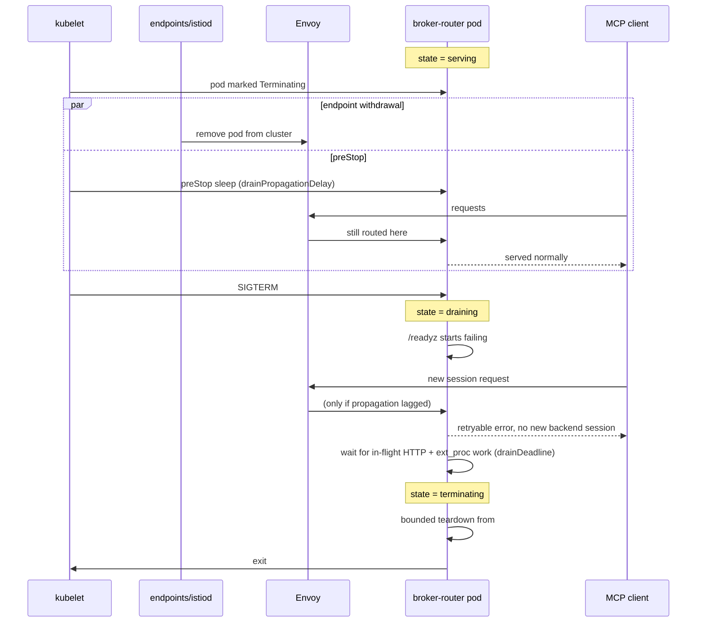

# Graceful Drain Design

## Problem

`failure_mode_allow` is `false` on the ext_proc filter (`internal/controller/mcpgatewayextension_controller.go:738`). That is deliberate and must stay: a router that is down must never become an auth bypass. The consequence is that any request Envoy sends to a router whose gRPC server has gone away is rejected with a local 5xx rather than degraded.

Pod termination produces exactly that window. When a pod is marked Terminating, endpoint removal and the `preStop` hook begin **in parallel**, and endpoint removal is eventually consistent: it propagates through the endpoints controller, then to istiod, then into the gateway's Envoy configuration. Until that completes Envoy still routes to the terminating pod.

Nothing in the process currently accounts for that window:

- There is no notion of a draining state. The process serves normally until SIGTERM, then tears down.
- `/readyz` gates on `mcpBroker.IsReady()` (`cmd/mcp-broker-router/broker.go:57`), which reports whether any upstream is reachable — not whether this pod is terminating.
- The pod spec sets no `preStop` hook and no `terminationGracePeriodSeconds` (`internal/controller/broker_router.go`), so the default 30s applies with nothing using it.

Two prior fixes bounded the teardown but did not drain anything. #1362 registered SIGTERM, so the shutdown path runs at all under Kubernetes. #1390 bounded `GracefulStop`, bounded the broker shutdown, and moved telemetry flushing last so drain-window traces and metrics survive. What remains is coordination: nothing tells the pod to stop taking new work, and nothing waits for the work it already has.

## Summary

Add an explicit lifecycle state to the broker/router process — `serving`, `draining`, `terminating` — driven by pod lifecycle rather than inferred. A `preStop` hook sleeps long enough for endpoint removal to reach Envoy while the pod keeps serving normally. SIGTERM then moves the process into `draining`: `/readyz` starts failing, new stateful backend sessions are refused with a retryable response, and the process waits for in-flight HTTP and ext_proc work up to a deadline before running the bounded teardown that already exists. `terminationGracePeriodSeconds` is computed from the sum of the budgets so the two cannot drift apart.

## Goals

- An explicit, observable process state: `serving`, `draining`, `terminating`.
- `/readyz` fails while draining; `/healthz` stays healthy until the process genuinely cannot operate.
- No new stateful backend sessions once draining begins, with a retryable response where the protocol and response state allow one.
- In-flight HTTP and ext_proc work is waited for within a configured deadline.
- `preStop` and `terminationGracePeriodSeconds` wired so the drain fits inside the grace period by construction.
- Drain observability: duration, requests completed during drain, forced terminations.
- A rollout-under-load e2e that asserts the drain guarantee.

## Non-Goals

- **Durable cleanup of backend sessions owned by a departing pod.** Declined in #1363: replaying an upstream `DELETE` from another process requires that session's credentials, and persisting per-user credentials for later replay is a security trade the gateway should not make. Legacy sessions fall back to Redis TTL and the upstream's own session timeout.
- **Live session migration.** Reusing a backend session ID from Redis is not the same problem as transferring an active SDK transport or an in-flight request.
- **Zero client-visible errors.** See [What this cannot promise](#what-this-cannot-promise).
- **Configurable replica count.** `replicas` is hardcoded to `int32(1)` (`internal/controller/broker_router.go:93`) with no field in `api/v1alpha1`. Out of scope here.
- **Making broker cleanup context-aware.** `mcpBrokerImpl.Shutdown` discards its context; #1390 bounded the *wait* rather than the work. The deeper fix belongs with in-flight work tracking, see [Future Considerations](#future-considerations).

## Job Stories

### When a platform engineer rolls out a new gateway version

When a platform engineer runs `kubectl rollout restart` during business hours, they want in-flight tool calls to finish and clients to see retryable errors rather than transport resets, so that a routine deploy is not a customer-visible incident.

### When a platform engineer drains a node

When a platform engineer cordons and drains a node hosting the gateway, they want the pod to stop accepting new work before it stops serving, so that the disruption is bounded and attributable rather than a burst of unexplained 5xx.

### When an MCP client is mid tool call

When an MCP client has a `tools/call` in flight and the serving pod begins terminating, they want that call to complete if it can, so that a deploy does not surface as a failed user action.

### When an MCP client starts a new session during a rollout

When an MCP client initializes a new session against a pod that has begun draining, they want a retryable protocol error rather than a connection reset, so that the client SDK can reconnect to a healthy pod instead of surfacing a hard failure.

### When a non-interactive agent is fanning out tool calls

When an agent issues many concurrent `tools/call` requests across a rollout, they want failures to be distinguishable from upstream tool errors, so that the agent's retry logic can act on them safely rather than treating a side-effecting call as failed.

### When an MCP developer tests their server against the gateway

When an MCP developer runs their server behind the gateway and redeploys it during development, they want drain behaviour to be identical whether or not their server supports session termination, so that they are not debugging gateway lifecycle behaviour while trying to debug their own tool.

### When an MCP developer's tool is slow

When an MCP developer's tool takes longer than the drain deadline to return and the pod is terminating, they want the truncation to be attributable to the gateway drain rather than to look like a fault in their server, so that they do not chase a bug that is not theirs.

### When a platform engineer investigates a slow rollout

When a rollout takes longer than expected, they want drain duration, requests completed during drain, and forced terminations exported as metrics, so that they can tell a slow drain from a stuck one without reading pod logs.

## Design

### Prerequisites

Both merged:

- #1362 — SIGTERM registered, so the shutdown path executes under Kubernetes at all.
- #1390 — `GracefulStop` bounded with a fallback to `Stop`, broker shutdown bounded, telemetry flush moved last with its own budget. Current budgets are `serverDrainTimeout` 8s, `brokerDrainTimeout` 5s, `grpcDrainTimeout` 10s, `telemetryFlushTimeout` 4s (`cmd/mcp-broker-router/main.go`).

### Why `preStop` sleeps rather than triggers the drain

Two mechanisms could withdraw traffic before teardown, and the choice is not arbitrary.

**Readiness cannot do it.** The generated probe is `PeriodSeconds: 10`, `FailureThreshold: 3` (`internal/controller/broker_router.go:235-248`). Failing `/readyz` therefore takes up to 30 seconds to mark the pod unready — longer than the entire 27s shutdown budget. Readiness gating is worth having for observability and for cases where the pod is not being deleted, but it cannot be the mechanism that stops traffic during termination.

**Pod deletion does it, and `preStop` buys the time.** Endpoint removal starts when the pod is marked Terminating, independent of readiness. `preStop` runs in the same window, so a sleep there lets propagation complete while the process is still serving.

That ordering also decides what `preStop` should *do*. Having `preStop` trigger the drain would mean the process starts refusing work while Envoy is still routing to it — turning requests that would have succeeded into errors. Serving normally through propagation and draining only once traffic should have stopped is strictly better. So `preStop` sleeps; SIGTERM initiates the drain.

### Flow



### Component Responsibilities

| Component | Responsibility |
| --- | --- |
| Controller (`broker_router.go`) | Emits `preStop` hook and `terminationGracePeriodSeconds` on the generated Deployment, derived from the drain budgets so they cannot drift. |
| Broker/router `main.go` | Owns the lifecycle state; registers SIGTERM; sequences drain then the existing bounded teardown. |
| Health handlers (`broker.go`) | `/readyz` fails while `draining` or `terminating`; `/healthz` reflects only whether the process can still operate. |
| Router (`Router202511`) | Refuses to initialize new stateful backend sessions while draining; returns a retryable error. Existing sessions continue to route. |
| ext_proc server | Tracks in-flight streams so the drain can wait on them; stops accepting new streams while draining. |
| Broker HTTP server | `http.Server.Shutdown` is started at the beginning of the drain rather than in the teardown, so HTTP requests drain concurrently with ext_proc streams under `drainDeadline`. The `serverDrainTimeout` call in the teardown remains as the backstop for anything still open. |
| Metrics | Exports drain duration, requests completed during drain, forced terminations. |

### State machine

| State | Entered by | `/healthz` | `/readyz` | New stateful sessions | In-flight work |
| --- | --- | --- | --- | --- | --- |
| `serving` | process start | 200 | `IsReady()` | accepted | served |
| `draining` | SIGTERM | 200 | 503 | refused, retryable | HTTP and ext_proc drained concurrently, up to `drainDeadline` |
| `terminating` | drain deadline reached or work complete | 200 until teardown | 503 | refused | abandoned to the bounded teardown |

The state is a single atomic value read on the request path. `/healthz` deliberately stays green through `draining` and `terminating`: a draining pod is not unhealthy, and failing liveness would invite the kubelet to restart a pod that is intentionally going away.

### Linearization point for session refusal

Refusing new sessions is a race unless the check has a defined position. `initializeMCPServerSession` calls `InitForClient` inside `initGroup.Do`, so a lifecycle check placed *before* `Do` can admit a caller that goes on to create a backend session after the transition to `draining` — the outcome the refusal exists to prevent.

The check therefore belongs **inside** the singleflight function, after the existing cache lookup and before `InitForClient`. That makes the atomic state read the linearization point: any initialization that observes `serving` proceeds to completion and is accounted for as in-flight work; any that observes `draining` is refused before an upstream session exists. Callers that joined an already-running `Do` share its result, which is correct — that session was admitted while the pod was still serving.

The transition to `draining` therefore does not need to cancel work already admitted; it only has to be visible to the next observation. This is why the drain waits for in-flight work rather than interrupting it.

### Budget arithmetic

`preStop` consumes `terminationGracePeriodSeconds` — the grace clock starts when the pod is marked Terminating, and `preStop` runs inside it. The merged teardown already spends 27s, so the default 30s grace period leaves no room for a `preStop` sleep or a drain wait. The controller must therefore compute the grace period rather than leave it defaulted:

```text
terminationGracePeriodSeconds = drainPropagationDelay   (preStop sleep)
                              + drainDeadline           (wait for in-flight work)
                              + serverDrainTimeout      (8s, merged)
                              + brokerDrainTimeout      (5s, merged)
                              + grpcDrainTimeout        (10s, merged)
                              + telemetryFlushTimeout   (4s, merged)
                              + safetyMargin
```

With `drainPropagationDelay` 5s, `drainDeadline` 15s and a 5s margin that is 52s.

The constants live in an importable package (`internal/drain`) rather than in `cmd/mcp-broker-router`, because `main` cannot be imported and the controller must derive the pod spec from the same source. Duplicating them would reintroduce exactly the drift this arithmetic exists to prevent.

Two distinct claims are involved here and only one of them is guaranteed. The **local** arithmetic is sound by construction: the process cannot spend more than the sum of its own budgets, so it cannot outlast a grace period computed from them. The **propagation** assumption is not. Whether endpoint removal reaches Envoy within `drainPropagationDelay` depends on the endpoints controller, istiod convergence and cluster load, none of which the gateway controls, and Istio publishes no bound for it. 5s is a starting value drawn from common practice, not a guarantee. It must be validated against a real cluster before the design claims anything about it, and it should be tunable so an operator on a slow or large cluster can raise it. If propagation exceeds the delay, the pod stops accepting new stateful sessions while Envoy is still routing to it — the drain degrades to retryable errors rather than losing work, but the window is not eliminated.

### API Changes

No CRD changes in this iteration. The budgets are package constants shared between the process and the controller, and the controller derives the pod spec from them. Operators using the controller-generated Deployment get correct values without configuration.

Exposing the budgets on `MCPGatewayExtension` is deferred — see [Future Considerations](#future-considerations). Because the controller owns the Deployment, an operator cannot currently override them, so if tuning turns out to be needed the CRD is the right surface rather than flags.

### Data storage

None. The lifecycle state is process-local and deliberately not persisted: it describes this pod's relationship to its own termination, and has no meaning to another replica.

## Failure-mode inventory

| Failure | Current behaviour | After this design |
| --- | --- | --- |
| Rollout while requests are in flight | Envoy routes to a terminating pod during propagation; ext_proc fails closed; local 5xx | `preStop` sleep covers propagation; requests served normally |
| New session arrives after SIGTERM | Backend session initialized, then abandoned mid-teardown | Refused with a retryable error; no orphaned backend session created |
| In-flight `tools/call` at SIGTERM | Cut at the socket when the servers stop | Waited for within `drainDeadline`; completes if it can |
| Long-lived ext_proc stream at SIGTERM | Bounded by `grpcDrainTimeout` (#1390), forced at 10s | Unchanged; drain gives it a chance to finish first |
| Drain exceeds its deadline | n/a | Forced into `terminating`, counted in metrics, bounded teardown proceeds |
| `preStop` + drain exceeds grace period | Pod killed mid-drain | Grace period computed from the same budget constants, so the process cannot outspend it |
| Endpoint removal slower than `drainPropagationDelay` | Requests hit a terminating pod; ext_proc fails closed; local 5xx | Not eliminated. New sessions get a retryable error instead of a reset; existing sessions still route. Mitigated by raising the delay, not by the grace period |
| Node drain or eviction | Same as rollout, but no replacement pod is ready | Drain still bounded and clean; the window is an outage regardless |
| Crash or SIGKILL | Nothing runs | Nothing runs. Backend sessions leak to Redis TTL and upstream timeout, per #1363 |
| Upstream slow during teardown | Broker shutdown could block unboundedly | Bounded by `brokerDrainTimeout` (#1390) |

## Security Considerations

- **`failure_mode_allow` stays `false`.** Nothing in this design changes it. A draining router must still reject rather than bypass; the point is to stop traffic arriving, not to soften what happens when it does.
- **`/healthz` and `/readyz` must not leak state.** Both remain unauthenticated status codes with no body describing internal condition.
- **No new credential persistence.** The drain closes nothing that requires replaying upstream credentials, which is what kept #1363's durable-cleanup half out of scope.
- **Retryable errors must not be forgeable.** The drain response is generated by the router from process state, never from a client-supplied header, consistent with the existing rule that `x-mcp-*` metadata is router-set.

## Relationship to Existing Approaches

This builds directly on the bounded teardown from #1390 rather than replacing it: drain is what happens *before* that sequence, and the sequence remains the backstop when the drain deadline is hit. The existing Redis session store is unaffected — backend session mappings survive pod replacement exactly as they do today, and the drain deliberately does not close handles for sessions that remain valid, since a replacement pod is expected to keep using them.

## What this cannot promise

Not zero client-visible errors. If an upstream tool performs a side effect and the pod dies before delivering the response, the gateway cannot know whether retrying is safe. Once a streaming response has started, a broken stream may not be replaceable with a well-formed JSON-RPC error. The achievable goal is bounded disruption, completion of requests that can safely finish, and retryable signalling where possible.

On the ceiling: no rollout `Strategy` is set, so Kubernetes defaults apply and at `replicas=1` that means `maxSurge=1`, `maxUnavailable=0` — during `kubectl rollout restart` the replacement pod is Ready before the old one terminates, so draining genuinely avoids disruption. For node drain, eviction or crash there is no second pod and the window is an outage regardless of how clean the drain is.

## Future Considerations

- **Context-aware broker cleanup.** `mcpBrokerImpl.Shutdown` discards its context; `activeMCP.Stop` blocks on `<-a.manager.done` and the pooled-session drain performs a blocking upstream `DELETE` per entry. #1390 bounded the wait, not the work. Threading a context through would make the bound real, and the in-flight tracking added here is the natural place to build from.
- **Budgets on `MCPGatewayExtension`.** If operators need to tune the drain, the CRD is the right surface, since the controller owns the Deployment.
- **Durable cleanup obligations.** Declined in #1363 on security and lifetime grounds. If `Router202511` outlives expectations, or if a configurable replica count arrives, the analysis in that issue is the starting point.
- **Drain on config change.** The same machinery could quiesce a pod during a disruptive config reload rather than only at termination.

## Execution

See [tasks/tasks.md](tasks/tasks.md) for the implementation plan, [tasks/e2e_test_cases.md](tasks/e2e_test_cases.md) for e2e coverage, and [tasks/documentation.md](tasks/documentation.md) for the documentation plan.
