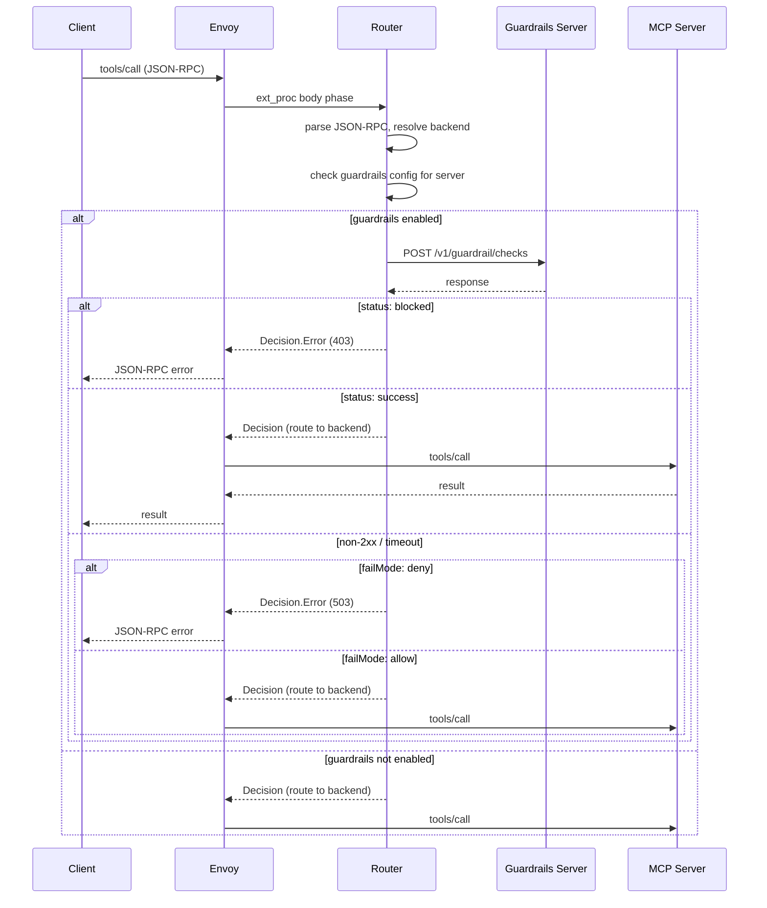

# Guardrails Integration

## Problem

Guardrails systems such as NeMo Guardrails do not support MCP natively. Their endpoints (e.g. `v1/chat/completions`, `v1/guardrail/checks`) are incompatible with MCP JSON-RPC request/response shapes. Integrating guardrails at the gateway level provides:

- Centralized policy configuration and enforcement
- Consistent protection across all clients

## Summary

Add an API translation layer in the MCP Router request pipeline that intercepts `tools/call` requests, translates them into a guardrails-compatible check request, evaluates the response, and either proceeds with routing or rejects the call. The initial implementation targets the NeMo Guardrails `v1/guardrail/checks` endpoint, but the design does not preclude other providers — any guardrails server that accepts a check request and returns a pass/block decision can be supported by adding a translation mapping.

Configuration is stored in a Kubernetes Secret of type `guardrails/external/nemo`, referenced from `MCPGatewayExtension` (global) and/or `MCPServerRegistration` (per-server override). TLS trust to the guardrails server reuses the gateway's existing CA bundle, with optional additional CAs in the guardrails config Secret.

## Goals

- Translate MCP `tools/call` and elicitation response requests to guardrails check requests without user-built proxies
- Support both global (all servers) and per-server guardrails configuration (platform engineer and developer)
- Fail closed by default when the guardrails server is unreachable but allow it to be configured
- Reuse the gateway's existing CA trust pool for TLS to the guardrails server
- Target NeMo Guardrails as the initial provider without coupling the design to it

## Non-Goals

- Guardrailing MCP `tools/call` responses (deferred — see Future Considerations)
- Adding MCP awareness to NeMo Guardrails itself

## Job Stories

### When I want to enforce safety policies on tool calls

When a platform engineer deploys MCP servers that interact with sensitive systems, they want tool calls to be checked against guardrails policies before execution so that blocked or dangerous calls are rejected at the gateway.

### When I want guardrails on all servers by default

When a platform engineer has a guardrails instance and wants all tool calls checked, they want to configure guardrails once at the gateway level so that every registered server inherits the policy without per-server configuration.

### When I need different guardrails policies per server

When a platform engineer has servers with different risk profiles (e.g. a read-only analytics server vs a server that modifies infrastructure), they want to assign different guardrails config IDs per server so that policies match the server's capabilities.

### When I want additional guardrails on a specific server

When an MCP server developer has a server that interacts with a downstream model or accepts freeform input, they want to add server-specific guardrails policies in addition to any global policy the platform engineer has configured, so that both the platform-wide and server-specific checks apply.

### When the guardrails server is down

When the guardrails server is unreachable or returns errors, the platform engineer wants tool calls to fail closed by default (reject the call) so that unverified calls never reach backends. For non-critical servers, they want the option to fail open.

### When the guardrails server uses a private CA

When a platform engineer deploys the guardrails server behind a corporate or self-signed CA, they want the gateway to trust that CA so that TLS connections succeed without disabling verification.

## Design

### Configuration via Secret

Guardrails configuration lives in a Kubernetes Secret of type `guardrails/external/nemo`. This follows the project's pattern of referencing Secrets for configuration that may evolve independently of CRD schema (similar to `credentialRef`, `caCertSecretRef`).

The Secret contains a YAML document under a well-known key:

```yaml
apiVersion: v1
kind: Secret
metadata:
  name: my-guardrails-config
  namespace: mcp-system
  labels:
    mcp.kuadrant.io/secret: "true" # ensures the controller has it in the cache
type: guardrails/external/nemo #allows for other config types (example perhaps without a url)
stringData:
  config.yaml: |
    url: https://nemo-guardrails.internal:8080
    configIDs:            # one or more NeMo config IDs to apply
      - "tool-safety-v1"
      - "input_checking"
    model: "meta/llama-3.1-8b-instruct"
    failMode: deny        # deny (default) | allow
    timeoutSeconds: 3     # request timeout to guardrails server (must leave headroom within ext_proc message_timeout)
  bearer-token: "my-nemo-api-token"  # authentication token for the guardrails server
```

| Field | Required | Description |
|-------|----------|-------------|
| `url` | yes | Guardrails server endpoint |
| `configIDs` | yes | List of guardrails config IDs to apply. Multiple policies are evaluated in a single request |
| `model` | yes | Model identifier passed to the guardrails check |
| `failMode` | no | Behavior when guardrails server is unreachable or returns non-2xx. `deny` (default): reject the tool call. `allow`: proceed with routing |
| `timeoutSeconds` | no | HTTP timeout for the guardrails request. Default: 3. Must leave headroom within the ext_proc `message_timeout` (default 10s) for parsing, resolution, and hairpin init |
| `bearer-token` | yes | Bearer token sent as `Authorization: Bearer <token>` to the guardrails server. Stored in the Secret's `bearer-token` key (not inside `config.yaml`) |

> **Note:** This config is specific to the type of guard rail being used. In the future there maybe different guardrails providers that are configurable `guardrails/praxis/nemo` 

> **Note:** TLS trust for the guardrails server uses the gateway's existing CA bundle (`caCertBundleRef` on MCPGatewayExtension). If the guardrails server uses a private CA, add it to the gateway CA bundle Secret rather than duplicating it here.

### API Changes

#### MCPGatewayExtension

New optional field `guardrailsRef` on `MCPGatewayExtensionSpec`:

```go
type MCPGatewayExtensionSpec struct {
    // ... existing fields ...

    // guardrailsRef references a Secret of type guardrails/external/nemo containing
    // the guardrails server endpoint and policy configuration. The secret must exist in the same namespace
    // When set, all tools/call requests are checked against the guardrails
    // server before routing to the backend, unless overridden per-server.
    // The Secret must have the label mcp.kuadrant.io/secret=true.
    // +optional
    GuardrailsRef *SecretReference `json:"guardrailsRef,omitempty"`
}
```

```yaml
apiVersion: mcp.kuadrant.io/v1alpha1
kind: MCPGatewayExtension
metadata:
  name: mcp-gateway
spec:
  targetRef:
    name: mcp-gateway
    sectionName: mcp
  guardrailsRef:
    name: my-guardrails-config
```

#### MCPServerRegistration

New optional field `guardrailsRef` on `MCPServerRegistrationSpec`:

```go
type MCPServerRegistrationSpec struct {
    // ... existing fields ...

    // guardrailsRef references a Secret of type guardrails/external/nemo containing
    // per-server guardrails configuration. Additive to the global guardrailsRef
    // on MCPGatewayExtension — both checks execute when both are configured.
    // The Secret must have the label mcp.kuadrant.io/secret=true.
    // +optional
    GuardrailsRef *SecretReference `json:"guardrailsRef,omitempty"`
}
```

#### Resolution Order

Gateway and per-server guardrails are additive. When both are configured, the router merges their `configIDs` into a single request to the guardrails server. This avoids multiple round-trips — NeMo evaluates all policies in one call.

When both levels reference the same guardrails server URL, the config IDs are merged into one request. When they reference different servers, two requests are made in parallel — each using its own `failMode` and `timeoutSeconds`. Both must succeed for the tool call to proceed; if either returns `blocked`, the call is rejected. The combined timeout budget must fit within the ext_proc `message_timeout` (default 10s). Since parallel execution uses the slower of the two timeouts (not the sum), this is less constrained than sequential, but operators should still keep individual timeouts well below `message_timeout`.

| Gateway `guardrailsRef` | Server `guardrailsRef` | Effective Behavior |
|-------------------------|------------------------|--------------------|
| Not set | Not set | No guardrails |
| Set | Not set | Gateway check only |
| Not set | Set | Server check only |
| Set (same URL) | Set (same URL) | Single request, merged config IDs |
| Set (URL A) | Set (URL B) | Parallel requests, each uses own failMode, both must pass |

### Request Flow

The guardrails check occurs in the router after the backend is resolved but before the Decision is returned. Server resolution must succeed before guardrails runs — the guardrails config to apply depends on which server the request targets. If server resolution fails (unknown tool, failed elicitation map lookup, session mismatch), the request is rejected with the existing error handling and no guardrails check occurs.

This applies to both `tools/call` requests (server resolved from routing table) and elicitation `accept` responses (server resolved from elicitation map). This keeps it in the ext_proc hot path but ensures we only check requests that would actually reach a backend.



### Translation Mapping (NeMo Guardrails)

This is the initial provider implementation. If there were other providers, we would define a new mapping.

#### MCP `tools/call` to NeMo `v1/guardrail/checks`

| MCP `tools/call` field | NeMo `v1/guardrail/checks` field |
|------------------------|----------------------------------|
| `params.name` | `messages[0].name` |
| `params.arguments` (JSON-encoded) | `messages[0].content` |
| N/A | `messages[0].role = "user"` |
| N/A | `messages[0].config = "tool"` |
| N/A (from Secret) | `guardrails.config_ids` |
| N/A (from Secret) | `model` |

Example request to NeMo:

```json
{
  "model": "meta/llama-3.1-8b-instruct",
  "messages": [
    {
      "role": "user",
      "name": "execute_sql",
      "content": "{\"query\": \"DROP TABLE users\"}",
      "config": "tool"
    }
  ],
  "guardrails": {
    "config_ids": ["tool-safety-v1", "input_checking"]
  }
}
```

#### Elicitation Response to NeMo `v1/guardrail/checks`

Elicitation `accept` responses carry user-provided token data back to the backend server. The router already resolves the target server from the elicitation map, so the guardrails config lookup uses the same server name. `decline` and `cancel` carry no user content and are passed through without a guardrails call.

| Elicitation response field | NeMo `v1/guardrail/checks` field |
|----------------------------|----------------------------------|
| `result.action` | `messages[0].name` |
| `result` minus `action` field (JSON-encoded) | `messages[0].content` |
| N/A | `messages[0].role = "user"` |
| N/A | `messages[0].config = "tool"` |
| N/A (from Secret) | `guardrails.config_ids` |
| N/A (from Secret) | `model` |


#### Guardrails Response to Router Decision

| Guardrails response | Router action |
|---------------------|---------------|
| `status: "success"` | Proceed with routing (no `Decision.Error`) |
| `status: "blocked"` | `Decision.Error` with 403, JSON-RPC error body including the rails message |
| Non-2xx HTTP | Apply `failMode`: deny returns 503, allow proceeds |
| Timeout | Apply `failMode`: deny returns 503, allow proceeds |
| Malformed body | Apply `failMode`: deny returns 502, allow proceeds |

### TLS Trust

The guardrails HTTP client reuses the gateway's existing CA trust pool (system roots + gateway CA bundle from `caCertBundleRef`). No separate CA configuration is needed — if the guardrails server uses a private CA, it should be added to the gateway's `caCertBundleRef` Secret alongside any other private CAs.

### Config Propagation

The controller reads guardrails Secrets and writes the resolved configuration into the existing `mcp-gateway-config` Secret, following the same pattern as all other config. Global guardrails (from `MCPGatewayExtension.guardrailsRef`) are written to the top-level `guardrails` field. Per-server guardrails (from `MCPServerRegistration.guardrailsRef`) are written into the corresponding server entry in the `servers` array. The router uses both at request time — global applies to all servers, per-server adds to it:

```go
type BrokerConfig struct {
    Servers          []MCPServer           `json:"servers"          yaml:"servers"`
    VirtualServers   []VirtualServerConfig `json:"virtualServers,omitempty" yaml:"virtualServers,omitempty"`
    GatewayCACertPEM string                `json:"gatewayCACertPEM,omitempty" yaml:"gatewayCACertPEM,omitempty"`
    // global guardrails config, nil if not configured
    GlobalGuardrails *GuardrailsConfig     `json:"globalGuardrails,omitempty" yaml:"globalGuardrails,omitempty"`
}

type MCPServer struct {
    // ... existing fields ...
    // per-server guardrails, additive to global; nil if not configured
    Guardrails *GuardrailsConfig `json:"guardrails,omitempty" yaml:"guardrails,omitempty"`
}

type GuardrailsConfig struct {
    URL            string   `json:"url"            yaml:"url"`
    ConfigIDs      []string `json:"configIDs"      yaml:"configIDs"`
    Model          string   `json:"model"          yaml:"model"`
    FailMode       string   `json:"failMode"       yaml:"failMode"`       // "deny" | "allow"
    TimeoutSeconds int      `json:"timeoutSeconds" yaml:"timeoutSeconds"`
    BearerToken    string   `json:"bearerToken"    yaml:"bearerToken"`
}
```

The router receives this via the existing config watcher and constructs an HTTP client per guardrails endpoint (with the appropriate TLS pool).

> **Note:** if possible we should make as few calls to the external service as possible. So if there are multiple configs to be applied, they will be batched into a single call

### Internal Architecture

The translation between MCP requests and guardrails provider requests is behind a `GuardrailsTransformer` interface. The Secret type determines which implementation is used — resolved once at config load time, not per-request.

```go
// GuardrailsTransformer translates an MCP request into a provider-specific
// guardrails check request body.
type GuardrailsTransformer interface {
    Transform(req *MCPRequest, cfg *GuardrailsConfig) ([]byte, error)
}
```

The router selects the transformer based on the Secret type from the resolved config:

```go
// guardrails/external/nemo  → NeMoTransformer
// guardrails/external/other → OtherTransformer (future)
```

Each transformer owns the request body shape for its provider. The router owns the HTTP call, timeout, TLS, fail mode handling, and Decision mapping — those are provider-independent.

### Component Responsibilities

| Component | Responsibility |
|-----------|----------------|
| Controller | Reads guardrails Secrets, validates, writes resolved config into `mcp-gateway-config` |
| Router | Reads guardrails config, calls guardrails server before routing `tools/call` and elicitation accept responses, maps response to Decision |
| Broker | No involvement — guardrails is a routing concern, not a federation concern |
| Envoy | No changes — ext_proc Decision already supports rejection via error responses |

### Observability

The guardrails check adds OpenTelemetry span attributes to the existing `mcp-router.tool-call` span:

| Attribute | Value |
|-----------|-------|
| `guardrails.enabled` | `true` / `false` |
| `guardrails.status` | `success` / `blocked` / `error` |
| `guardrails.config_ids` | the config IDs used |
| `guardrails.latency_ms` | round-trip time to the guardrails server |
| `guardrails.fail_mode` | `deny` / `allow` |

Structured log at `Debug` level for each check (per-request), `Info` level for config changes.

## Performance Impact

The guardrails check adds a synchronous HTTP round-trip to an external service in the ext_proc body processing phase. The router is a hot path (see `docs/design/performance.md`), and this call directly impacts request latency.

**Latency budget:**
- The guardrails call blocks the ext_proc response to Envoy. Envoy holds the full request body in BUFFERED mode while waiting.
- NeMo Guardrails performs LLM inference — expect 100ms+ per check, potentially more under load.
- The ext_proc `message_timeout` defaults to 10s (`internal/controller/mcpgatewayextension_controller.go:743`, `config/istio/envoyfilter.yaml:31`). This is the total budget for all ext_proc body phase processing — JSON-RPC parsing, backend resolution, hairpin init, and guardrails calls. If guardrails `timeoutSeconds` is set to 5s, the guardrails call alone consumes half the budget. In the two-server case (global + per-server with different URLs), two sequential 5s timeouts would exceed the 10s budget entirely, causing Envoy to kill the ext_proc stream.
- `timeoutSeconds` should default to 3s and be capped at a value that leaves headroom for other ext_proc processing. A safe upper bound is `message_timeout - 4s` (reserving 4s for parsing, resolution, and hairpin init). The controller should validate this and warn when the configured timeout risks exceeding the budget.

**Possible Mitigations:**
- **Connection pooling** — the router should use a persistent HTTP client with connection pooling to the guardrails server. Avoids per-request TCP/TLS handshake overhead.
- **HTTP/2** — prefer HTTP/2 to the guardrails server where supported. Multiplexing avoids head-of-line blocking when multiple tool calls are in flight.
- **Keep-alive** — idle connections should be kept alive to avoid TLS handshake latency on the first call after idle periods.
- **Timeout coordination** — the operator must ensure `timeoutSeconds` < Envoy ext_proc `message_timeout`. The controller should validate this where possible and warn when it cannot.

**Scope of impact:**
- Only `tools/call` and elicitation `accept` requests are affected. All other MCP methods (`tools/list`, `initialize`, etc.) bypass guardrails entirely.
- Servers without guardrails configured (no global or per-server `guardrailsRef`) have zero additional latency.

## Security Considerations

- **Fail closed by default** — `failMode: deny` is the default. Consistent with invariant #5 (`failure_mode_allow` must be false). Guardrails down means tool calls are rejected.
- **Secret validation** — the controller validates the Secret has type `guardrails/external/nemo`, label `mcp.kuadrant.io/secret=true`, a non-empty `configIDs` list, and a valid `url`. Secrets with empty `configIDs` are rejected and the controller sets a condition on the parent resource (MCPGatewayExtension or MCPServerRegistration) with the validation error
- **Router-only path** — guardrails checks happen in the router during ext_proc. The broker never interacts with the guardrails server
- **Bearer token in shared config Secret** — the guardrails bearer token is serialized into the `mcp-gateway-config` Secret, which is mounted into the broker-router pod. The broker has filesystem access to this Secret but does not consume the guardrails config. This is a weaker isolation boundary than ideal (compared to a separate Secret or env var injection), but is an accepted tradeoff given the broker and router run in the same pod and share the same config volume. A future improvement could separate router-only config into a dedicated Secret
- **TLS required** — the router should warn (log) if the guardrails URL is not HTTPS. In production, non-TLS should be disallowed or gated behind an explicit opt-in

## Relationship to Existing Approaches

## Provider Extensibility

The design is structured around a translation mapping between MCP and a guardrails check endpoint. While NeMo Guardrails is the initial target, any provider that offers a comparable API — accept a check request with tool name and arguments, return a pass/block decision — can be supported by adding a new translation mapping. The CRD fields, Secret structure, config propagation, and router interception point remain the same. Only the HTTP request/response translation changes per provider.

## Future Considerations

### Response Guardrailing

Checking `tools/call` responses before they reach the client. This requires buffering the upstream response in the router's response phase, translating it to a guardrails request, and potentially blocking the response. Adds complexity:
- Response body buffering in ext_proc (not currently on by default)
- Different translation mapping (tool result vs tool arguments)
- UX for blocked responses (the tool already executed)

Deferred to a future release.

### Guardrails for Prompts

When `prompts/get` responses are routed through the gateway, guardrails could check prompt content. Same pattern as tool call guardrailing but with a different translation mapping.

### AI Gateway Provider Integration

A dedicated AI gateway provider such as Praxis could offer guardrails as a native capability with its own filter and configuration model. In this case, a controller (e.g. MCP Gateway Controller) would translate the `guardrailsRef` configuration from the MCP Gateway CRDs into the provider's specific filters and configuration resources, rather than the router performing the translation itself. The CRD field (`guardrailsRef`) stays the same, but the Secret type and its contents would differ per provider — for example, a Praxis-based provider may not need a `url` field since guardrails enforcement happens within the provider's own infrastructure.

## Open Questions

### Request-side value for schema-constrained tools

Most MCP tools have well-typed input schemas — the arguments are structured, not freeform. For these tools, AuthPolicy already controls who can call what, and the tool's own input validation handles the rest. Request-side guardrails add clear value for tools that accept freeform text, natural language, or arguments that are passed to a downstream model (prompt injection risk). For rigid schemas (`{"namespace": "prod", "replicas": 3}`), the latency cost of a guardrails round-trip may not be justified. Should we allow per-server opt-in rather than global-on by default? Should the design doc be explicit that the primary request-side use case is freeform/model-interacting tools?

### Should guardrails be on the request path, response path, or both?

The initial scope covers request-side only. Response guardrailing (checking what the tool returns) may be more valuable for many use cases — data exfiltration, PII in responses, harmful content generated by upstream models. The request-side and response-side have different cost/value profiles. Should the first release include both, or is request-side sufficient to validate the integration pattern?

## Execution

See:
- [tasks/tasks.md](tasks/tasks.md) for the implementation plan (TODO)
- [tasks/e2e_test_cases.md](tasks/e2e_test_cases.md) for E2E test cases
- [tasks/documentation.md](tasks/documentation.md) for documentation plan
