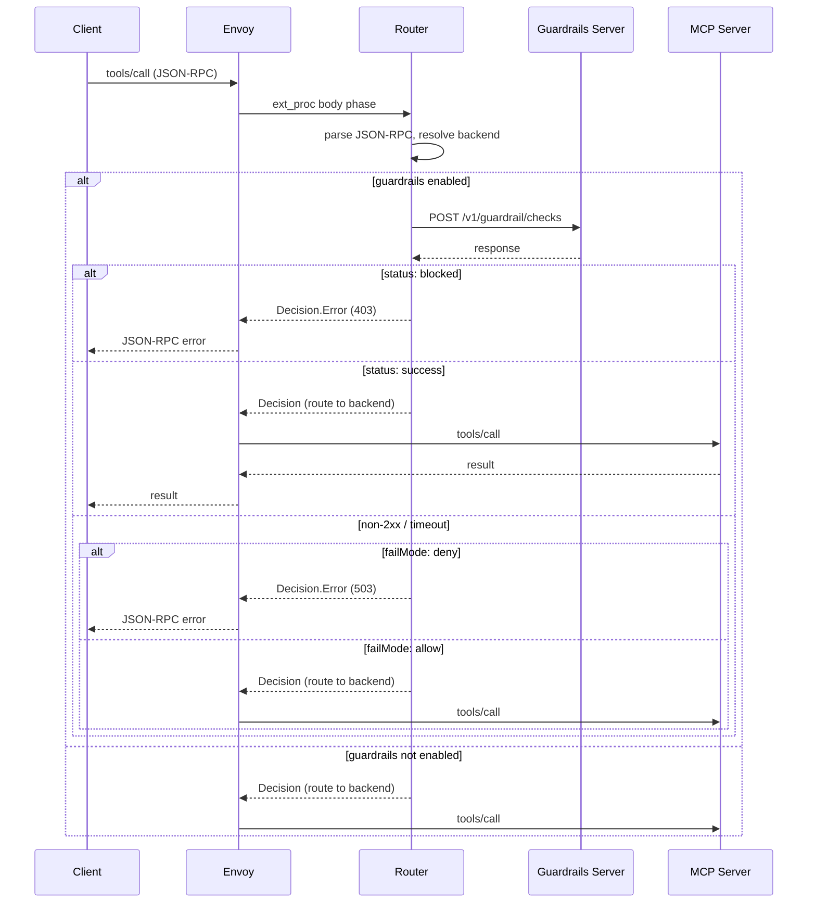
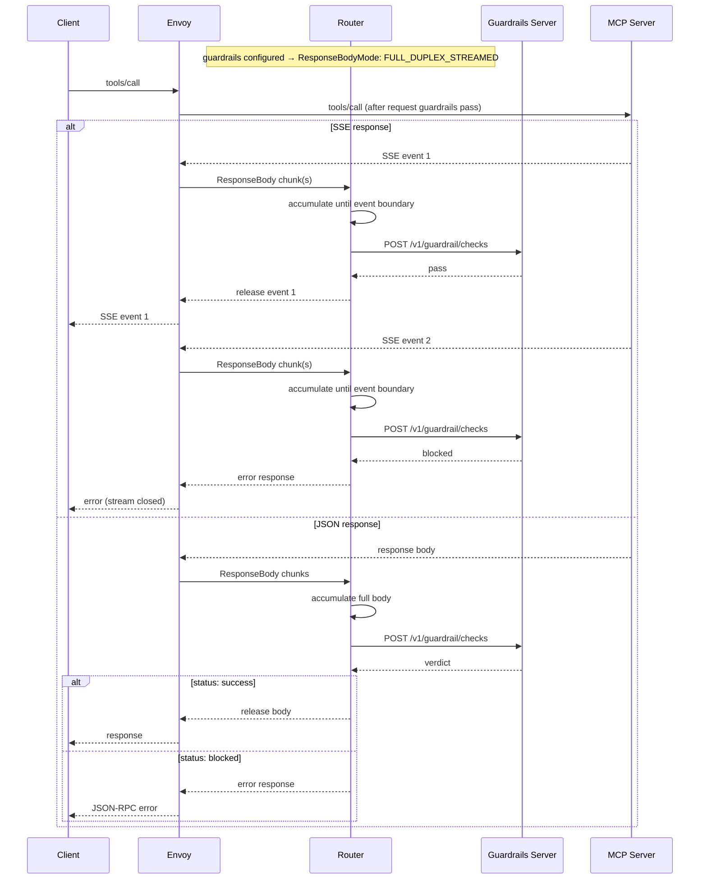

# Guardrails Integration

## Problem

> **Note:** examples reference NeMo Guardrails as the initial target.

Guardrails endpoints are incompatible with MCP JSON-RPC. Guardrails are an important piece of the security landscape for agent based interactions. MCP Servers provide information to agents so it is important to be able to apply policy and govern what can be sent to those agents and their respective LLMs. 

## Summary

A new translation layer in the router intercepts `tools/call` requests and responses, translates to guardrails checks, proceeds or rejects. Request checks run in ext_proc body phase before routing. Response checks accumulate the body in a size-capped buffer, parse JSON-RPC, and send text content to guardrails before releasing to the client. Configuration via Secret referenced from MCPGatewayExtension annotation (global). Allow extended policy configs per server via annotation. TLS reuses the gateway's existing CA bundle.

## Goals

- Translate MCP `tools/call` requests and elicitation responses to guardrails checks
- Check `tools/call` response content before it reaches the client
- Support global and per-server guardrails
- Fail closed by default, configurable to allow
- Reuse gateway CA trust pool
- Target NeMo Guardrails initially
- Keep the integration light and not part of the core API given it is likely to migrate to its own filter in the future

## Non-Goals

- Adding MCP awareness to NeMo itself

## Job Stories

### When I want to enforce safety policies on tool calls

When a platform engineer deploys MCP servers that interact with sensitive systems, they want tool calls checked against guardrails before execution so that dangerous calls are rejected at the gateway.

### When I want guardrails on all servers by default

When a platform engineer wants all tool calls checked, they configure guardrails once at the gateway level so every server inherits the policy.

### When I need different or additional guardrails per server

When servers have different risk profiles, the platform engineer wants per-server config IDs — either replacing or extending the global policy.

### When I want to inspect tool responses for sensitive content

When MCP servers return data from sensitive systems, tool responses are checked against guardrails before reaching the client so that PII, secrets, or harmful content in `text` results are caught at the gateway.

### When the guardrails server is down

Tool calls fail closed by default. `failMode: allow` exists for non-critical servers.

## Constraints

The gateway does not deploy or operate a guardrails instance. A running guardrails server must exist and be reachable.

## Design

### Configuration via Secret

Type `guardrails/external/nemo`, following the project's Secret reference pattern:

```yaml
apiVersion: v1
kind: Secret
metadata:
  name: my-guardrails-config
  namespace: mcp-system
  labels:
    mcp.kuadrant.io/secret: "true"
type: guardrails/external/nemo
stringData:
  config.yaml: |
    url: https://nemo-guardrails.internal:8080
    configIDs:
      - "tool-safety-v1"
      - "input_checking"
    model: "meta/llama-3.1-8b-instruct"
    failMode: deny        # deny (default) | allow
```

| Field | Required | Description |
|-------|----------|-------------|
| `url` | yes | Guardrails server endpoint |
| `configIDs` | no | Default config IDs for all servers. Empty for per-server-only model |
| `model` | yes | Model identifier for the guardrails check |
| `failMode` | no | `deny` (default) or `allow` |

The Secret type determines which provider validates and parses the content. The controller resolves the type to a provider implementation that exposes a `ValidateConfig()` method, returning a typed config or an error.

TLS uses the gateway's existing CA bundle (`caCertBundleRef`). `maxBodyBytes` is configured on MCPGatewayExtension spec, not per guardrails config.

### API Changes

Guardrails configuration is an extension to the core API, delivered via annotations rather than spec-level fields. This keeps guardrails decoupled from the CRD schema. See [Alternatives Considered](#alternatives-considered) for the rejected spec-level approach and rationale.

#### MCPGatewayExtension

`mcp.kuadrant.io/guardrails-ref` — Secret name in the same namespace. Validated at reconcile time, not admission.

```yaml
apiVersion: mcp.kuadrant.io/v1alpha1
kind: MCPGatewayExtension
metadata:
  name: mcp-gateway
  annotations:
    mcp.kuadrant.io/guardrails-ref: my-guardrails-config
spec:
  targetRef:
    name: mcp-gateway
    sectionName: mcp
  maxBodyBytes: 1048576  # 1 MiB (default)
```

`maxBodyBytes` is a spec field — it applies to any body the router buffers (request or response) (prefix stripping, guardrails), not just guardrails.

```go
type MCPGatewayExtensionSpec struct {
    // ... existing fields ...

    // +optional
    MaxBodyBytes *int `json:"maxBodyBytes,omitempty"`
}
```

#### MCPServerRegistration

`mcp.kuadrant.io/guardrails-config-ids` — comma-separated config IDs merged with gateway defaults. Requires `mcp.kuadrant.io/guardrails-ref` on the MCPGatewayExtension.

```yaml
apiVersion: mcp.kuadrant.io/v1alpha1
kind: MCPServerRegistration
metadata:
  name: dangerous-server
  annotations:
    mcp.kuadrant.io/guardrails-config-ids: "strict-input-checking,pii-detection"
spec:
  targetRef:
    name: dangerous-server-route
  prefix: dangerous_
```

#### Validation

If `guardrails-config-ids` is set but no `guardrails-ref` exists on the MCPGatewayExtension:

1. MCPServerRegistration set to `NotReady` with reason `GatewayGuardrailsNotConfigured`
2. Server removed from gateway config
3. Re-reconciled when the gateway annotation is added

#### Guardrails Secret Deletion

If the referenced Secret is missing while the annotation is set:

1. MCPGatewayExtension gets condition `GuardrailsSecretNotFound`
2. `GlobalGuardrails` cleared from `mcp-gateway-config`
3. All MCPServerRegistrations set to `NotReady` and removed
4. Restore by recreating the Secret or removing the annotation

#### Resolution Order

One guardrails server per gateway. Per-server config IDs are additive — they cannot remove gateway defaults. This lets gateway admins enforce org-wide policies via the Secret's `configIDs` while teams add domain-specific rails for their servers.

| Gateway `guardrails-ref` | Server `guardrails-config-ids` | Effective Behavior |
|-------------------------|------------------------------|--------------------|
| Not set | Not set | No guardrails |
| Set (Secret has default IDs) | Not set | Gateway defaults applied |
| Set (Secret has empty IDs) | Not set | No check — per-server-only model |
| Set (Secret has default IDs) | Set | Gateway defaults + server IDs merged |
| Set (Secret has no default IDs) | Set | Server IDs only |
| Not set | Set | **NotReady** — server removed |

### Request Flow

Runs after backend resolution, before the Decision is returned. Applies to `tools/call` and elicitation `accept`. Client `Authorization` is not forwarded to the guardrails server.

For `2026-07-28`, request bodies arrive `STREAMED` — the router accumulates chunks bounded by `maxBodyBytes`. For `2025-11-25`, request bodies are already `BUFFERED` by Envoy. Envoy's `per_connection_buffer_limit_bytes` (default 1 MiB) must be >= `maxBodyBytes` for `2025-11-25` clients.


```mermaid
sequenceDiagram
    participant Client
    participant Envoy
    participant Router
    participant Guardrails as Guardrails Server
    participant Backend as MCP Server

    Client->>Envoy: tools/call (JSON-RPC)
    Envoy->>Router: ext_proc body phase
    Router->>Router: parse JSON-RPC, resolve backend

    alt guardrails enabled
        Router->>Guardrails: POST /v1/guardrail/checks
        Guardrails-->>Router: response

        alt status: blocked
            Router-->>Envoy: Decision.Error (403)
            Envoy-->>Client: JSON-RPC error
        else status: success
            Router-->>Envoy: Decision (route to backend)
            Envoy->>Backend: tools/call
            Backend-->>Envoy: result
            Envoy-->>Client: result
        else non-2xx / timeout
            alt failMode: deny
                Router-->>Envoy: Decision.Error (503)
                Envoy-->>Client: JSON-RPC error
            else failMode: allow
                Router-->>Envoy: Decision (route to backend)
                Envoy->>Backend: tools/call
            end
        end
    else guardrails not enabled
        Router-->>Envoy: Decision (route to backend)
        Envoy->>Backend: tools/call
    end
```

### Response Handling

Response body mode depends on scope:

| Configuration | Response body mode | Mechanism |
|---------------|-------------------|-----------|
| Gateway-level (Secret has default config IDs) | `FULL_DUPLEX_STREAMED` permanently | Controller configures ext_proc filter |
| Per-server only (empty default IDs) | `FULL_DUPLEX_STREAMED` dynamically | Router sets `ModeOverride` only for requests/responses for servers with guardrails |

See [streamed body processing](../router-2026-07-28/streamed-body-processing.md) for the mode override mechanism. This mirrors how elicitation is handled also.

#### SSE responses (`text/event-stream`)

> **Note:** SSE is [deprecated as of `2026-07-28`](https://blog.modelcontextprotocol.io/posts/2026-07-28/#deprecations) with a year-long offramp.

Per-event processing reuses the `sseRewriter` pattern from `internal/mcp-router/elicitation.go`:

1. Extract `content[].text`, send to guardrails
2. On pass: release event
3. On block: error, close stream
4. Event exceeds `maxBodyBytes`: 413

#### JSON responses (`application/json`)

Accumulate full body (bounded by `maxBodyBytes`), extract `content[].text`, send to guardrails. Only `text` content is inspected — binary and `resource` types bypass (see Open Questions).


```mermaid
sequenceDiagram
    participant Client
    participant Envoy
    participant Router
    participant Guardrails as Guardrails Server
    participant Backend as MCP Server

    Note over Router: guardrails configured → ResponseBodyMode: FULL_DUPLEX_STREAMED

    Client->>Envoy: tools/call
    Envoy->>Backend: tools/call (after request guardrails pass)

    alt SSE response
        Backend-->>Envoy: SSE event 1
        Envoy->>Router: ResponseBody chunk(s)
        Router->>Router: accumulate until event boundary
        Router->>Guardrails: POST /v1/guardrail/checks
        Guardrails-->>Router: pass
        Router-->>Envoy: release event 1
        Envoy-->>Client: SSE event 1

        Backend-->>Envoy: SSE event 2
        Envoy->>Router: ResponseBody chunk(s)
        Router->>Router: accumulate until event boundary
        Router->>Guardrails: POST /v1/guardrail/checks
        Guardrails-->>Router: blocked
        Router-->>Envoy: error response
        Envoy-->>Client: error (stream closed)

    else JSON response
        Backend-->>Envoy: response body
        Envoy->>Router: ResponseBody chunks
        Router->>Router: accumulate full body
        Router->>Guardrails: POST /v1/guardrail/checks
        Guardrails-->>Router: verdict
        alt status: success
            Router-->>Envoy: release body
            Envoy-->>Client: response
        else status: blocked
            Router-->>Envoy: error response
            Envoy-->>Client: JSON-RPC error
        end
    end
```

#### Response to Decision Mapping

| Outcome | Router action |
|---------|---------------|
| `status: "success"` | Release original body to client |
| `status: "modified"` | **Unresolved** — see Open Questions |
| `status: "blocked"` | Error response, discard buffer, close stream |
| Exceeds `maxBodyBytes` | 413. `failMode` does not apply |
| Non-2xx / timeout | Apply `failMode`: deny → error, allow → release |

### Translation Mapping (NeMo)

#### Request: `tools/call` → `v1/guardrail/checks`

| MCP field | NeMo field |
|-----------|------------|
| `params.name` | `messages[0].name` |
| `params.arguments` (JSON-encoded) | `messages[0].content` |
| N/A | `messages[0].role = "user"` |
| from config | `guardrails.config_ids` |
| from config | `model` |

```json
{
  "model": "meta/llama-3.1-8b-instruct",
  "messages": [
    {
      "role": "user",
      "name": "execute_sql",
      "content": "{\"query\": \"DROP TABLE users\"}",
      "config": "tool"
    }
  ],
  "guardrails": {
    "config_ids": ["tool-safety-v1", "input_checking"]
  }
}
```

#### Request: elicitation `accept` → `v1/guardrail/checks`

`decline`/`cancel` bypass guardrails (no user content).

| Elicitation field | NeMo field |
|-------------------|------------|
| `result.action` | `messages[0].name` |
| `result` minus `action` (JSON-encoded) | `messages[0].content` |
| N/A | `messages[0].role = "user"` |
| from config | `guardrails.config_ids`, `model` |

#### Response: `result` → `v1/guardrail/checks`

| MCP response field | NeMo field |
|-------------------|------------|
| `result.content[].text` (text items only) | `messages[0].content` |
| tool name (from request context) | `messages[0].name` |
| N/A | `messages[0].role = "assistant"` |
| from config | `guardrails.config_ids`, `model` |

#### Decision Mapping

| Outcome | Router action |
|---------|---------------|
| Translation failure | Always deny (400). `failMode` does not apply |
| `status: "success"` | Proceed |
| `status: "blocked"` | 403 with rails message |
| Non-2xx / timeout / malformed | Apply `failMode` |

### Config Propagation

Controller writes resolved guardrails config into `mcp-gateway-config` Secret:

```go
type BrokerConfig struct {
    Servers          []MCPServer           `json:"servers"          yaml:"servers"`
    VirtualServers   []VirtualServerConfig `json:"virtualServers,omitempty" yaml:"virtualServers,omitempty"`
    GatewayCACertPEM string                `json:"gatewayCACertPEM,omitempty" yaml:"gatewayCACertPEM,omitempty"`
    GlobalGuardrails *GuardrailsConfig     `json:"globalGuardrails,omitempty" yaml:"globalGuardrails,omitempty"`
}

type MCPServer struct {
    // ... existing fields ...
    GuardrailsConfigIDs []string `json:"guardrailsConfigIDs,omitempty" yaml:"guardrailsConfigIDs,omitempty"`
}

type GuardrailsConfig struct {
    URL       string   `json:"url"       yaml:"url"`
    ConfigIDs []string `json:"configIDs" yaml:"configIDs"`
    Model     string   `json:"model"     yaml:"model"`
    FailMode  string   `json:"failMode"  yaml:"failMode"` // "deny" | "allow"
}
```

Single `*http.Client` per guardrails server, following the `HairpinClientPool` pattern. Recreated on config change.

| Setting | Value | Rationale |
|---------|-------|-----------|
| Keep-alive | enabled | avoid TCP/TLS per check |
| `MaxIdleConnsPerHost` | ext_proc stream count | match concurrency |
| `http.Client.Timeout` | none | per-request `context.WithTimeout` |
| `DialContext` timeout | 1s | fast-fail DNS/TCP |
| Per-request deadline | 3s | within 10s `message_timeout` |

### Internal Architecture

```go
type GuardrailsTransformer interface {
    TransformRequest(req *MCPRequest, cfg *GuardrailsConfig, configIDs []string) ([]byte, error)
    TransformResponse(toolName string, content []byte, cfg *GuardrailsConfig, configIDs []string) ([]byte, error)
}
```

Secret type determines implementation (`guardrails/external/nemo` → `NeMoTransformer`). Transformer owns request body shape. Router owns HTTP call, timeout, TLS, fail mode, config ID merging, and Decision mapping.

### Component Responsibilities

| Component | Responsibility |
|-----------|----------------|
| Controller | Reads/validates guardrails Secret, writes config. Sets MCPServerRegistration NotReady if gateway guardrails missing |
| Router | Calls guardrails before routing `tools/call` and elicitation accepts, maps response to Decision |
| Broker | No involvement |
| Envoy | `FULL_DUPLEX_STREAMED` response body mode when guardrails configured |

### Observability

Span attributes on `mcp-router.tool-call`:

| Attribute | Value |
|-----------|-------|
| `guardrails.enabled` | `true` / `false` |
| `guardrails.status` | `success` / `blocked` / `error` |
| `guardrails.config_ids` | config IDs used |
| `guardrails.latency_ms` | round-trip time |
| `guardrails.fail_mode` | `deny` / `allow` |

`Debug` level per check, `Info` for config changes.

## Performance Impact

Hot path — see `docs/design/performance.md`. Synchronous HTTP round-trip per check. 3s guardrails budget within 10s `message_timeout`. Response-side: per-event for SSE, full-body for JSON. Bodies exceeding `maxBodyBytes` → 413 regardless of `failMode`.

## Security Considerations

- **Fail closed by default** — consistent with invariant #5
- **Secret validation** — type `guardrails/external/nemo`, label `mcp.kuadrant.io/secret=true`, valid `url`
- **Router-only path** — broker never interacts with guardrails
- **No credential leak** — client `Authorization` not forwarded to guardrails server
- **TLS optional in-cluster**

## Why the Router

Requires parsed JSON-RPC body, resolved backend, and guardrails config. Only the router has all three. Alternatives (`ext_authz`, Lua/WASM) either can't access the body or duplicate the JSON-RPC parser.

## Future Considerations

### Guardrails for Prompts

Check `prompts/get` response content. Same pattern, different translation mapping.

### Circuit Breaker

If the guardrails server degrades, every check eats the full timeout. A circuit breaker tripping after N consecutive failures would fast-fail by applying `failMode` immediately.

### Standalone Guardrails Filter

Guardrails could move out of the router into a separate filter in the request chain with its own CRD and deployment. The annotation-based API avoids blocking this — dropping an annotation is not a breaking change.

### AI Gateway Provider Integration

A provider like Praxis could offer guardrails natively. Secret type differs per provider (`type: guardrails/internal/praxis`). If guardrails migrate to a standalone filter, the provider abstraction moves with it.

## Alternatives Considered

### Spec-level `guardrailsRef` field on MCPGatewayExtension

Add `guardrailsRef *SecretReference` to `MCPGatewayExtensionSpec` and `guardrailsConfigIDs []string` to `MCPServerRegistrationSpec`.

```go
type MCPGatewayExtensionSpec struct {
    // ... existing fields ...
    GuardrailsRef *SecretReference `json:"guardrailsRef,omitempty"`
}

type MCPServerRegistrationSpec struct {
    // ... existing fields ...
    GuardrailsConfigIDs []string `json:"guardrailsConfigIDs,omitempty"`
}
```

Benefits: schema-validated at admission, discoverable via `kubectl explain`, consistent with `caCertBundleRef`.

**Rejected** — unclear whether guardrails belong permanently in the router and gateway API. The router has the parsed body, resolved backend, and config today, but that is implementation convenience, not ownership. Guardrails could migrate to a separate filter in the request chain with its own CRD. A spec field becomes dead API surface requiring backwards-compatible maintenance. The annotation avoids this.

## Open Questions

### Request-side value for schema-constrained tools

For rigid schemas (`{"namespace": "prod", "replicas": 3}`), the latency cost may not be justified — AuthPolicy and input validation already cover access and correctness.

### Modified response handling

NeMo can return `status: "modified"` with altered content (e.g. PII redacted). Should the router replace the original body or release the original?

### Non-text response content

Only `text` content items are inspected. `image`/`audio` (base64) and `resource` (URI reference) bypass guardrails.

## Execution

See:
- [tasks/tasks.md](tasks/tasks.md) for the implementation plan (TODO)
- [tasks/test_cases.md](tasks/test_cases.md) for E2E test cases
- [tasks/documentation.md](tasks/documentation.md) for documentation plan
