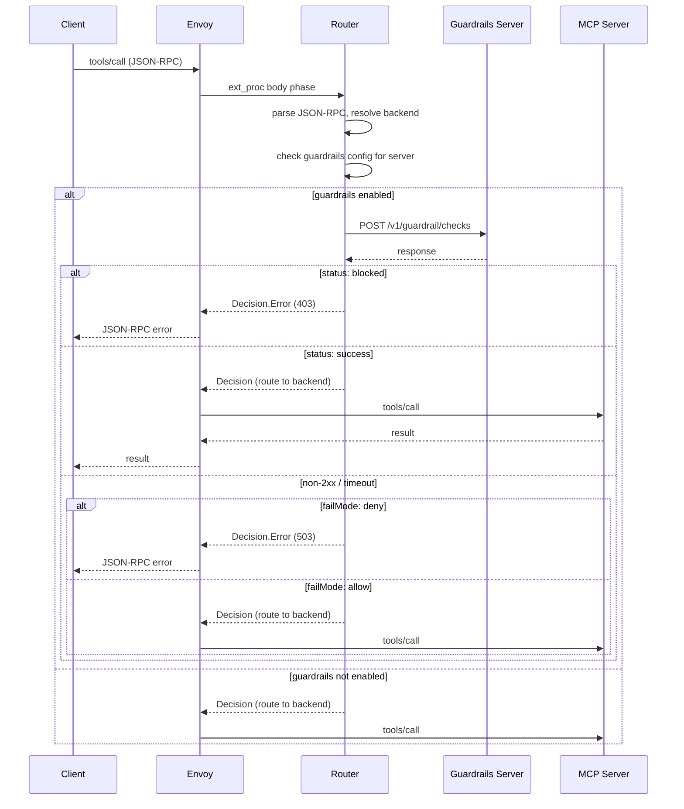

# Guardrails Integration

## Problem

> **Note:** examples reference NeMo Guardrails as the initial target.

Guardrails systems don't support MCP natively. Their endpoints (`v1/chat/completions`, `v1/guardrail/checks`) are incompatible with MCP JSON-RPC. Integrating at the router level provides centralized enforcement and consistent protection across all clients.

## Summary

Translation layer in the router that intercepts `tools/call` requests, translates them to a guardrails check, and either proceeds or rejects. Configuration via Kubernetes Secret referenced from `MCPGatewayExtension` (global) and/or `MCPServerRegistration` (per-server). TLS reuses the gateway's existing CA bundle.

## Goals

- Translate MCP `tools/call` and elicitation responses to guardrails checks
- Support global and per-server guardrails
- Fail closed by default, configurable to allow
- Reuse gateway CA trust pool
- Target NeMo Guardrails initially

## Non-Goals

- Response guardrailing (deferred)
- Adding MCP awareness to NeMo itself

## Job Stories

### When I want to enforce safety policies on tool calls

When a platform engineer deploys MCP servers that interact with sensitive systems, they want tool calls checked against guardrails before execution so that dangerous calls are rejected at the gateway.

### When I want guardrails on all servers by default

When a platform engineer wants all tool calls checked, they want to configure guardrails once at the gateway level so every server inherits the policy.

### When I need different guardrails policies per server

When servers have different risk profiles, the platform engineer wants different config IDs per server so policies match capabilities.

### When I want additional guardrails on a specific server

When an MCP server accepts freeform input or interacts with a downstream model, the developer wants server-specific policies in addition to global ones.

### When the guardrails server is down

When the guardrails server is unreachable, tool calls fail closed by default. For non-critical servers, the option to fail open exists.

### When the guardrails server uses a private CA

When the guardrails server uses a corporate or self-signed CA, the platform engineer adds it to the gateway CA bundle.

## Design

### Configuration via Secret

Type `guardrails/external/nemo`, following the project's Secret reference pattern (`credentialRef`, `caCertSecretRef`):

```yaml
apiVersion: v1
kind: Secret
metadata:
  name: my-guardrails-config
  namespace: mcp-system
  labels:
    mcp.kuadrant.io/secret: "true"
type: guardrails/external/nemo
stringData:
  config.yaml: |
    url: https://nemo-guardrails.internal:8080
    configIDs:
      - "tool-safety-v1"
      - "input_checking"
    model: "meta/llama-3.1-8b-instruct"
    failMode: deny        # deny (default) | allow
```

| Field | Required | Description |
|-------|----------|-------------|
| `url` | yes | Guardrails server endpoint |
| `configIDs` | no | Default config IDs applied to all servers. Empty if per-server `guardrailsConfigIDs` supply policies |
| `model` | yes | Model identifier for the guardrails check |
| `failMode` | no | `deny` (default): reject on failure. `allow`: proceed |

> **Note:** TLS uses the gateway's existing CA bundle (`caCertBundleRef`). Add private CAs there.

### API Changes

#### MCPGatewayExtension

```go
type MCPGatewayExtensionSpec struct {
    // ... existing fields ...

    // guardrailsRef references a Secret of type guardrails/external/nemo.
    // When set, all tools/call requests are checked before routing.
    // +optional
    GuardrailsRef *SecretReference `json:"guardrailsRef,omitempty"`
}
```

```yaml
apiVersion: mcp.kuadrant.io/v1alpha1
kind: MCPGatewayExtension
metadata:
  name: mcp-gateway
spec:
  targetRef:
    name: mcp-gateway
    sectionName: mcp
  guardrailsRef:
    name: my-guardrails-config
```

#### MCPServerRegistration

```go
type MCPServerRegistrationSpec struct {
    // ... existing fields ...

    // guardrailsConfigIDs specifies additional config IDs merged with gateway
    // defaults into a single check request. Requires guardrailsRef on the
    // MCPGatewayExtension — without it, the server is set to NotReady.
    // +optional
    GuardrailsConfigIDs []string `json:"guardrailsConfigIDs,omitempty"`
}
```

```yaml
apiVersion: mcp.kuadrant.io/v1alpha1
kind: MCPServerRegistration
metadata:
  name: dangerous-server
spec:
  targetRef:
    name: dangerous-server-route
  prefix: dangerous_
  guardrailsConfigIDs:
    - "strict-input-checking"
    - "pii-detection"
```

#### Validation

If `guardrailsConfigIDs` is set but no `guardrailsRef` exists on the MCPGatewayExtension:

1. MCPServerRegistration set to `NotReady` with reason `GuardrailsNotConfigured`
2. Server removed from gateway config (no tools/list, tool calls fail)
3. Re-reconciled when `guardrailsRef` is added

#### Guardrails Secret Deletion

If the guardrails Secret is missing (deleted or never created) while `guardrailsRef` is set:

1. MCPGatewayExtension gets condition `GuardrailsSecretNotFound`
2. `GlobalGuardrails` is cleared from `mcp-gateway-config`
3. All MCPServerRegistrations are set to `NotReady` and removed from the gateway
4. To restore: recreate the Secret or remove `guardrailsRef` from MCPGatewayExtension

This ensures a missing Secret fails closed uniformly. No stale config is retained — there may be no prior config to retain (Secret never created), and retaining a config pointing at an unreachable URL only adds latency before the same outcome.

#### Resolution Order

One guardrails server per gateway. Per-server config IDs are additive.

| Gateway `guardrailsRef` | Server `guardrailsConfigIDs` | Effective Behavior |
|-------------------------|------------------------------|--------------------|
| Not set | Not set | No guardrails |
| Set (with default IDs) | Not set | Gateway defaults applied |
| Set (empty default IDs) | Not set | No check — per-server-only model |
| Set (with default IDs) | Set | Gateway defaults + server IDs merged |
| Set (no default IDs) | Set | Server IDs only |
| Not set | Set | **NotReady** — server removed |

### Request Flow

Guardrails runs in the router after backend resolution, before the Decision is returned. Applies to `tools/call` and elicitation `accept` responses. If server resolution fails, existing error handling applies — no guardrails check.

**No authorization header forwarding:** The router does not forward the client's `Authorization` header to the guardrails server. NeMo Guardrails does not require client auth — it authenticates to its LLM backend via its own `OPENAI_API_KEY` env var, configured independently on the NeMo server. The guardrails server is deployed without auth enabled (the default) and accessed over in-cluster networking. This avoids exposing client bearer tokens to infrastructure services and keeps credential flows clean: client tokens are for the gateway and upstream MCP servers, not for guardrails.


```mermaid
sequenceDiagram
    participant Client
    participant Envoy
    participant Router
    participant Guardrails as Guardrails Server
    participant Backend as MCP Server

    Client->>Envoy: tools/call (JSON-RPC)
    Envoy->>Router: ext_proc body phase
    Router->>Router: parse JSON-RPC, resolve backend
    Router->>Router: check guardrails config for server

    alt guardrails enabled
        Router->>Guardrails: POST /v1/guardrail/checks
        Guardrails-->>Router: response

        alt status: blocked
            Router-->>Envoy: Decision.Error (403)
            Envoy-->>Client: JSON-RPC error
        else status: success
            Router-->>Envoy: Decision (route to backend)
            Envoy->>Backend: tools/call
            Backend-->>Envoy: result
            Envoy-->>Client: result
        else non-2xx / timeout
            alt failMode: deny
                Router-->>Envoy: Decision.Error (503)
                Envoy-->>Client: JSON-RPC error
            else failMode: allow
                Router-->>Envoy: Decision (route to backend)
                Envoy->>Backend: tools/call
            end
        end
    else guardrails not enabled
        Router-->>Envoy: Decision (route to backend)
        Envoy->>Backend: tools/call
    end
```

### Translation Mapping (NeMo)

#### MCP `tools/call` to NeMo `v1/guardrail/checks`

| MCP field | NeMo field |
|-----------|------------|
| `params.name` | `messages[0].name` |
| `params.arguments` (JSON-encoded) | `messages[0].content` |
| N/A | `messages[0].role = "user"` |
| N/A | `messages[0].config = "tool"` |
| from config | `guardrails.config_ids` |
| from config | `model` |

Example:

```json
{
  "model": "meta/llama-3.1-8b-instruct",
  "messages": [
    {
      "role": "user",
      "name": "execute_sql",
      "content": "{\"query\": \"DROP TABLE users\"}",
      "config": "tool"
    }
  ],
  "guardrails": {
    "config_ids": ["tool-safety-v1", "input_checking"]
  }
}
```

#### Elicitation Response to NeMo

Only `accept` responses are checked (`decline`/`cancel` carry no user content).

| Elicitation field | NeMo field |
|-------------------|------------|
| `result.action` | `messages[0].name` |
| `result` minus `action` (JSON-encoded) | `messages[0].content` |
| N/A | `messages[0].role = "user"` |
| N/A | `messages[0].config = "tool"` |
| from config | `guardrails.config_ids` |
| from config | `model` |

#### Response to Decision Mapping

| Outcome | Router action |
|---------|---------------|
| Translation failure | Always deny with 400. `failMode` does not apply |
| `status: "success"` | Proceed with routing |
| `status: "blocked"` | 403 with rails message |
| Non-2xx HTTP | Apply `failMode`: deny → 503, allow → proceed |
| Timeout | Apply `failMode`: deny → 503, allow → proceed |
| Malformed response body | Apply `failMode`: deny → 502, allow → proceed |

Translation failures (e.g. `params.arguments` not valid JSON) are always denied — `failMode: allow` applies only to guardrails server availability, not untranslatable requests.

### TLS Trust

Reuses the gateway's CA trust pool (system roots + `caCertBundleRef`).

### Config Propagation

Controller writes resolved guardrails config into `mcp-gateway-config` Secret. Per-server `guardrailsConfigIDs` go into each server entry:

```go
type BrokerConfig struct {
    Servers          []MCPServer           `json:"servers"          yaml:"servers"`
    VirtualServers   []VirtualServerConfig `json:"virtualServers,omitempty" yaml:"virtualServers,omitempty"`
    GatewayCACertPEM string                `json:"gatewayCACertPEM,omitempty" yaml:"gatewayCACertPEM,omitempty"`
    GlobalGuardrails *GuardrailsConfig     `json:"globalGuardrails,omitempty" yaml:"globalGuardrails,omitempty"`
}

type MCPServer struct {
    // ... existing fields ...
    GuardrailsConfigIDs []string `json:"guardrailsConfigIDs,omitempty" yaml:"guardrailsConfigIDs,omitempty"`
}

type GuardrailsConfig struct {
    URL       string   `json:"url"       yaml:"url"`
    ConfigIDs []string `json:"configIDs" yaml:"configIDs"`
    Model     string   `json:"model"     yaml:"model"`
    FailMode  string   `json:"failMode"  yaml:"failMode"`  // "deny" | "allow"
}
```

The router constructs a single `*http.Client` for the guardrails server, reused across requests:

- **Keep-alive enabled** — persistent connections avoid TCP/TLS handshake per check
- **`MaxIdleConnsPerHost`** tuned for expected concurrency (matches ext_proc stream count)
- **No `http.Client.Timeout`** — end-to-end deadline is set per-request via `context.WithTimeout`, not on the client. This matches the `HairpinClientPool` pattern and allows the deadline to account for time already spent in the ext_proc body phase
- **`http.Transport.DialContext`** timeout of 1s — bounds connection setup independently so a DNS or TCP hang fails fast rather than consuming the full request deadline
- **Per-request `context.WithTimeout`** of 3s — covers the full round-trip: connection (if not pooled), TLS handshake (if not reused), request write, server processing, and response read. This is the guardrails budget within the 10s ext_proc `message_timeout`. The remaining ~7s covers JSON-RPC parsing, backend resolution, and hairpin init

Client recreated when guardrails config changes (URL or TLS trust pool update). Idle connections from the previous client are closed.

### Internal Architecture

Translation behind a `GuardrailsTransformer` interface. Secret type determines implementation, resolved at config load time.

```go
// GuardrailsTransformer translates an MCP request into a provider-specific
// check request body. configIDs is the merged gateway + per-server set.
type GuardrailsTransformer interface {
    Transform(req *MCPRequest, cfg *GuardrailsConfig, configIDs []string) ([]byte, error)
}
```

Router merges config IDs (gateway defaults + per-server, deduplicated) before calling Transform. Transformer selection by Secret type:

```go
// guardrails/external/nemo  → NeMoTransformer
// guardrails/external/other → OtherTransformer (future)
```

Transformer owns the request body shape. Router owns HTTP call, timeout, TLS, fail mode, config ID merging, and Decision mapping.

### Component Responsibilities

| Component | Responsibility |
|-----------|----------------|
| Controller | Reads/validates guardrails Secret, writes config. Sets MCPServerRegistration NotReady if gateway guardrails missing |
| Router | Calls guardrails server before routing `tools/call` and elicitation accepts, maps response to Decision |
| Broker | No involvement |
| Envoy | No changes |

### Observability

Span attributes on `mcp-router.tool-call`:

| Attribute | Value |
|-----------|-------|
| `guardrails.enabled` | `true` / `false` |
| `guardrails.status` | `success` / `blocked` / `error` |
| `guardrails.config_ids` | config IDs used |
| `guardrails.latency_ms` | round-trip time |
| `guardrails.fail_mode` | `deny` / `allow` |

`Debug` level per check, `Info` for config changes.

## Performance Impact

Synchronous HTTP round-trip in the ext_proc body phase. Hot path — see `docs/design/performance.md`.

- Guardrails call blocks ext_proc response. Envoy holds request body in BUFFERED mode.
- NeMo performs LLM inference .
- ext_proc `message_timeout` is 10s total for all body phase processing (parsing, resolution, hairpin init, guardrails).
- Guardrails per-request deadline: 3s (`context.WithTimeout`), dial timeout: 1s. Leaves ~7s for other ext_proc processing
- Only `tools/call` and elicitation `accept` affected. Other methods bypass guardrails entirely.

## Security Considerations

- **Fail closed by default** — consistent with invariant #5
- **Secret validation** — type `guardrails/external/nemo`, label `mcp.kuadrant.io/secret=true`, valid `url`. `configIDs` may be empty for per-server-only policies
- **Router-only path** — broker never interacts with guardrails
- **No credential leak** — guardrails Secret contains no upstream MCP credentials. The router does not forward client `Authorization` headers to the guardrails server. NeMo authenticates to its LLM backend via its own `OPENAI_API_KEY`, not client tokens
- **TLS optional in-cluster** — acceptable for in-cluster communication

## Why the Router

The check requires the parsed JSON-RPC body, the resolved backend server, and the guardrails config. Only the router has all three.

**Alternatives considered:**

- **ext_authz** — operates on headers, not body. Would need router to parse body first, copy into headers for ext_authz second pass. Two filter round-trips, fragile ordering.
- **Lua/WASM filter** — duplicates the JSON-RPC parser. Two parsers in the same pipeline is a maintenance liability.

The cost is a synchronous round-trip in the hot path. Accepted: guardrails server runs in-cluster, impact scoped to `tools/call` and elicitation `accept` only.

## Future Considerations

### Response Guardrailing

Check `tools/call` responses before they reach the client. Requires response body buffering in ext_proc, different translation mapping, and UX for blocked responses (tool already executed). Deferred.

### Guardrails for Prompts

Check `prompts/get` response content. Same pattern, different translation mapping.

### Circuit Breaker

If the guardrails server degrades (slow but not down), every check eats the full timeout. A circuit breaker tripping after N consecutive failures would fast-fail by applying `failMode` immediately.

### AI Gateway Provider Integration

A provider like Praxis could offer guardrails natively. This design allows for that. The controller would translate `guardrailsRef` into provider-specific resources instead of the router performing translation. CRD field stays the same, Secret type differs per provider (example `type: guardrails/internal/praxis` ).

## Open Questions

### Request-side value for schema-constrained tools

Most MCP tools have typed input schemas. AuthPolicy controls access, input validation handles correctness. Guardrails add clear value for freeform text or arguments passed to downstream models. For rigid schemas (`{"namespace": "prod", "replicas": 3}`), the latency cost may not be justified.

### Should guardrails be on the request path, response path, or both?

Response guardrails (data exfiltration, PII, harmful content) may be more valuable for many use cases. Different cost/value profile. Is request-side sufficient to validate the pattern?

## Execution

See:
- [tasks/tasks.md](tasks/tasks.md) for the implementation plan (TODO)
- [tasks/e2e_test_cases.md](tasks/test_cases.md) for E2E test cases
- [tasks/documentation.md](tasks/documentation.md) for documentation plan
