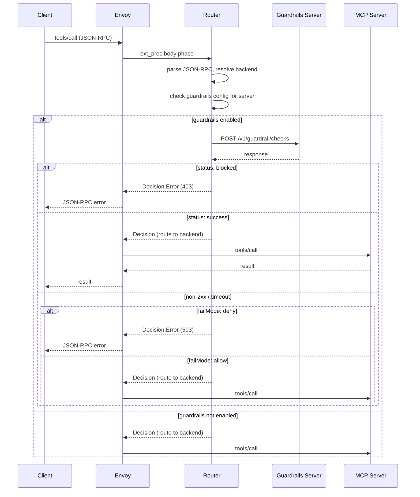
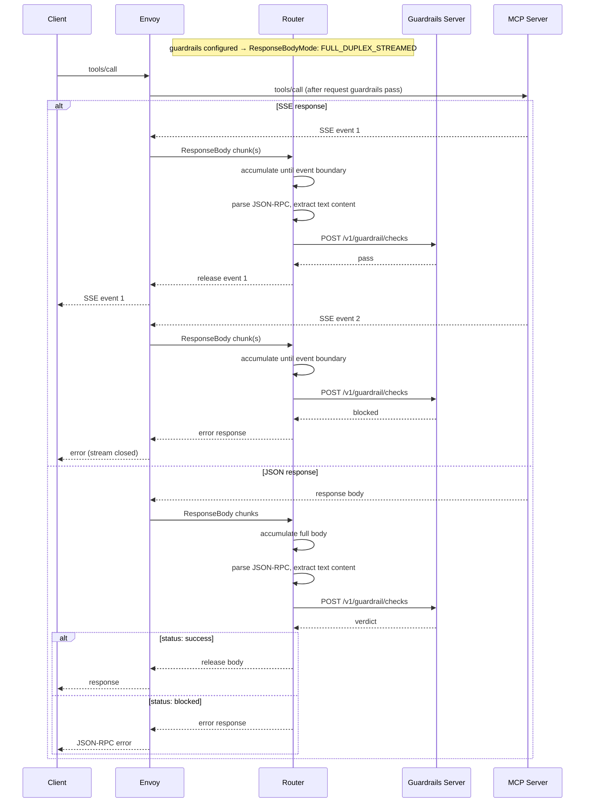

# Guardrails Integration

## Problem

> **Note:** examples reference NeMo Guardrails as the initial target.

Guardrails systems don't support MCP natively. Their endpoints (`v1/chat/completions`, `v1/guardrail/checks`) are incompatible with MCP JSON-RPC. Integrating at the router level provides centralized enforcement and consistent protection across all clients.

## Summary

Add a translation layer in the router that intercepts `tools/call` requests and responses, translates them to guardrails checks, and either proceeds or rejects. Request checks run in the ext_proc body phase before routing. Response checks accumulate the response body in a size-capped buffer, parse the JSON-RPC result, and send text content to the guardrails service before releasing to the client. Configuration via Kubernetes Secret referenced from `MCPGatewayExtension` (global) and/or `MCPServerRegistration` (per-server). TLS reuses the gateway's existing CA bundle configuration.

## Goals

- Translate MCP `tools/call` requests and elicitation responses to guardrails checks
- Check `tools/call` response content before it reaches the client
- Support global and per-server guardrails
- Fail closed by default, configurable to allow
- Reuse gateway CA trust pool
- Target NeMo Guardrails initially

## Non-Goals

- Adding MCP awareness to NeMo itself

## Job Stories

### When I want to enforce safety policies on tool calls

When a platform engineer deploys MCP servers that interact with sensitive systems, they want tool calls checked against guardrails before execution so that dangerous calls are rejected at the gateway.

### When I want guardrails on all servers by default

When a platform engineer wants all tool calls checked, they configure guardrails once at the gateway level so every server inherits the policy.

### When I need different or additional guardrails per server

When servers have different risk profiles, the platform engineer wants per-server config IDs — either replacing or extending the global policy.

### When I want to inspect tool responses for sensitive content

When MCP servers return data from sensitive systems, tool responses are checked against guardrails before reaching the client so that PII, secrets, or harmful content in `text` results are caught at the gateway.

### When the guardrails server is down

Tool calls fail closed by default. `failMode: allow` exists for non-critical servers.

### When the guardrails server uses a private CA

Add the CA to the gateway CA bundle (`caCertBundleRef`). No separate guardrails TLS config.

## Constraints

### Deployment model

The gateway does not deploy or operate a guardrails instance. A running guardrails server must exist and be reachable before configuring `guardrailsRef`.

## Design

### Configuration via Secret

Type `guardrails/external/nemo`, following the project's Secret reference pattern (`credentialRef`, `caCertSecretRef`):

```yaml
apiVersion: v1
kind: Secret
metadata:
  name: my-guardrails-config
  namespace: mcp-system
  labels:
    mcp.kuadrant.io/secret: "true"
type: guardrails/external/nemo
stringData:
  config.yaml: |
    url: https://nemo-guardrails.internal:8080
    configIDs:
      - "tool-safety-v1"
      - "input_checking"
    model: "meta/llama-3.1-8b-instruct"
    failMode: deny        # deny (default) | allow
```

| Field | Required | Description |
|-------|----------|-------------|
| `url` | yes | Guardrails server endpoint |
| `configIDs` | no | Default config IDs applied to all servers. Empty if per-server `guardrailsConfigIDs` supply policies |
| `model` | yes | Model identifier for the guardrails check |
| `failMode` | no | `deny` (default): reject on failure. `allow`: proceed |

> **Note:** The body buffer size cap (`maxBodyBytes`) is configured at the gateway level on MCPGatewayExtension, not per guardrails config. See API Changes below.

> **Note:** TLS uses the gateway's existing CA bundle (`caCertBundleRef`). Add private CAs there.

### API Changes

#### MCPGatewayExtension

```go
type MCPGatewayExtensionSpec struct {
    // ... existing fields ...

    // guardrailsRef references a Secret of type guardrails/external/nemo.
    // When set, all tools/call requests are checked before routing.
    // +optional
    GuardrailsRef *SecretReference `json:"guardrailsRef,omitempty"`

    // maxBodyBytes is the buffer size cap in bytes for a streamed body 
    // (request or response) accumulation. Applies to any body the router buffers (prefix
    // stripping, guardrails inspection). Bodies exceeding this are
    // rejected with a 413. Default 1 MiB. 
    // For 2025 protocol the request is sent buffered from Envoy and so this setting defaults
    // to the default body buffer in Envoy and needs to be controlled via Envoy
    // +optional
    MaxBodyBytes *int `json:"maxBodyBytes,omitempty"`
}
```

```yaml
apiVersion: mcp.kuadrant.io/v1alpha1
kind: MCPGatewayExtension
metadata:
  name: mcp-gateway
spec:
  targetRef:
    name: mcp-gateway
    sectionName: mcp
  maxBodyBytes: 1048576  # 1 MiB (default)
  guardrailsRef:
    name: my-guardrails-config
```

#### MCPServerRegistration

```go
type MCPServerRegistrationSpec struct {
    // ... existing fields ...

    // guardrailsConfigIDs specifies additional config IDs merged with gateway
    // defaults into a single check request. Requires guardrailsRef on the
    // MCPGatewayExtension — without it, the server is set to NotReady.
    // +optional
    GuardrailsConfigIDs []string `json:"guardrailsConfigIDs,omitempty"`
}
```

```yaml
apiVersion: mcp.kuadrant.io/v1alpha1
kind: MCPServerRegistration
metadata:
  name: dangerous-server
spec:
  targetRef:
    name: dangerous-server-route
  prefix: dangerous_
  guardrailsConfigIDs:
    - "strict-input-checking"
    - "pii-detection"
```

#### Validation

If `guardrailsConfigIDs` is set but no `guardrailsRef` exists on the MCPGatewayExtension:

1. MCPServerRegistration set to `NotReady` with reason `GuardrailsNotConfigured`
2. Server removed from gateway config (no tools/list, tool calls fail)
3. Re-reconciled when `guardrailsRef` is added

#### Guardrails Secret Deletion

If the guardrails Secret is missing (deleted or never created) while `guardrailsRef` is set:

1. MCPGatewayExtension gets condition `GuardrailsSecretNotFound`
2. `GlobalGuardrails` is cleared from `mcp-gateway-config`
3. All MCPServerRegistrations are set to `NotReady` and removed from the gateway
4. To restore: recreate the Secret or remove `guardrailsRef` from MCPGatewayExtension

#### Resolution Order

One guardrails server per gateway. Per-server config IDs are additive.

| Gateway `guardrailsRef` | Server `guardrailsConfigIDs` | Effective Behavior |
|-------------------------|------------------------------|--------------------|
| Not set | Not set | No guardrails |
| Set (with default IDs) | Not set | Gateway defaults applied |
| Set (empty default IDs) | Not set | No check — per-server-only model |
| Set (with default IDs) | Set | Gateway defaults + server IDs merged |
| Set (no default IDs) | Set | Server IDs only |
| Not set | Set | **NotReady** — server removed |

### Request Flow

Guardrails runs in the router after backend resolution, before the Decision is returned. Applies to `tools/call` and elicitation `accept` responses. Client `Authorization` header is not forwarded to the guardrails server (see Security Considerations).


```mermaid
sequenceDiagram
    participant Client
    participant Envoy
    participant Router
    participant Guardrails as Guardrails Server
    participant Backend as MCP Server

    Client->>Envoy: tools/call (JSON-RPC)
    Envoy->>Router: ext_proc body phase
    Router->>Router: parse JSON-RPC, resolve backend
    Router->>Router: check guardrails config for server

    alt guardrails enabled
        Router->>Guardrails: POST /v1/guardrail/checks
        Guardrails-->>Router: response

        alt status: blocked
            Router-->>Envoy: Decision.Error (403)
            Envoy-->>Client: JSON-RPC error
        else status: success
            Router-->>Envoy: Decision (route to backend)
            Envoy->>Backend: tools/call
            Backend-->>Envoy: result
            Envoy-->>Client: result
        else non-2xx / timeout
            alt failMode: deny
                Router-->>Envoy: Decision.Error (503)
                Envoy-->>Client: JSON-RPC error
            else failMode: allow
                Router-->>Envoy: Decision (route to backend)
                Envoy->>Backend: tools/call
            end
        end
    else guardrails not enabled
        Router-->>Envoy: Decision (route to backend)
        Envoy->>Backend: tools/call
    end
```

### Response Handling

When guardrails are configured, the router sets `ResponseBodyMode` to `FULL_DUPLEX_STREAMED` via `ModeOverride`. Applies to both protocol versions. See [streamed body processing](../router-2026-07-28/streamed-body-processing.md) for the mode override mechanism.

For `2026-07-28` request bodies (`STREAMED`), the router accumulates chunks before sending to guardrails, bounded by `maxBodyBytes`. For `2025-11-25`, request bodies are already `BUFFERED` by Envoy.

> **Note:** For `2025-11-25`, Envoy's `per_connection_buffer_limit_bytes` (default 1 MiB) must be >= `maxBodyBytes` — otherwise Envoy rejects before the router sees the request.


#### SSE responses (`text/event-stream`)

> **Note:** SSE is [deprecated as of `2026-07-28`](https://blog.modelcontextprotocol.io/posts/2026-07-28/#deprecations) with a year-long offramp.

For `2025-11-25` responses, each SSE event is a complete JSON-RPC message. Per-event processing reuses the `sseRewriter` pattern from `internal/mcp-router/elicitation.go`:

1. Extract `content[].text` from tool results, send to guardrails
2. On pass: release the event to the client
3. On block: return error, close stream
4. If a single event exceeds `maxBodyBytes`: reject with 413

#### JSON responses (`application/json`)

Accumulate full body (bounded by `maxBodyBytes`), extract `content[].text`, send to guardrails. Only `text` content is inspected — binary and `resource` types bypass (see Open Questions).


```mermaid
sequenceDiagram
    participant Client
    participant Envoy
    participant Router
    participant Guardrails as Guardrails Server
    participant Backend as MCP Server

    Note over Router: guardrails configured → ResponseBodyMode: FULL_DUPLEX_STREAMED

    Client->>Envoy: tools/call
    Envoy->>Backend: tools/call (after request guardrails pass)

    alt SSE response
        Backend-->>Envoy: SSE event 1
        Envoy->>Router: ResponseBody chunk(s)
        Router->>Router: accumulate until event boundary
        Router->>Router: parse JSON-RPC, extract text content
        Router->>Guardrails: POST /v1/guardrail/checks
        Guardrails-->>Router: pass
        Router-->>Envoy: release event 1
        Envoy-->>Client: SSE event 1

        Backend-->>Envoy: SSE event 2
        Envoy->>Router: ResponseBody chunk(s)
        Router->>Router: accumulate until event boundary
        Router->>Guardrails: POST /v1/guardrail/checks
        Guardrails-->>Router: blocked
        Router-->>Envoy: error response
        Envoy-->>Client: error (stream closed)

    else JSON response
        Backend-->>Envoy: response body
        Envoy->>Router: ResponseBody chunks
        Router->>Router: accumulate full body
        Router->>Router: parse JSON-RPC, extract text content
        Router->>Guardrails: POST /v1/guardrail/checks
        Guardrails-->>Router: verdict
        alt status: success
            Router-->>Envoy: release body
            Envoy-->>Client: response
        else status: blocked
            Router-->>Envoy: error response
            Envoy-->>Client: JSON-RPC error
        end
    end
```

#### Response Translation Mapping (NeMo)

| MCP response field | NeMo field |
|-------------------|------------|
| `result.content[].text` (text items only) | `messages[0].content` |
| tool name (from request context) | `messages[0].name` |
| N/A | `messages[0].role = "assistant"` |
| from config | `guardrails.config_ids` |
| from config | `model` |

#### Response to Decision Mapping

| Outcome | Router action |
|---------|---------------|
| `status: "success"` | Release original event/body to client |
| `status: "modified"` | **Unresolved** — see Open Questions |
| `status: "blocked"` | Error response, discard buffer, close stream |
| Event/body exceeds `maxBodyBytes` | 413 error — general resource limit, not guardrails-specific. `failMode` does not apply |
| Non-2xx / timeout | Apply `failMode`: deny → error, allow → release |

### Translation Mapping (NeMo)

#### MCP `tools/call` to NeMo `v1/guardrail/checks`

| MCP field | NeMo field |
|-----------|------------|
| `params.name` | `messages[0].name` |
| `params.arguments` (JSON-encoded) | `messages[0].content` |
| N/A | `messages[0].role = "user"` |
| N/A | `messages[0].config = "tool"` |
| from config | `guardrails.config_ids` |
| from config | `model` |

Example:

```json
{
  "model": "meta/llama-3.1-8b-instruct",
  "messages": [
    {
      "role": "user",
      "name": "execute_sql",
      "content": "{\"query\": \"DROP TABLE users\"}",
      "config": "tool"
    }
  ],
  "guardrails": {
    "config_ids": ["tool-safety-v1", "input_checking"]
  }
}
```

#### Elicitation `accept` to NeMo

`decline`/`cancel` bypass guardrails (no user content).

| Elicitation field | NeMo field |
|-------------------|------------|
| `result.action` | `messages[0].name` |
| `result` minus `action` (JSON-encoded) | `messages[0].content` |
| N/A | `messages[0].role = "user"` |
| N/A | `messages[0].config = "tool"` |
| from config | `guardrails.config_ids` |
| from config | `model` |

#### Response to Decision Mapping

| Outcome | Router action |
|---------|---------------|
| Translation failure | Always deny with 400. `failMode` does not apply |
| `status: "success"` | Proceed with routing |
| `status: "blocked"` | 403 with rails message |
| Non-2xx HTTP | Apply `failMode`: deny → 503, allow → proceed |
| Timeout | Apply `failMode`: deny → 503, allow → proceed |
| Malformed response body | Apply `failMode`: deny → 502, allow → proceed |

### TLS Trust

Reuses the gateway's CA trust pool (system roots + `caCertBundleRef`).

### Config Propagation

Controller writes resolved guardrails config into `mcp-gateway-config` Secret. Per-server `guardrailsConfigIDs` go into each server entry:

```go
type BrokerConfig struct {
    Servers          []MCPServer           `json:"servers"          yaml:"servers"`
    VirtualServers   []VirtualServerConfig `json:"virtualServers,omitempty" yaml:"virtualServers,omitempty"`
    GatewayCACertPEM string                `json:"gatewayCACertPEM,omitempty" yaml:"gatewayCACertPEM,omitempty"`
    GlobalGuardrails *GuardrailsConfig     `json:"globalGuardrails,omitempty" yaml:"globalGuardrails,omitempty"`
}

type MCPServer struct {
    // ... existing fields ...
    GuardrailsConfigIDs []string `json:"guardrailsConfigIDs,omitempty" yaml:"guardrailsConfigIDs,omitempty"`
}

type GuardrailsConfig struct {
    URL       string   `json:"url"       yaml:"url"`
    ConfigIDs []string `json:"configIDs" yaml:"configIDs"`
    Model     string   `json:"model"     yaml:"model"`
    FailMode  string   `json:"failMode"  yaml:"failMode"` // "deny" | "allow"
}
```

Single `*http.Client` per guardrails server, reused across requests. Follows the `HairpinClientPool` pattern. Recreated on config change (URL or TLS).

| Setting | Value | Rationale |
|---------|-------|-----------|
| Keep-alive | enabled | avoid TCP/TLS per check |
| `MaxIdleConnsPerHost` | ext_proc stream count | match concurrency |
| `http.Client.Timeout` | none | per-request `context.WithTimeout` instead |
| `DialContext` timeout | 1s | fast-fail DNS/TCP hangs |
| Per-request deadline | 3s | guardrails budget within 10s `message_timeout` |

### Internal Architecture

Translation behind a `GuardrailsTransformer` interface. Secret type determines implementation, resolved at config load time.

```go
// GuardrailsTransformer translates MCP requests and responses into
// provider-specific check request bodies. configIDs is the merged
// gateway + per-server set.
type GuardrailsTransformer interface {
    TransformRequest(req *MCPRequest, cfg *GuardrailsConfig, configIDs []string) ([]byte, error)
    TransformResponse(toolName string, content []byte, cfg *GuardrailsConfig, configIDs []string) ([]byte, error)
}
```

Transformer selection by Secret type (`guardrails/external/nemo` → `NeMoTransformer`). Transformer owns the request body shape. Router owns HTTP call, timeout, TLS, fail mode, config ID merging, and Decision mapping.

### Component Responsibilities

| Component | Responsibility |
|-----------|----------------|
| Controller | Reads/validates guardrails Secret, writes config. Sets MCPServerRegistration NotReady if gateway guardrails missing |
| Router | Calls guardrails server before routing `tools/call` and elicitation accepts, maps response to Decision |
| Broker | No involvement |
| Envoy | `FULL_DUPLEX_STREAMED` response body mode when guardrails configured (set by router via `ModeOverride`) |

### Observability

Span attributes on `mcp-router.tool-call`:

| Attribute | Value |
|-----------|-------|
| `guardrails.enabled` | `true` / `false` |
| `guardrails.status` | `success` / `blocked` / `error` |
| `guardrails.config_ids` | config IDs used |
| `guardrails.latency_ms` | round-trip time |
| `guardrails.fail_mode` | `deny` / `allow` |

`Debug` level per check, `Info` for config changes.

## Performance Impact

Hot path — see `docs/design/performance.md`. Synchronous HTTP round-trip per check. 3s guardrails budget within the 10s ext_proc `message_timeout`. Response-side: per-event for SSE, full-body for JSON. Bodies exceeding `maxBodyBytes` → 413 regardless of `failMode`.

## Security Considerations

- **Fail closed by default** — consistent with invariant #5
- **Secret validation** — type `guardrails/external/nemo`, label `mcp.kuadrant.io/secret=true`, valid `url`. `configIDs` may be empty for per-server-only policies
- **Router-only path** — broker never interacts with guardrails
- **No credential leak** — client `Authorization` not forwarded to guardrails server. NeMo uses its own `OPENAI_API_KEY` for LLM auth
- **TLS optional in-cluster** — acceptable for in-cluster communication

## Why the Router

Requires parsed JSON-RPC body, resolved backend, and guardrails config. Only the router has all three. Alternatives (`ext_authz`, Lua/WASM) either can't access the body or duplicate the JSON-RPC parser. Cost: synchronous round-trip in the hot path, scoped to `tools/call` and elicitation `accept`.

## Future Considerations

### Guardrails for Prompts

Check `prompts/get` response content. Same pattern, different translation mapping.

### Circuit Breaker

If the guardrails server degrades (slow but not down), every check eats the full timeout. A circuit breaker tripping after N consecutive failures would fast-fail by applying `failMode` immediately.

### AI Gateway Provider Integration

A provider like Praxis could offer guardrails natively. CRD field stays the same, Secret type differs per provider (`type: guardrails/internal/praxis`).

## Open Questions

### Request-side value for schema-constrained tools

Guardrails add clear value for freeform text. For rigid schemas (`{"namespace": "prod", "replicas": 3}`), the latency cost may not be justified — AuthPolicy and input validation already cover access and correctness.

### Modified response handling

NeMo can return `status: "modified"` with altered content (e.g. PII redacted). Should the router replace the original body with the modified content, or release the original?

### Non-text response content

Only `text` content items are inspected. `image`/`audio` (base64) and `resource` (URI reference) bypass guardrails. PII in screenshots or confidential audio would not be caught. Text-only inspection leaves a gap.

## Execution

See:
- [tasks/tasks.md](tasks/tasks.md) for the implementation plan (TODO)
- [tasks/test_cases.md](tasks/test_cases.md) for E2E test cases
- [tasks/documentation.md](tasks/documentation.md) for documentation plan
