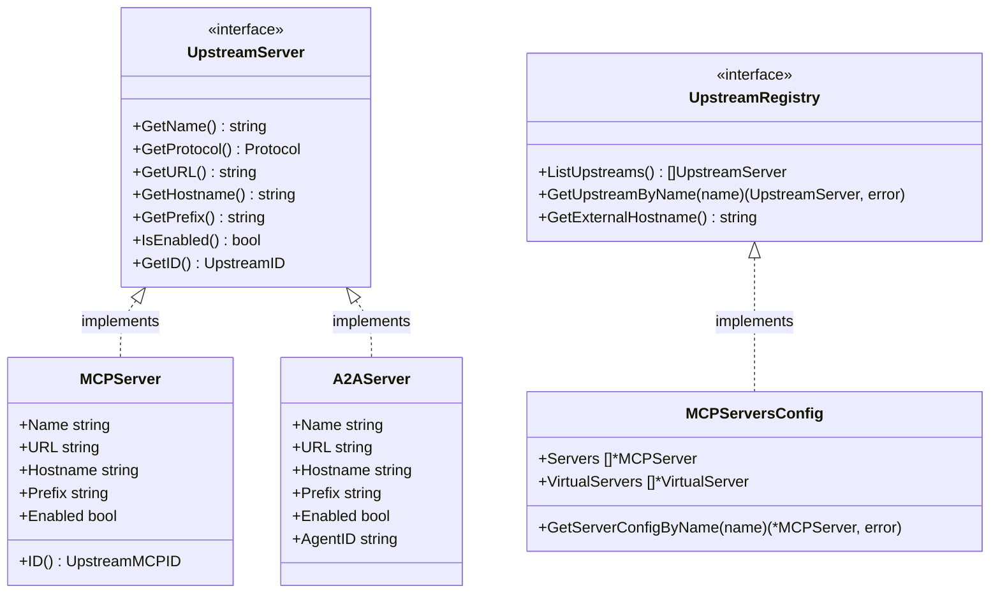

# Multi-Protocol Broker Config Model for A2A Upstreams

This document details the architectural design and implementation plan for decoupling the MCP Gateway broker configuration from Model Context Protocol (MCP) specific structures, paving the way for future Agent-to-Agent (A2A) protocol support.

> [!IMPORTANT]
> **Scope Disclaimer**: This design represents foundational architectural groundwork only. It defines the interface boundaries and core structural modeling to support multi-protocol configurations in a backward-compatible manner. It does NOT implement full A2A routing, controller reconciliation, or runtime proxying, which remain part of the future development direction.


## Overview & Background

The MCP Gateway was originally designed exclusively for Model Context Protocol (MCP) backends. As a result, the broker's configuration schemas, runtime lookup mechanisms, and internal routing maps are tightly coupled to MCP terminology (e.g., `MCPServer`, `MCPServersConfig`, `UpstreamMCPID`).

With the evolution of the ecosystem, there is an active need to support other backend protocols, such as **Agent-to-Agent (A2A)** upstreams. Forcing A2A upstreams into MCP-specific models results in awkward abstraction leaks, high maintenance overhead, and developer friction. 

This architectural change introduces a **protocol-neutral configuration and runtime interface** layer that is fully backward compatible, extremely lightweight, and directly supports the future integration of A2A upstreams.

---

## Architectural Objectives

1. **Decouple the Core**: Extract protocol-agnostic concepts (name, prefix, hostname, URL, enabled status, registry lookups) into clean, high-level interfaces.
2. **Backward Compatibility (No Regressions)**: Do not break existing configurations, Kubernetes Secrets serialization, or any existing controller/broker/router runtime lookup structures.
3. **Clean Extensibility**: Provide concrete, type-safe structures for A2A configurations (`A2AServer`) and demonstrate how they align with the protocol-neutral config models.

---

## The Protocol-Neutral Model



### 1. Protocol-Neutral Abstractions (`internal/config/types.go`)

We define the protocol enum and generic upstream identifiers:

```go
// UpstreamID is a generic identifier for any upstream server (MCP, A2A, etc.)
type UpstreamID string

// Protocol represents the communication protocol of an upstream server
type Protocol string

const (
	// ProtocolMCP represents the Model Context Protocol
	ProtocolMCP Protocol = "mcp"
	// ProtocolA2A represents the Agent-to-Agent protocol
	ProtocolA2A Protocol = "a2a"
)
```

### 2. The `UpstreamServer` Interface

Rather than controllers and broker runners relying directly on the concrete `*MCPServer` struct, they can consume the generic `UpstreamServer` interface:

```go
// UpstreamServer represents the interface that any upstream server config must satisfy,
// regardless of the protocol (MCP, A2A, etc.)
type UpstreamServer interface {
	GetName() string
	GetProtocol() Protocol
	GetURL() string
	GetHostname() string
	GetPrefix() string
	IsEnabled() bool
	GetID() UpstreamID
}
```

### 3. The `UpstreamRegistry` Interface

The runtime lookup paths are generalized through `UpstreamRegistry` to abstract the underling storage (ConfigMap, Secret, or memory):

```go
// UpstreamRegistry represents a protocol-neutral registry for looking up upstream servers
type UpstreamRegistry interface {
	ListUpstreams() []UpstreamServer
	GetUpstreamByName(name string) (UpstreamServer, error)
	GetExternalHostname() string
}
```

---

## Backward Compatibility & Integration Path

### MCPServer Compatibility
By implementing the methods of the `UpstreamServer` interface directly on `*MCPServer`, the existing structure satisfies the interface implicitly with **zero code modifications required for existing consumers**:

```go
func (mcpServer *MCPServer) GetName() string     { return mcpServer.Name }
func (mcpServer *MCPServer) GetProtocol() Protocol { return ProtocolMCP }
func (mcpServer *MCPServer) GetURL() string      { return mcpServer.URL }
func (mcpServer *MCPServer) GetHostname() string { return mcpServer.Hostname }
func (mcpServer *MCPServer) GetPrefix() string   { return mcpServer.Prefix }
func (mcpServer *MCPServer) IsEnabled() bool     { return mcpServer.Enabled }
func (mcpServer *MCPServer) GetID() UpstreamID   { return UpstreamID(mcpServer.ID()) }
```

### Extensible A2AServer Scaffolding
A2A configurations are modeled alongside MCP inside the parsed configuration structures. The struct fields and JSON/YAML annotations allow seamless integration inside the shared Kubernetes config Secrets without conflicts:

```go
type A2AServer struct {
	Name            string            `json:"name"                      yaml:"name"`
	URL             string            `json:"url"                       yaml:"url"`
	Hostname        string            `json:"hostname,omitempty"        yaml:"hostname,omitempty"`
	Prefix          string            `json:"prefix,omitempty"          yaml:"prefix,omitempty"`
	Auth            *AuthConfig       `json:"auth,omitempty"            yaml:"auth,omitempty"`
	Enabled         bool              `json:"enabled"                   yaml:"enabled"`
	AgentID         string            `json:"agentId,omitempty"         yaml:"agentId,omitempty"`
	AgentCardURL    string            `json:"agentCardUrl,omitempty"    yaml:"agentCardUrl,omitempty"`
	TaskEndpoint    string            `json:"taskEndpoint,omitempty"    yaml:"taskEndpoint,omitempty"`
	ProtocolBinding string            `json:"protocolBinding,omitempty" yaml:"protocolBinding,omitempty"`
	Metadata        map[string]string `json:"metadata,omitempty"        yaml:"metadata,omitempty"`
}
```

### Extensible `BrokerConfig` Structure
We expanded the global parsed configuration structure `BrokerConfig` to support `A2AServers` as an optional section:

```go
type BrokerConfig struct {
	Servers        []MCPServer           `json:"servers"                  yaml:"servers"`
	A2AServers     []A2AServer           `json:"a2aServers,omitempty"     yaml:"a2aServers,omitempty"`
	VirtualServers []VirtualServerConfig `json:"virtualServers,omitempty" yaml:"virtualServers,omitempty"`
}
```

Existing controllers writing to the Kubernetes configuration secret will simply marshal and unmarshal the A2A servers seamlessly if they are added in the future, with no runtime schema validation errors or deployment friction.

---

## Architectural Rationale & Future Work

1. **Interface-Based Routing**: In future phases, the Envoy external processor and router can perform target lookup using `UpstreamRegistry.GetUpstreamByName()`, making it simple to fetch and handle custom properties for non-MCP protocols without mutating core routing engines.
2. **Kubernetes CRD Harmonization**: In a later step, a new `A2AServerRegistration` Custom Resource Definition (CRD) can be introduced. The gateway controller will reconcile it exactly like `MCPServerRegistration` and upsert the result into the same `BrokerConfig` secret using `A2AServers` block, preserving all security validation features.
