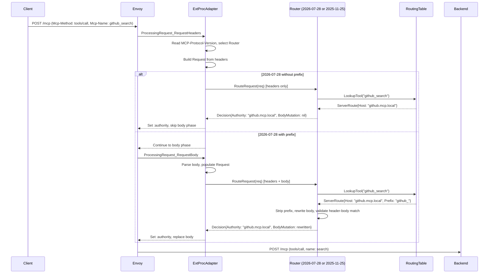

# Router: MCP `2026-07-28` Protocol Support

## Problem

The router is tightly coupled to `2025-11-25` protocol semantics — body parsing for every routing decision, session management, hairpin initialization, elicitation ID rewriting. The `2026-07-28` spec makes most of this unnecessary: `Mcp-Method` and `Mcp-Name` headers enable header-based routing, sessions are removed, and elicitation is stateless. The router needs to support both protocols during a transition period while isolating the `2025-11-25` code for eventual removal.

The 2026 version of the protocol, offers a TTL type timeout on tools etc rather than relying on notifications. This change makes it easier for the router to query the broker based on TTL rather than relying on notifications sent by the backend MCP Servers. Currently the router imports `internal/broker` for the `MCPBroker` interface (4 methods) to resolve tool names to servers. This coupling prevents independent deployment and can be removed with the new protocol. 

## Summary

Extract routing logic behind a `Router` interface with two implementations: one for `2026-07-28` (header-based, stateless) and one for `2025-11-25` (body-based, stateful). The ext_proc `Process` loop becomes a thin adapter that selects the implementation based on `MCP-Protocol-Version`. The broker dependency is replaced by a routing table the router consumes as a cached dataset.

## Goals

- **G1:** Support `2026-07-28` routing: `Mcp-Method`/`Mcp-Name` header-based routing, `:authority` rewrite, prefix stripping, `Mcp-Name` header rewrite. Provide steel thread around new protocol for tool and prompts.
- **G2:** Isolate `2025-11-25` code path so it can be removed without touching the `2026-07-28` path.
- **G3:** Zero broker imports in router. Replace `MCPBroker` interface with a routing table.
- **G4:** Define the `Router` interface as the contract for a future Praxis adapter.
- **G5:** Validate `Mcp-Name` and `Mcp-Method` headers match the body (spec requirement: server must reject mismatches with `HeaderMismatch` error).

## Non-Goals

- Praxis filter implementation (Phase 2, separate design)
- Full broker `2026-07-28` redesign (`InputRequiredResult`, `ttlMs`/`cacheScope` cache semantics, identity-keyed scope store — separate design, scoped in `tasks/broker-2026-scope.md`)
- `2025-11-25` deprecation or removal
- Independent deployment of router and broker

> **Note:** Some Broker changes were made to support the dual-protocol gateway:
> - `protocolRouter` in `MCPHandler()` dispatches 2026-07-28 requests to a stateless `StreamableHTTPHandler`, bypassing the compat layer and session management. Both handlers are always active — no `protocolMode` flag.
> - `discover_tools`/`select_tools` always registered, filtered to stateful clients only via pre-cached protocol tool sets.
> - Upstream `Ping()` skipped for 2026-07-28 upstreams (SDK limitation: `_meta` not injected on ping).
> - `server/discover` response overridden with the union of upstream server protocol versions for natural version negotiation.
>
> See `tasks/broker-2026-scope.md` for remaining broker work and the `single-gateway-dual-protocol` design for the dual-protocol gateway design.

## Job Stories

### When supporting clients on different protocol versions

When a platform admin has agents using both `2025-11-25` and `2026-07-28`, they want a single gateway to serve both so that they don't need to deploy separate instances. The gateway negotiates the correct version per client via `server/discover`.

### When migrating upstream servers to the new protocol

When an upstream is upgraded from `2025-11-25` to `2026-07-28`, clients see the change automatically — the gateway's `server/discover` response updates to reflect the new version, and tools move from the stateful to the stateless cache.

## Constraints

### No cross-protocol translation

The gateway does not translate between protocols. A 2025 client talks to 2025 backends; a 2026 client talks to 2026 backends. Tools from incompatible backends are filtered out of `tools/list`. This avoids the complexity of translating session semantics, `_meta` fields, and transport differences between protocol versions.

## Design

### Prerequisites

- `mcp-go` SDK must support `2026-07-28` types (or the router must handle new types independently of the SDK for the routing path)


### Routing table

The `RoutingTable` interface (`internal/routing/table.go`) decouples the router from the broker. The broker populates the table; the router reads it. The `2025-11-25` router accesses it via a `RoutingTableFunc` closure; the `2026-07-28` router will use the same interface.

```go
// internal/routing/table.go
type RoutingTable interface {
    LookupTool(name string) (*ServerRoute, bool)
    LookupPrompt(name string) (*ServerRoute, bool)
    LookupPrefix(name string) (*ServerRoute, bool)
    IsBrokerTool(name string) bool
    ToolAnnotations(serverID, toolName string) (*ToolAnnotation, bool)
}

```

`LookupPrefix` exists for `UserSpecificList` servers where per-user tools may not appear in the tool lookup. The router falls back to prefix matching when a tool name is not found via `LookupTool`.

**Delivery (current):** co-located — the broker builds the table in-memory and the router accesses it via `RoutingTableFunc`. Both protocol implementations share the same lookup mechanism.

**Delivery (future):** broker exposes the routing table via a lightweight HTTP endpoint. The router fetches on startup and refreshes based on the TTL derived from upstream `ttlMs` values.

### Protocol implementations

#### `2026-07-28` router

```go
type Router202607 struct {
    Table           RoutingTableFunc
    RoutingConfig   *atomic.Pointer[config.MCPServersConfig]
    Logger          *slog.Logger
}

func (r *Router202607) RouteRequest(ctx context.Context, req *Request) *Decision {
    // validate authority matches gateway hostname (from RoutingConfig)
    // lookup tool/prompt in routing table by Mcp-Name header
    // if not found, try prefix match
    // if not found and not a broker tool, return error
    // set :authority to server hostname
    // if prefix configured: strip prefix from Mcp-Name, rewrite body
    // validate Mcp-Name header matches body name field (HeaderMismatch check)
    // set x-mcp-* headers
}
```

Key properties:
- Routing decision is header-only when no prefix is configured
- Body access only for prefix stripping and header-body validation
- No session management, no hairpin init, no elicitation handling
- No `SessionCache` dependency, no `JWTManager` dependency, no `singleflight`

#### `2025-11-25` router

Already implemented in `internal/routing/router_202511.go`. Implements `Router` with body-based routing, session management, hairpin init, and elicitation handling.

This implementation is explicitly temporary — removed when `2025-11-25` support is dropped.

### Ext_proc adapter

The `Process` loop in `server.go` becomes the adapter. It:

1. Receives the ext_proc stream
2. In the header phase: reads `MCP-Protocol-Version`, constructs a `Request` from headers
3. Selects the `Router` implementation based on protocol version
4. For `2026-07-28` without prefix: calls `RouteRequest` with headers only, skips body phase if `BodyMutation` is nil
5. For `2026-07-28` with prefix or `2025-11-25`: enters body phase, populates `Request.Body`/`Request.Parsed`, calls `RouteRequest`
6. Translates `Decision` to ext_proc `ProcessingResponse`

```go
type ExtProcAdapter struct {
    router202607 Router
    router202511 Router
    logger       *slog.Logger
}

func (a *ExtProcAdapter) Process(stream extProcV3.ExternalProcessor_ProcessServer) error {
    // header phase: read MCP-Protocol-Version, select router
    // body phase (conditional): parse body if router needs it
    // call router.RouteRequest()
    // translate Decision → ProcessingResponse
    // response phase: unchanged (session ID mapping for 2025-11-25, pass-through for 2026-07-28)
}
```

### Flow



### Component Responsibilities

| Component | Responsibility |
|-----------|---------------|
| **ExtProcAdapter** | ext_proc stream handling, protocol version selection, `Request` construction, `Decision` → `ProcessingResponse` translation |
| **Router202607** | header-based routing, prefix stripping, header-body validation, routing table lookup |
| **Router202511** | body-based routing, session management, hairpin init, elicitation handling (existing logic) |
| **RoutingTable** | tool/prompt → server mapping, prefix matching, annotations. Populated by broker, consumed by router |

### Response handling

For `2026-07-28`, response handling simplifies:
- No session ID mapping (no sessions)
- No 404-based session invalidation
- No elicitation ID rewriting
- Pass-through of response headers and body

The `HandleResponseHeaders` and response body SSE rewriter in `server.go` are `2025-11-25`-only code paths.

## Security Considerations

- **Header-body validation.** The `2026-07-28` spec requires servers to reject requests where `Mcp-Method`/`Mcp-Name` headers disagree with the body. After prefix stripping, the router must ensure the rewritten `Mcp-Name` header matches the rewritten body `name` field.
- **Authority validation.** The router validates `:authority` matches the gateway's public hostname before rewriting. Unchanged from today.
- **Prefix stripping is the only body mutation.** The router does not modify any other body fields. This limits the attack surface for body manipulation.


### Dual-protocol gateway — DONE

Implemented in `docs/design/single-gateway-dual-protocol/`. A single gateway serves both protocols via `server/discover` negotiation. Protocol-specific routes (`/mcp/stateful`, `/mcp/stateless`) let agents access tools from both versions. `protocolMode` was removed — both routers are always active.

## Future Considerations

### Server cards (SEP-2127)

The gateway could serve a server card advertising both protocol paths as separate remotes. This builds on the existing `/mcp/stateful` and `/mcp/stateless` routes. Separate design scope.

### Other future work

- **Praxis adapter.** The `Router` interface is designed to be implementable from a Praxis `HttpFilter`. The `Request`/`Decision` types are transport-agnostic.
- **Body phase skip.** When no prefix is configured on any MCPServerRegistration, the ext_proc could be configured with `request_body_mode: NONE` for `2026-07-28` routes, eliminating the body phase entirely at the Envoy level.
- **`2025-11-25` removal.** When support is dropped, `Router202511` and all its dependencies (SessionCache, JWTManager, singleflight, InitForClient, ElicitationMap) are deleted.
- **Discovery tools for stateless clients.** The `scopeStore` keys by session ID, which doesn't exist in stateless mode. Options: re-key by `sub` claim, or use the spec's `requiredHeaders` mechanism on endpoints to pass an opaque scope key per request.

## Execution

See:
- [tasks/tasks.md](tasks/tasks.md) for the implementation plan
