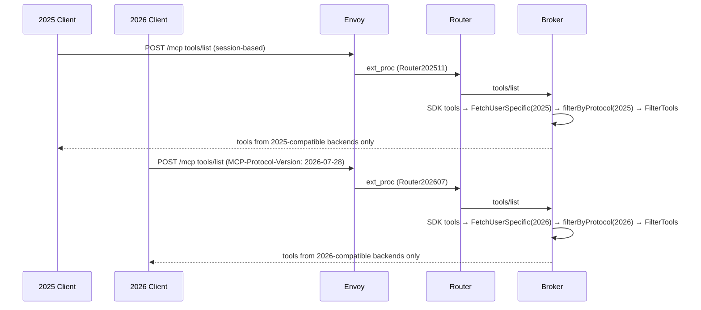

# Single Gateway for Both Protocol Versions

## Problem

Initially the implementation in the gateway to support the new stateless mcp protocol, required setting `protocolMode` on MCPGatewayExtension. Operators who need to support both `2025-11-25` and `2026-07-28` clients must deploy two gateway instances — doubling infrastructure, complicating DNS, and splitting tool management across two config secrets.

The router already has dual implementations (`Router202511`, `Router202607`) selected by `MCP-Protocol-Version` header. The broker already has a `protocolRouter` that dispatches to stateful or stateless handlers. The pieces exist but are gated behind a boolean switch that forces a single mode.

## Summary

Remove the `protocolMode` gate. Both protocol handlers are always active. The broker filters `tools/list` responses by the client's protocol version so each client sees only tools from compatible backends. UserSpecificList servers are queried with the client's protocol version and auth headers — stateful clients reuse cached sessions as today, stateless clients get a fresh upstream call per request.

## Goals

- **G1:** A single gateway instance serves both `2025-11-25` and `2026-07-28` clients.
- **G2:** `tools/list` returns only tools from backends matching the client's protocol version.
- **G3:** UserSpecificList servers respect the client's protocol version — the broker queries upstreams using the client's version and only returns tools from version-compatible backends.
- **G4:** Remove `protocolMode` from the CRD, controller, and broker/router startup (`protocolMode` only exists on this branch, never released).
- **G5:** `discover_tools`/`select_tools` remain available for `2025-11-25` clients only (session-scoped, unchanged).

## Non-Goals

- Discovery endpoints (`server/discover`, `/vmcp/` routing) — separate design
- Server Cards (SEP-2127)
- Broker redesign for `2026-07-28` (ttlMs, cacheScope, InputRequiredResult)
- Independent deployment of router and broker

## Job Stories

### When supporting clients on different protocol versions

When a platform engineer has agents using `2025-11-25` and newer agents using `2026-07-28`, they want a single gateway instance to serve both so that they don't need to deploy and manage two separate gateway stacks.

### When a category has mixed-protocol backends

When a platform engineer registers upstream servers where some support `2025-11-25` and others support `2026-07-28`, they want each client to see only the tools from backends matching its protocol version so that clients don't receive tools they can't call.

### When a UserSpecificList server supports the new protocol

When a platform engineer marks an upstream server as `userSpecificList: true` and that server speaks `2026-07-28`, they want `2026-07-28` clients to see per-user tools from that server so that user-specific tool listing works across protocol versions.

### When an upstream server supports both protocol versions

When a platform engineer registers an upstream server that supports both `2025-11-25` and `2026-07-28`, they want that server's tools to be available to all clients regardless of protocol version so that they don't need to register the same server twice or choose which clients can access it.

### When migrating upstream servers to the new protocol

When a platform engineer upgrades an upstream server from `2025-11-25` to `2026-07-28`, they want existing `2025-11-25` clients to stop seeing that server's tools and `2026-07-28` clients to start seeing them, without any gateway reconfiguration.

## Design

### Prerequisites

- `2026-07-28` router implementation (done, `internal/routing/router_202607.go`)
- Upstream protocol version detection from initialize handshake (done, `upstream/mcp.go:UsesStatelessProtocol()`)

### Protocol version tracking

A single upstream server can support both `2025-11-25` and `2026-07-28`. The upstream manager must detect all supported versions, not just the negotiated one.

**Detection flow:**

The go-sdk `Client.Connect` already handles version negotiation:
1. Tries `server/discover` with `2026-07-28` first
2. If `server/discover` succeeds, the `DiscoverResult` contains `SupportedVersions []string` — the full list of versions the server supports (e.g. `["2025-11-25", "2026-07-28"]`)
3. If `server/discover` fails, falls back to legacy `initialize` with `2025-11-25`

However, the SDK maps `DiscoverResult` to `InitializeResult` internally and drops `SupportedVersions`. The upstream manager must call `server/discover` itself after `Connect` for servers that negotiated `>= 2026-07-28`, to retrieve the full `SupportedVersions` list.

For servers that negotiated `2025-11-25` (no `server/discover` support), the supported versions list is `["2025-11-25"]`.

**Storage:**

The `MCPServer` struct gains a `supportedVersions []string` field, populated after connect:

```go
type MCPServer struct {
    // ... existing fields
    supportedVersions []string // e.g. ["2025-11-25", "2026-07-28"]
}

func (up *MCPServer) SupportsVersion(v string) bool {
    return slices.Contains(up.supportedVersions, v)
}
```

The broker maintains a `serverVersions` map (`map[config.UpstreamMCPID][]string`) updated when upstream managers report status. The filtering middleware uses this to check whether a tool's server supports the client's protocol version.

### tools/list protocol filtering

Rather than filtering per request, the broker pre-caches tools into two sets — `stateful` and `stateless` — keyed by protocol type. The cache is rebuilt when tools are added, removed, or when upstream manager reports a version change. A tool from a dual-version server appears in both sets.

```
tool change event → rebuild stateful/stateless tool caches

tools/list request → select cached set by client protocol → FetchUserSpecificTools → FilterTools → response
```

The client's protocol version is determined from request headers:
- `MCP-Protocol-Version: 2026-07-28` → stateless set
- Absent or any other value → stateful set

The `filteringMiddleware` replaces the SDK's full tool list with the protocol-appropriate cached set before `FetchUserSpecificTools` and `FilterTools` run. This avoids per-tool map lookups on every request.

Broker meta-tools (`discover_tools`, `select_tools`) are included only in the stateful set.

### UserSpecificList: protocol-aware fetching

`FetchUserSpecificTools` currently queries all UserSpecificList servers regardless of protocol. It must filter by the client's protocol version.

**Stateful clients (2025-11-25):** Unchanged. Session-keyed upstream pool, cached sessions, `Mcp-Session-Id` header required.

**Stateless clients (2026-07-28):** No session caching. Each `tools/list` request makes a fresh upstream call:
1. Create a new `mcp.Client` with `MCP-Protocol-Version: 2026-07-28` in headers
2. Connect, call `ListTools`, close
3. Forward the client's auth headers via `DynamicHeaderRoundTripper`
4. No session pool entry — the connection is not reused

The `userSpecificServers` list gains a supported versions field. `FetchUserSpecificTools` receives the client's protocol version and only queries servers that support it.

```go
type userSpecificServer struct {
    id                config.UpstreamMCPID
    name              string
    url               string
    prefix            string
    supportedVersions []string // from upstream manager detection
}
```

A server supporting both versions is queried by both stateful and stateless clients. The fetch strategy depends on the client's protocol:

**Stateful client → any matching server:** existing session-pooled path (unchanged).

**Stateless client → any matching server:**
1. Skips the session pool entirely
2. Creates a short-lived client with the user's headers + `MCP-Protocol-Version: 2026-07-28`
3. Connects, lists tools, closes — all within the request timeout
4. Does not cache the upstream session ID (no sessions to cache)

A dual-version server is queried once per request, using the client's protocol. The upstream server sees either a stateful or stateless connection depending on the client.

### Removing protocolMode

`protocolMode` only exists on this branch and was never released. No deprecation or migration needed — just delete.

| Component | Current | After |
|-----------|---------|-------|
| CRD (`MCPGatewayExtensionSpec`) | `ProtocolMode` field, `Stateful`/`Stateless` constants | Deleted |
| Controller (`broker_router.go`) | Appends `--protocol-mode=stateless` conditionally | No flag |
| `main.go` | `--protocol-mode` flag gates broker/router mode | Deleted |
| Broker | `statelessMode` bool gates `protocolRouter` creation | Both handlers always created |
| Router startup | Selects single router implementation | Both routers always constructed |
| Broker discovery | `discover_tools`/`select_tools` disabled in stateless mode | Always enabled (filtered to stateful clients only) |

### Ext_proc adapter

No changes needed. The `ExtProcAdapter` already selects the router implementation based on `MCP-Protocol-Version` header per request. Both routers are constructed at startup.

### Routing table

No changes needed. The routing table contains all tools from all backends. Protocol filtering happens at the broker `tools/list` level — clients never see tools from incompatible backends, so they can't issue `tools/call` for them.

### Flow: dual-protocol tools/list



### Component Responsibilities

| Component | Responsibility |
|-----------|---------------|
| **Upstream manager** | Detect and report backend protocol version (already done) |
| **Broker** | Maintain server→protocol map, filter tools/list by client version, partition UserSpecificList servers by version |
| **filteringMiddleware** | Protocol version filter step between FetchUserSpecific and FilterTools |
| **FetchUserSpecificTools** | Query only version-matching UserSpecificList backends; stateless fetch for 2026 backends |
| **ExtProcAdapter** | Select router by MCP-Protocol-Version header (unchanged) |
| **Controller** | Remove protocolMode flag propagation |

### Version-aware server/discover

The broker's `server/discover` response must reflect which protocol versions actually have backend support. If the gateway has only `2025-11-25` backends, `supportedVersions` should be `["2025-11-25"]` — the SDK negotiates down to 2025 automatically. A dual-protocol gateway returns `["2025-11-25", "2026-07-28"]`.

The broker computes the union of `supportedVersions` across all registered upstream servers. This is updated on config change and upstream connect/disconnect. The `mcp.Server`'s `server/discover` response uses this computed set.

```
gateway with only 2025 backends  → supportedVersions: ["2025-11-25"]
gateway with only 2026 backends  → supportedVersions: ["2026-07-28"]
gateway with both                → supportedVersions: ["2025-11-25", "2026-07-28"]
```

This eliminates the need for client-side workarounds — a standard SDK client connecting to a 2025-only gateway negotiates 2025 naturally.

### Protocol-specific routes

A single gateway exposes version-specific path routes alongside the default `/mcp` endpoint:

```
/mcp            — default, negotiates best available version via server/discover
/mcp/stateful   — forces 2025-11-25, only returns 2025-compatible tools
/mcp/stateless  — forces 2026-07-28, only returns 2026-compatible tools
```

This allows a multi-model agent to configure separate MCP servers pointing at the same gateway:

```yaml
mcp-servers:
  gateway:
    url: https://mcp.example.com/mcp           # negotiates best version
  gateway-legacy:
    url: https://mcp.example.com/mcp/stateful   # forces 2025
```

An agent that supports `2026-07-28` but also wants access to `2025-11-25`-only tools can connect to both endpoints. Each endpoint returns only protocol-compatible tools.

**Implementation:** The broker registers path handlers for `/mcp/stateful` and `/mcp/stateless`. The path determines which protocol handler serves the request, overriding the `MCP-Protocol-Version` header. The ext_proc adapter reads the path and selects the router accordingly. The controller adds a single HTTPRoute prefix rule for `/mcp/` that covers all sub-paths.

**Interaction with `/vmcp/`:** The discovery design's `/vmcp/{name}` endpoints also need version routes — `/vmcp/{name}/stateful` and `/vmcp/{name}/stateless`. This is additive and follows the same pattern.

## Security Considerations

- **No new attack surface.** Both protocol handlers already exist in the codebase. This change removes a gate, not adds code.
- **Protocol version header trust.** The `MCP-Protocol-Version` header comes from the client. A malicious client could lie about its version, but the worst outcome is receiving tools it can't use — not a security issue.
- **UserSpecificList stateless fetch.** Short-lived connections per request. No session state to leak across clients. Auth headers are forwarded per-request as today.
- **discover_tools/select_tools visibility.** These tools remain session-scoped. A stateless client cannot invoke them (no session context).

## Future Considerations

- **Discovery endpoints.** `server/discover` and `/vmcp/` routing build on this work — see `docs/design/discovery/`.
- **TTL-based routing table refresh.** When the broker exposes the routing table via HTTP, the TTL can be derived from upstream `ttlMs` values, scoped by protocol version.

## Execution

See:
- [tasks/tasks.md](tasks/tasks.md) for the implementation plan
- [tasks/e2e_test_cases.md](tasks/e2e_test_cases.md) for test cases
- [tasks/documentation.md](tasks/documentation.md) for documentation plan
