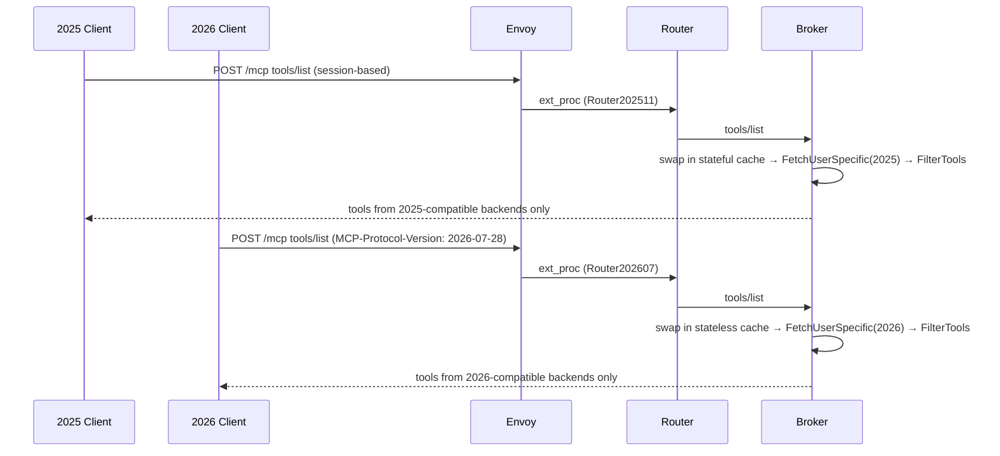

# Single Gateway for Both Protocol Versions

## Problem

The initial 2026-07-28 implementation required `protocolMode` on MCPGatewayExtension, forcing one protocol per gateway instance. Operators supporting both client populations needed two gateway stacks.

The router already has dual implementations (`Router202511`, `Router202607`) selected by `MCP-Protocol-Version` header. The broker has a `protocolRouter` dispatching to stateful or stateless handlers. Both were gated behind a boolean switch.

## Summary

Remove `protocolMode`. Both handlers are always active. The broker pre-caches tools into stateful and stateless sets, serving the correct set per client. `server/discover` advertises only the protocol versions that have backend support, so SDK clients negotiate naturally. Protocol-specific routes (`/mcp/stateful`, `/mcp/stateless`) let agents access tools from both protocol versions via separate endpoints.

## Goals

- **G1:** Single gateway serves both `2025-11-25` and `2026-07-28` clients
- **G2:** `tools/list` returns only tools from protocol-compatible backends
- **G3:** UserSpecificList respects client protocol version
- **G4:** `server/discover` advertises only versions with backend support
- **G5:** Protocol-specific routes let agents force a version explicitly
- **G6:** `discover_tools`/`select_tools` available to stateful clients only

## Non-Goals

- Server Cards (SEP-2127)
- Broker redesign for `2026-07-28` (ttlMs, cacheScope, InputRequiredResult)
- Independent deployment of router and broker
- `/vmcp/` discovery routing (separate design)

## Job Stories

### When supporting clients on different protocol versions

When a platform engineer has agents using both protocols, they want a single gateway instance to serve both without deploying two stacks.

### When a category has mixed-protocol backends

When upstream servers support different protocol versions, each client should see only tools from compatible backends.

### When an upstream server supports both protocol versions

When a server supports both versions, its tools should be available to all clients without duplicate registrations.

### When an agent needs tools from both protocol versions

When an agent supports `2026-07-28` but also needs `2025-11-25`-only tools, they want protocol-specific routes so they can connect to both endpoints on the same gateway.

### When migrating upstream servers to the new protocol

When an upstream is upgraded from `2025-11-25` to `2026-07-28`, clients see the change automatically without gateway reconfiguration.

## Design

### Protocol version tracking

Each upstream server's supported versions are detected at connect time. Currently defaults to only the negotiated version (e.g. `["2025-11-25"]` or `["2026-07-28"]`). Future work: call `server/discover` on 2026 upstreams to get the full `SupportedVersions` list for servers that support both.

The broker maintains a `serverVersions` map updated when upstream managers connect. The `ServerSupportsVersion(id, version)` method provides lookups.

### Pre-cached tool sets

Tools are partitioned into stateful and stateless caches, rebuilt when tools change. The `filteringMiddleware` swaps in the correct set based on the client's `MCP-Protocol-Version` header before `FetchUserSpecificTools` and `FilterTools` run.

Broker meta-tools (`discover_tools`, `select_tools`) are identified by the `kuadrant/broker-tool` meta key and included only in the stateful set.

### UserSpecificList: protocol-aware fetching

`FetchUserSpecificTools` filters servers by `ServerSupportsVersion` at query time.

- **Stateful clients:** existing session-pooled path (unchanged)
- **Stateless clients:** fresh connect → ListTools → close per request, no session caching

### Version-aware server/discover

The broker's `filteringMiddleware` intercepts `server/discover` responses and overrides `SupportedVersions` with the union of all upstream server versions. When no upstreams are registered, the SDK's built-in version filtering is left untouched.

```
gateway with only 2025 backends  → supportedVersions: ["2025-11-25"]
gateway with only 2026 backends  → supportedVersions: ["2026-07-28"]
gateway with both                → supportedVersions: ["2025-11-25", "2026-07-28"]
```

SDK clients negotiate down naturally — no client-side workarounds needed.

### Protocol-specific routes

```
/mcp            — negotiates best available version via server/discover
/mcp/stateful   — forces 2025-11-25, returns only stateful tools
/mcp/stateless  — forces 2026-07-28, returns only stateless tools
```

An agent can configure multiple MCP server entries pointing at the same gateway to access tools from both protocols. The broker dispatches by path, overriding the `MCP-Protocol-Version` header. The ext_proc adapter selects the router by path.

### Flow



### Component Responsibilities

| Component | Responsibility |
|-----------|---------------|
| **Upstream manager** | Detect backend protocol version, expose `SupportedVersions` |
| **Broker** | `serverVersions` map, pre-cached tool sets, version-aware `server/discover`, protocol-specific route dispatch |
| **filteringMiddleware** | Swap tool set by protocol, override `server/discover` response |
| **FetchUserSpecificTools** | Query only version-matching backends; stateless fetch for 2026 |
| **ExtProcAdapter** | Select router by `MCP-Protocol-Version` header or path |

## Security Considerations

- **No new attack surface.** Both handlers existed; this removes a gate.
- **Protocol version header.** A client lying about its version gets tools it can't call — not a security issue.
- **UserSpecificList stateless fetch.** Short-lived connections, no session state leakage.
- **discover_tools/select_tools.** Session-scoped, invisible to stateless clients.

## Future Considerations

- **Dual-version detection via server/discover probe.** Call `server/discover` on 2026 upstreams after connect to get the full `SupportedVersions` list. Currently defaults to negotiated version only.
- **Discovery endpoints.** `server/discover` instructions and `/vmcp/` routing build on this — see `docs/design/discovery/`.
- **TTL-based routing table refresh.** Scoped by protocol version when the broker exposes the table via HTTP.

## Execution

See:
- [tasks/tasks.md](tasks/tasks.md) for the implementation plan
- [tasks/e2e_test_cases.md](tasks/e2e_test_cases.md) for test cases
- [tasks/documentation.md](tasks/documentation.md) for documentation plan
